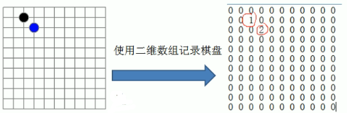
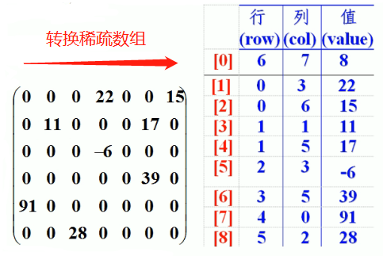

<!-- TOC -->

- [实际应用场景](#实际应用场景)
    - [需求:](#需求)
    - [方案:](#方案)
    - [讨论:](#讨论)
- [基本介绍](#基本介绍)
    - [定义](#定义)
    - [处理方法](#处理方法)
    - [转换实例](#转换实例)
    - [实例分析](#实例分析)

<!-- /TOC -->

# 稀疏数组 sparse array

## 1. 实际应用场景

### 需求:  

在五子棋程序中, 要能随时对棋盘进行存档和加载.

  
****

### 方案:  

将棋盘转换成二维数组, 并按棋子种类进行区分,   
0 代表该点没有落子,  
1 代表改点放的是黑子,  
2 代表改点放的是蓝子.
****

### 讨论:

最后得出了如上图右边的数组,  
可以看到由于该二维数组很多值默认是 0,  
记录了很多没有意义的数据, 因此可用稀疏数组进行存储.
****

## 2. 基本介绍

### 定义

当一个数组中大部分元素为 0, 或者为同一个值的数组时,  
可以用稀疏数组来保存该数组.
****

### 处理方法

1. 记录数组一共有几行几列, 有多少个不同的值.  
2. 把具有不同值的元素的行列及值记录在一个小规模数组中,  
   从而缩小程序的规模. 
****

### 转换实例

  
****

### 实例分析  

如上图所示, 右边的就是转换后的稀疏数组,   
稀疏数组的第一行和下面行的内容有所区别:  
- 第一行存储的内容分别是:  
  - 原数组的行数
  - 原数组的列数
  - 原数组中不同值元素的数量
- 下面行存储的内容分别是:
  - 不同值元素所在的行号
  - 不同值元素所在的列号
  - 不同值元素自身的数值

因此, 数组由原来的 `6*7` 大小变成了 `9*3` 的大小.  
一定程度上节省了空间, 将数组规模变小.