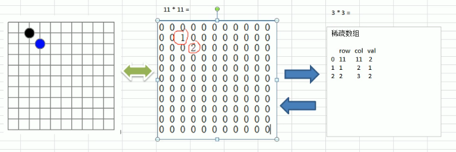

<!-- TOC -->

- [应用实例分析](#%E5%BA%94%E7%94%A8%E5%AE%9E%E4%BE%8B%E5%88%86%E6%9E%90)
    - [要求](#%E8%A6%81%E6%B1%82)
    - [转换思路分析](#%E8%BD%AC%E6%8D%A2%E6%80%9D%E8%B7%AF%E5%88%86%E6%9E%90)
        - [二维数组 转 稀疏数组的思路](#%E4%BA%8C%E7%BB%B4%E6%95%B0%E7%BB%84-%E8%BD%AC-%E7%A8%80%E7%96%8F%E6%95%B0%E7%BB%84%E7%9A%84%E6%80%9D%E8%B7%AF)
        - [稀疏数组 转 二维数组的思路](#%E7%A8%80%E7%96%8F%E6%95%B0%E7%BB%84-%E8%BD%AC-%E4%BA%8C%E7%BB%B4%E6%95%B0%E7%BB%84%E7%9A%84%E6%80%9D%E8%B7%AF)

<!-- /TOC -->

## 1. 应用实例分析
### 要求
1) 用稀疏数组来保存类似之前的二维数组(棋盘, 地图等)
2) 将稀疏数组存盘, 并可重新恢复原来的二维数组
****

### 转换思路分析
- 以前面的棋盘为例, 进行转换  

#### 二维数组 转 稀疏数组的思路
1) 遍历原始的二维数组, 得到有效数据的个数 sum  
   有效数据的个数决定了稀疏数组的行数, 行数为 sum+1
   
2) 根据 sum 创建稀疏数组 `sparseArr = int[sum+1][3]`  
   稀疏数组固定为 3 列, 每列对应的是 row col 和 val  
   注意第一行和后面行的数据的意义是不一样的.  
   第一行存的是原始数组的行数列数以及有效元素个数,  
   后面行存的是有效元素在原数组中的行号列号及数值.

3) 将二维数组的有效数据存入稀疏数组中

 

#### 稀疏数组 转 二维数组的思路
1) 先读取稀疏数组的第一行,  
   根据第一行的数据创建原始的二维数组,  
   比如上面的棋盘数组 `chessArr = int[11][11]`

2) 再读取稀疏数组后面行的数据, 并赋给原始数组
****