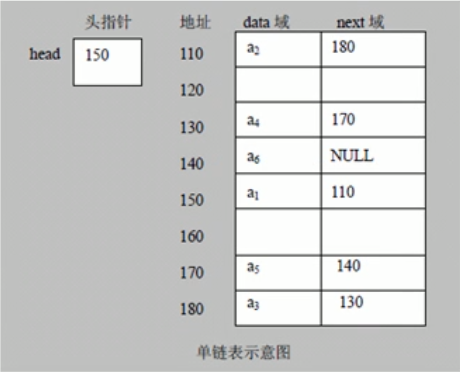
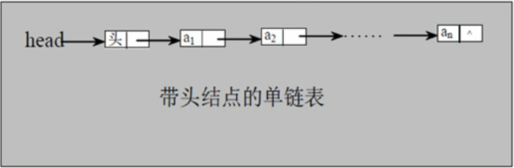
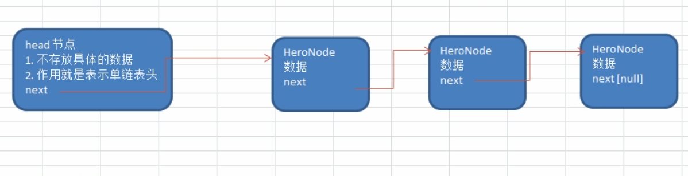
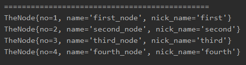
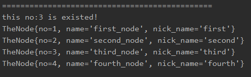
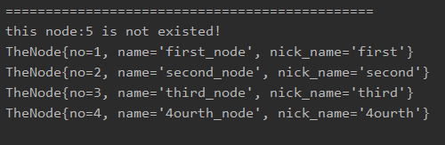
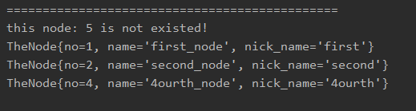

<!-- TOC -->

- [1. 单链表 single link list 的介绍和内存布局](#1-单链表-single-link-list-的介绍和内存布局)
  - [1.1. 单链表的内存存储示意图](#11-单链表的内存存储示意图)
  - [1.2. 单链表特征](#12-单链表特征)
  - [1.3. 单链表(带头节点)的逻辑结构示意图](#13-单链表带头节点的逻辑结构示意图)
- [2. 单链表的应用实例](#2-单链表的应用实例)
  - [2.1. 需求分析](#21-需求分析)
  - [2.2. 实现细节](#22-实现细节)
  - [2.3. 示意图](#23-示意图)
  - [2.4. 执行流程](#24-执行流程)
- [3. 单链表代码实现](#3-单链表代码实现)
  - [3.1. 创建节点类](#31-创建节点类)
  - [3.2. 创建链表类](#32-创建链表类)
  - [3.3. 创建测试类](#33-创建测试类)
  - [3.4. 运行结果](#34-运行结果)

<!-- /TOC -->

## 1. 单链表 single link list 的介绍和内存布局

### 1.1. 单链表的内存存储示意图
- 链表是有序列表, 但它在内存中的存储如下, 下图为单链表  
  
  

****

### 1.2. 单链表特征  
- 链表是以节点的方式来存储的, 是链式存储  
- 每个节点必须包含 data 域, 用以存放数据,  
  以及 next 域, 用以指向下一节点的位置  
- 链表的各个节点的存储位置不一定是连续的
- 链表分带头节点的链表和不带头节点的链表,  
  根据实际情况来进行定义

****

### 1.3. 单链表(带头节点)的逻辑结构示意图
- 带头节点的单链表逻辑结构  
  - 从头节点依次指向下一个节点, 直到指向最后一个节点  
  最后一个节点的 next 域存储为 null  
  - 从逻辑上看单链表是连续的, 实际在内存的存储中不一定连续  
    
  

****

## 2. 单链表的应用实例

### 2.1. 需求分析
使用带 head 头的单向链表实现--水浒英雄排行榜管理
1) 完成对英雄人物的增删改查操作
2) 第一种方式添加英雄时, 直接添加到链表的尾部
3) 第二种方式添加英雄时, 根据排名将英雄插入指定位置  
   如果排名已经存在, 则添加失败, 并给出提示.

****

### 2.2. 实现细节

**节点类**  
- 单链表节点类起名叫 SinglyLinkList  

- 包含的成员如下:  
  - 编号 int no
  - 名字 String name
  - 称号 String nick_name
  - 下一节点 SinglyLinkList next

**头节点**  
- 主要用来连接链表  
  
- 作用如下:  
  - 不存放具体的数据
  - 作用就是表示单链表头

****

### 2.3. 示意图
- 首先 head 节点并不存放具体数据, 只在 next 域中存放指向表头的位置信息  
- 然后链表每个节点中的 next 域都存放着下一节点的指向位置  
- 最后一个节点的 next 域为空, 因此判断链表尾部的条件是 next 域是否为空


****

### 2.4. 执行流程
**添加(创建)节点**  
- 先创建一个 head 头节点, 作用就是表示单链表的头
- 后面每添加一个节点, 就直接加入到链表的最后

**遍历节点**  
- 通过一个辅助指针, 帮助遍历整个单链表

****

## 3. 单链表代码实现

### 3.1. 创建节点类
```java
package com.leo9.dc04.singly_link_list;
/**
 * 定义节点类
 * */

public class TheNode {
    public int no;
    public String name;
    public String nick_name;
    public TheNode next;

    //定义构造器
    public TheNode(int no, String name, String nick_name){
        this.no = no;
        this.name = name;
        this.nick_name = nick_name;
    }

    //重写toString方法

    @Override
    public String toString() {
        return "TheNode{" +
                "no=" + no +
                ", name='" + name + '\'' +
                ", nick_name='" + nick_name + '\'' +
                '}';
    }
}

```

### 3.2. 创建链表类
```java
package com.leo9.dc04.singly_link_list;

/**
 * 定义单链表类
 */

public class SinglyLinkList {
    //初始化头节点,不存放具体数据
    private TheNode head_node = new TheNode(0,"","");

    //添加节点
    //当不需要考虑编号顺序直接插入链表时
    //1.找到当前链表最后的节点
    //2.将最后这个节点的next指向新的节点
    public void addNode(TheNode new_node){
        //因为head节点不能动, 因此需要一个辅助指针temp
        TheNode temp = head_node;
        //开始遍历链表, 找到最后一个节点
        while (true){
            //如果找到了最后一个节点,则跳出循环
            if(temp.next == null){
                break;
            }
            //如果没有找到最后一个节点,指针后移
            temp = temp.next;
        }
        //当退出循环时,此时temp就指向了链表最后
        //因此将最后节点的next域指向当前新增节点
        temp.next = new_node;
    }

    //排序添加节点
    //首先找出正确的位置
    //然后当前节点的next域指向前一个节点next域所指向的位置
    //最后前一个节点的next域改为指向当前节点
    public void addNodeOrder(TheNode new_node){
        //编号不能小于等于0
        if(new_node.no <= 0){
            System.out.println("the no cant be 0 or less than 0 !");
            return;
        }
        //因为head节点不能动, 因此需要一个辅助指针temp
        TheNode temp = head_node;
        while(true){
            //当指针指到最后一个节点时, 跳出循环
            if(temp.next == null){
                temp.next = new_node;
                break;
            }

            //找到要插入的位置的前一个节点
            if(temp.next.no > new_node.no){
                new_node.next = temp.next;
                temp.next = new_node;
                break;
            }
            else if(temp.next.no == new_node.no){
                System.out.println("this no:"+ new_node.no + " is existed!");
                break;
            }
            temp = temp.next;
        }
    }

    //修改节点, 根据no来寻找节点, 因此no不能被修改
    public void editNode(int edit_no, String new_name, String new_nick_name){
        //因为head节点不能动, 因此需要一个辅助指针temp
        TheNode temp = head_node;
        while (true){
            if(temp.no == edit_no){
                temp.name = new_name;
                temp.nick_name = new_nick_name;
                break;
            }

            if(temp.next == null){
                System.out.println("this node:" + edit_no + " is not existed!");
                break;
            }
            temp = temp.next;
        }
    }

    //删除节点, 根据no来进行查找
    public void delNode(int del_no){
        //因为head节点不能动, 因此需要一个辅助指针temp
        TheNode temp = head_node;
        while(true){
            if(temp.next == null){
                System.out.println("this node: " + del_no + " is not existed!");
                break;
            }

            if(temp.next.no == del_no){
                temp.next = temp.next.next;
                break;
            }


            temp = temp.next;
        }
    }

    //显示链表
    public void showList(){
        //先判断链表是否为空
        if(head_node.next == null){
            System.out.println("the list is empty!");
        }
        //因为头节点不能动,因此需要辅助指针
        //因为头节点next域不为空,因此至少有一个数据
        TheNode temp = head_node.next;
        while (true){
            //判断链表是否走到最后
            if(temp == null){
                break;
            }
            //输出当前节点
            System.out.println(temp);
            //节点后移
            temp = temp.next;
        }
    }
}

```

### 3.3. 创建测试类
```java
package com.leo9.dc04.singly_link_list;

public class TestDemoSLL {
    public static void main(String[] args) {
        //先创建节点
        TheNode first_node = new TheNode(1,"first_node","first");
        TheNode second_node = new TheNode(2,"second_node","second");
        TheNode third_node = new TheNode(3,"third_node","third");
        TheNode third_node_2 = new TheNode(3,"third_node_2","third_2");
        TheNode fourth_node = new TheNode(4,"fourth_node","fourth");

        //然后创建链表
//        SinglyLinkList the_list01 = new SinglyLinkList();
        SinglyLinkList the_list02 = new SinglyLinkList();

//        //直接加入节点
//        System.out.println("==============================================");
//        the_list01.addNode(first_node);
//        the_list01.addNode(second_node);
//        the_list01.addNode(third_node);
//        the_list01.addNode(fourth_node);
//
//        //输出链表
//        the_list01.showList();


        //按顺序加入节点
        System.out.println("==============================================");
        the_list02.addNodeOrder(first_node);
        the_list02.addNodeOrder(second_node);
        the_list02.addNodeOrder(fourth_node);
        the_list02.addNodeOrder(third_node);
        the_list02.addNodeOrder(third_node_2);

        //输出链表
        the_list02.showList();

        //修改节点
        System.out.println("==============================================");
        the_list02.editNode(5,"test","ttt");
        the_list02.editNode(4,"4ourth_node","4ourth");

        //输出链表
        the_list02.showList();

        //删除节点
        System.out.println("==============================================");
        the_list02.delNode(3);
        the_list02.delNode(5);

        //输出链表
        the_list02.showList();
    }
}

```

### 3.4. 运行结果
直接插入执行完后全部进行注释, 后续的操作以排序插入的表为基础执行

****
**(1)直接插入**  
- 不按顺序插入会陷入死循环...



****
**(2)排序插入**  
- 因为是单向链表, 所以要找到插入节点位置的上一个节点
- 从而使上一个节点的 next 域指向当前要插入的节点
- 然后当前要插入节点的 next 域指向要插入位置的下一节点



****
**(3)修改节点**  
- 通过 no 来进行查找节点, 因此 no 是不可修改的
- 然后传入新的节点 name 和 nick_name 即可



****
**(4)删除节点**  
- 因为是单向链表, 所以要找到删除节点位置的上一个节点
- 然后让上一节点的 next 域指向要删除位置的下一个节点即可
- 被删除的节点会因为最后没有任何引用指向它, 从而被垃圾回收器进行回收

