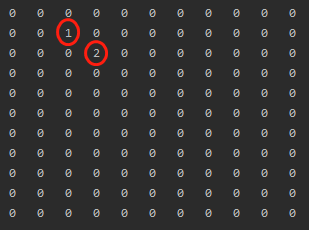
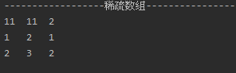
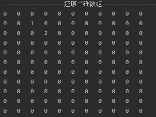

## 1. 首先创建棋盘数组, 并进行输出棋盘数组

### 代码实现
```java
/**
* 创建一个原始二维数组, 11*11大小的棋盘
* 0表示没有落子. 1表示黑子, 2表示蓝子
*/
//1. 创建棋盘并记录棋子位置
int[][] chessArr1 = new int[11][11];
chessArr1[1][2] = 1;
chessArr1[2][3] = 2;
//2.输出原始棋盘数组
System.out.println("------------------原始二维数组-------------------");
for(int[] rows : chessArr1){
    for(int data : rows){
        System.out.printf("%d\t", data);
    }
    System.out.println();
}
```

### 输出结果
如下图所示, 这就是原始的二维棋盘数组  



## 2. 然后将棋盘数组转化为稀疏数组, 并输出稀疏数组

### 代码实现
```java
/**
* 将二维数组转换成稀疏数组
*/

//1. 定义非0数据的个数sum, 默认为0
//2. 遍历数组取的 sum 的个数
int sum = 0;
for (int i = 0; i < 11; i++) {
    for (int j = 0; j < 11; j++) {
        if (chessArr1[i][j] != 0 ) {
            sum++;
        }
    }
}
System.out.println("非零值的个数为: " + sum);

//3.创建稀疏数组
int[][] sparseArr2 = new int[sum+1][3];

//4.给稀疏数组第一行赋值
sparseArr2[0][0] = 11;
sparseArr2[0][1] = 11;
sparseArr2[0][2] = sum;

//5.再次遍历原始二维数组, 并设定计数器计算非零值个数, 默认为 0
int count = 0;
for (int i = 0; i < 11; i++) {
    for (int j = 0; j < 11; j++) {
        if (chessArr1[i][j] != 0 ) {
            count++;
            sparseArr2[count][0] = i;
            sparseArr2[count][1] = j;
            sparseArr2[count][2] = chessArr1[i][j];
        }
        //count等于有效值的个数就终止循环
        if(count == sum){
            break;
        }
    }
}

//6.输出稀疏数组
System.out.println("------------------稀疏数组-------------------");
for(int[] rows : sparseArr2){
    for(int data : rows){
        System.out.printf("%d\t", data);
    }
    System.out.println();
}
```

### 输出结果


## 3. 最后将稀疏数组还原成原始二维数组

### 代码实现
```java
/**
    * 将稀疏数组转换回原始二维数组
    */

//1.获取原始数组行数列数
int row_count = sparseArr2[0][0];
int col_count = sparseArr2[0][1];

//2.定义原始数组
int[][] chessArr3 = new int[row_count][col_count];

//3.获取有效数据的数量
int ele_count = sparseArr2[0][2];

//4.给原始数组进行赋值, 重新存放有效值
for (int i = 0; i < ele_count; i++) {
    //获取有效数值所在行和列
    int the_row = sparseArr2[i+1][0];
    int the_col = sparseArr2[i+1][1];
    //将有效元素放入原始数组
    chessArr3[the_row][the_col] = sparseArr2[i+1][2];
}

//5.输出还原的二维数组
System.out.println("------------------还原二维数组-------------------");
for(int[] rows : chessArr3){
    for(int data : rows){
        System.out.printf("%d\t", data);
    }
    System.out.println();
}
```

### 输出结果



## 4. 全篇完整代码
```java
package com.leo9.sparse_array;

public class SparseArray {
    public static void main(String[] args) {
        /**
        * 创建一个原始二维数组, 11*11大小的棋盘
        * 0表示没有落子. 1表示黑子, 2表示蓝子
        */

        //1. 创建棋盘并记录棋子位置
        int[][] chessArr1 = new int[11][11];
        chessArr1[1][2] = 1;
        chessArr1[2][3] = 2;

        //2.输出原始棋盘数组
        System.out.println("------------------原始二维数组-------------------");
        for(int[] rows : chessArr1){
            for(int data : rows){
                System.out.printf("%d\t", data);
            }
            System.out.println();
        }

        /**
        * 将二维数组转换成稀疏数组
        **/

        //1. 定义非0数据的个数sum, 默认为0
        //2. 遍历数组取的 sum 的个数
        int sum = 0;
        for (int i = 0; i < 11; i++) {
            for (int j = 0; j < 11; j++) {
                if (chessArr1[i][j] != 0 ) {
                    sum++;
                }
            }
        }
        System.out.println("非零值的个数为: " + sum);

        //3.创建稀疏数组
        int[][] sparseArr2 = new int[sum+1][3];

        //4.给稀疏数组第一行赋值
        sparseArr2[0][0] = 11;
        sparseArr2[0][1] = 11;
        sparseArr2[0][2] = sum;

        //5.再次遍历原始二维数组, 并设定计数器计算非零值个数, 默认为 0
        int count = 0;
        for (int i = 0; i < 11; i++) {
            for (int j = 0; j < 11; j++) {
                if (chessArr1[i][j] != 0 ) {
                    count++;
                    sparseArr2[count][0] = i;
                    sparseArr2[count][1] = j;
                    sparseArr2[count][2] = chessArr1[i][j];
                }
                //count等于有效值的个数就终止循环
                if(count == sum){
                    break;
                }
            }
        }

        //6.输出稀疏数组
        System.out.println("------------------稀疏数组-------------------");
        for(int[] rows : sparseArr2){
            for(int data : rows){
                System.out.printf("%d\t", data);
            }
            System.out.println();
        }

        /**
         * 将稀疏数组转换回原始二维数组
         */

        //1.获取原始数组行数列数
        int row_count = sparseArr2[0][0];
        int col_count = sparseArr2[0][1];

        //2.定义原始数组
        int[][] chessArr3 = new int[row_count][col_count];

        //3.获取有效数据的数量
        int ele_count = sparseArr2[0][2];

        //4.给原始数组进行赋值, 重新存放有效值
        for (int i = 0; i < ele_count; i++) {
            //获取有效数值所在行和列
            int the_row = sparseArr2[i+1][0];
            int the_col = sparseArr2[i+1][1];
            //将有效元素放入原始数组
            chessArr3[the_row][the_col] = sparseArr2[i+1][2];
        }

        /* 另一种还原写法
        // 遍历稀疏数组, 给二维数组还原有效值
        for(int i = 1; i < sparseArr2.length; i++){
            chessArr3[sparseArr2[i][0]][sparseArr2[i][1]] = sparseArr2[i][2];
        }        
        */

        //5.输出还原的二维数组
        System.out.println("------------------还原二维数组-------------------");
        for(int[] rows : chessArr3){
            for(int data : rows){
                System.out.printf("%d\t", data);
            }
            System.out.println();
        }
    }
}

```