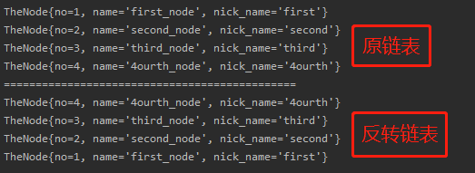

<!-- TOC -->

- [1. 新浪面试题-查找单链表中的倒数第 K 个节点](#1-新浪面试题-查找单链表中的倒数第-k-个节点)
  - [分析思路](#分析思路)
  - [关键代码](#关键代码)
    - [获取链表长度, 在链表方法内定义](#获取链表长度-在链表方法内定义)
    - [获取目标倒数第 K 个节点](#获取目标倒数第-k-个节点)
- [2. 腾讯面试题-单链表的反转](#2-腾讯面试题-单链表的反转)
  - [图解思路](#图解思路)
  - [关键代码](#关键代码-1)
  - [运行结果](#运行结果)
- [3.百度面试题-从尾到头打印单链表](#3百度面试题-从尾到头打印单链表)
  - [栈的思路](#栈的思路)
  - [栈的基本使用](#栈的基本使用)
  - [解题答案](#解题答案)

<!-- /TOC -->
## 1. 新浪面试题-查找单链表中的倒数第 K 个节点

### 分析思路
1) 编写一个方法, 接收 head 节点, 同时接收一个 index
2) index 表示的是倒数第 index 个节点
3) 先把链表从头到尾遍历, 获取链表的长度 length (不包括头节点)
4) 得到 length 后, 从链表第一个有效节点开始遍历, 遍历的次数为 length - index

****
### 关键代码
#### 获取链表长度, 在链表方法内定义
- TheNode 为节点类
```java
public int getLength(TheNode head_node){
    //头节点下一个为空则全表为空
    if(head_node.next == null){
        return 0;
    }
    
    //创建临时节点
    TheNode temp = head_node.next;
    int length = 0;
    
    //当前节点不为空长度加一
    while(temp != null){
        length ++;
        temp = temp.next;
    }
    return length;
}
```

#### 获取目标倒数第 K 个节点
```java
public void showTheNodeK(TheNode head_node, int index){
    int length = theList01.getLength(head_node);
    if(length == 0){
        System.out.println("the list is empty!");
        return;
    }
    //从第一个有效节点开始遍历
    TheNode cur = head_node.next;
    //循环length - index次, 若为0则就是当前第一个节点
    //先检验index的有效性
    if(index < 0 || index > length){
        System.out.println("the index is incorrect!");
        return;
    }

    //开始遍历, 最后输出结果
    for(int i = 0; i < length - index; i++){
        cur = cur.next;
    }
    System.out.println(cur);
}
```

****
## 2. 腾讯面试题-单链表的反转
### 图解思路
1) 首先, 创建一个带头节点的链表 list01
2) 然后, 链表反转的时候用新链表 list02 进行接收节点
3) 接着, 开始用临时指针 temp 指向 list01 的有效节点
   - temp 每指向一个有效节点, list02 就插入一个节点
   - 插入节点的时候  
     新建一个拷贝节点, 复制 temp 节点, 防止指向混乱  
     `TheNode copy_node = new TheNode(temp.no,temp.name,temp.nick_name);`  
     `copy_node.next = list02.head_node.next;`,  
     `head_node.next = copy_node`.
   - 当 `temp = null` 时, 停止插入


****
### 关键代码
```java
    //反转链表
    public SinglyLinkList reversalList(){
        //创建临时指针, 先指向原链表的头节点
        TheNode temp = this.head_node;

        //创建新链表, 用来接受倒置节点
        SinglyLinkList rev_list = new SinglyLinkList();

        //判断链表是否为空, 为空直接返回
        if(temp.next == null){
            System.out.println("the list is empty!");
            return rev_list;
        }

        //temp从第一个有效节点开始进行遍历
        temp = temp.next;
        while(temp != null){
            //复制当前节点
            TheNode copy_node = new TheNode(temp.no,temp.name,temp.nick_name);
            //插入复制节点到新链表
            copy_node.next = rev_list.head_node.next;
            rev_list.head_node.next = copy_node;
            //指针后移
            temp = temp.next;
        }

        //返回反转链表
        return rev_list;
    }
```

****
### 运行结果


****
## 3.百度面试题-从尾到头打印单链表
- 要求方式1: 反向遍历 
  - 解答: 反转链表如上一题, 但会破坏链表结构
- 要求方式2: Stack 栈

****
### 栈的思路
- 利用栈这个数据结构, 将各个节点压入到栈中  
  然后利用栈先进后出的特性, 实现逆序打印

****
### 栈的基本使用

```java
public static void main(String args[]){
    //建立一个栈, 其存储的数据类型为String
    Stack<String> stack = new Stack();
    
    //向栈里面加入数据, 即入栈操作
    stack.add("String01");
    stack.add("String02");
    stack.add("String03");

    //取出栈里面的数据, 即出栈操作
    while(stack.size() > 0){
        //stack 的 pop 方法是将栈顶的数据取出的方法
        System.out.println(stack.pop());
    }
}
```

- 执行完毕后的输出结果是
```
String01
String02
String03
```

****
### 解题答案
- 在测试类中加入该方法即可

```java
public void reversePrint(TheNode head_node){
    //判断链表是否为空
    if(head_node.next == null){
        System.out.println('the list is empty!');
        return;
    }

    //创建一个栈, 将节点压入栈里
    Stack<TheNode> stack = new Stack<TheNode>();
    //创建当前节点指针
    TheNode cur_node = head_node.next;
    //将链表的所有节点压入栈中
    while(cur_node != null){
        stack.push(cur_node);
        cur_node = cur_node.next;
    }

    //取出栈里面的数据, 倒序输出
    while(stack.size() > 0){
        System.out.println(stack.pop());
    }
}
```