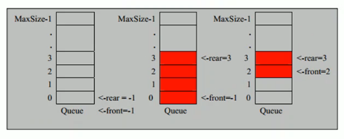

# 队列

## 1. 实际应用场景
银行排队的案例, 先进先出.

## 2. 队列基本介绍

### 定义
- 队列是一个有序列表, 可以用数组或者链表来实现  
  数组实现则为顺序存储, 链表实现则为链式存储  
- 遵循先入先出的原则, 即:  
  先存入队列的数据要先取出, 后存入的数据后取出   
- 示意图: (使用数组模拟队列示意图)  
    
  - 有一个队列 Queue, 里面存在两个指针,  
    指针分别为 rear 和 front, 指代队尾和队首,  
    两个指针的初始指向都为 -1  
  - 当有数据加入的时候, rear 向上移动, front 不会变化
  - 当有数据减少的时候, front 向上移动, rear 不会变化