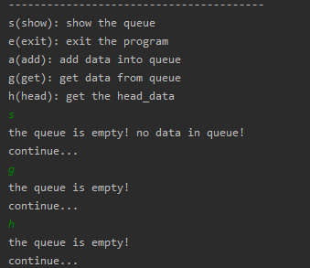
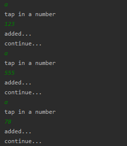
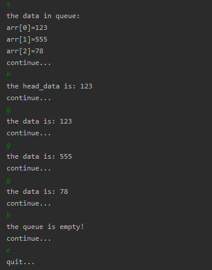

<!-- TOC -->

- [首先创建一个队列数组类来模拟队列](#%E9%A6%96%E5%85%88%E5%88%9B%E5%BB%BA%E4%B8%80%E4%B8%AA%E9%98%9F%E5%88%97%E6%95%B0%E7%BB%84%E7%B1%BB%E6%9D%A5%E6%A8%A1%E6%8B%9F%E9%98%9F%E5%88%97)
- [然后创建一个测试类执行主方法测试数组](#%E7%84%B6%E5%90%8E%E5%88%9B%E5%BB%BA%E4%B8%80%E4%B8%AA%E6%B5%8B%E8%AF%95%E7%B1%BB%E6%89%A7%E8%A1%8C%E4%B8%BB%E6%96%B9%E6%B3%95%E6%B5%8B%E8%AF%95%E6%95%B0%E7%BB%84)
- [然后执行, 得出运行结果](#%E7%84%B6%E5%90%8E%E6%89%A7%E8%A1%8C-%E5%BE%97%E5%87%BA%E8%BF%90%E8%A1%8C%E7%BB%93%E6%9E%9C)
    - [队列数组没有加入任何数据时](#%E9%98%9F%E5%88%97%E6%95%B0%E7%BB%84%E6%B2%A1%E6%9C%89%E5%8A%A0%E5%85%A5%E4%BB%BB%E4%BD%95%E6%95%B0%E6%8D%AE%E6%97%B6)
    - [向队列数组内添加元素](#%E5%90%91%E9%98%9F%E5%88%97%E6%95%B0%E7%BB%84%E5%86%85%E6%B7%BB%E5%8A%A0%E5%85%83%E7%B4%A0)
    - [再对队列数组进行操作](#%E5%86%8D%E5%AF%B9%E9%98%9F%E5%88%97%E6%95%B0%E7%BB%84%E8%BF%9B%E8%A1%8C%E6%93%8D%E4%BD%9C)
- [分析这种做法弊端](#%E5%88%86%E6%9E%90%E8%BF%99%E7%A7%8D%E5%81%9A%E6%B3%95%E5%BC%8A%E7%AB%AF)

<!-- /TOC -->

## 1. 首先创建一个队列数组类来模拟队列
```java
package com.leo9.dc02.queue_array;
/**
 * 使用数组模拟队列编写一个QueueArray类
 * */
public class QueueArray {
    //定义队列数组的最大容量
    private int max_size;
    //定义队首指针
    private int front;
    //定义队尾指针
    private int rear;
    //定义队列本身, 用以存放数据模拟队列.
    private int[] arr;

    //创建队列的构造器
    public QueueArray(int arr_max_size){
        max_size = arr_max_size;
        arr = new int[max_size];
        //front指向队列头部, 但是是队列头的前一个位置,
        //就是第一个数据前面, 而非这个数据本身.
        this.front = -1;
        //rear指向队列尾部, 指向队列尾的数据, 就是队列最后一个数据本身.
        this.rear = -1;
    }

    //判断队列是否占满
    public boolean isFull(){
        return rear == max_size - 1;
    }

    //判断队列是否为空
    public boolean isEmpty(){
        return rear == front;
    }

    //添加数据到队列, 数据入列
    public void addQueue(int data){
        //先判断队列是否占满
        if (isFull()){
            System.out.println("the queue is full!");
            return;
        }
        //队列还有位置则, 队尾后移一位, 再增加数据
        rear++;
        arr[rear] = data;
    }

    //取出队列的数据, 数据出列
    public int getQueue(){
        //先判断队列是否为空
        if(isEmpty()){
            throw new RuntimeException("the queue is empty!");
        }
        //队列内有数据, 队首后移一位, 再取出数据
        front ++;
        return arr[front];
    }

    //显示队列的所有数据, 实际是遍历数组
    public void showQueue(){
        //先判断非空
        if(isEmpty()){
            System.out.println("the queue is empty! no data in queue!");
            return;
        }
        System.out.println("the data in queue:");
        for (int i = 0; i < arr.length; i++) {
            System.out.printf("arr[%d]=%d\n", i, arr[i]);
        }
    }

    //显示队列的头数据, 并非取出数据
    public int headQueue(){
        //先判断队列是否为空
        if(isEmpty()){
            throw new RuntimeException("the queue is empty!");
        }
        return arr[front+1];
    }
}

```

## 2. 然后创建一个测试类执行主方法测试数组
```java
package com.leo9.dc02.queue_array;
import java.util.Scanner;

public class TestDemo {
    public static void main(String[] args) {
        //创建并初始化队列
        QueueArray queue = new QueueArray(3);

        //创建一个字符变量用以接收用户输入
        char key = ' ';
        Scanner scanner = new Scanner(System.in);
        boolean loop = true;

        //输出一个菜单
        System.out.println("----------------------------------------");
        System.out.println("s(show): show the queue");
        System.out.println("e(exit): exit the program");
        System.out.println("a(add): add data into queue");
        System.out.println("g(get): get data from queue");
        System.out.println("h(head): get the head_data");
        while (loop){
            //接受一个字符
            key = scanner.next().charAt(0);
            switch (key){
                case 's':
                    queue.showQueue();
                    System.out.println("continue...");
                    break;
                case 'a':
                    System.out.println("tap in a number");
                    int val = scanner.nextInt();
                    queue.addQueue(val);
                    System.out.println("added...");
                    System.out.println("continue...");
                    break;
                case 'g':
                    try{
                        int result = queue.getQueue();
                        System.out.println("the data is: " + result);
                    }catch(Exception ex){
                        System.out.println(ex.getMessage());
                    }
                    System.out.println("continue...");
                    break;
                case 'h':
                    try{
                        int result = queue.headQueue();
                        System.out.println("the head_data is: " + result);
                    }catch (Exception ex){
                        System.out.println(ex.getMessage());
                    }
                    System.out.println("continue...");
                    break;
                case 'e':
                    scanner.close();
                    loop = false;
                    System.out.println("quit...");
                    break;
                default:
                    break;
            }
        }
    }
}

```

## 3. 然后执行, 得出运行结果

### 3.1 队列数组没有加入任何数据时
- 对队列数组进行展示, 取出下一个元素, 以及显示当前头元素操作

- 运行结果如下:  
  显而易见的, 全部提示都是队列数组为空  
  

****
### 3.2 向队列数组内添加元素
- 往队列数组中加入 3 个元素, 数组初始化默认最大长度为 3
- 加入的元素数值分别为 123, 555, 78

- 运行结果如下  
  

****
### 3.3 再对队列数组进行操作
- 运行结果如下  
  


****
## 4. 分析这种做法弊端
- 这种队列不是环形队列, 只能用一次就不能再用, 不能复用  
- 需要将数组使用算法改进成环形数组, 用取模的方式实现.