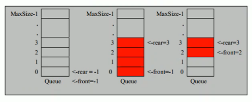
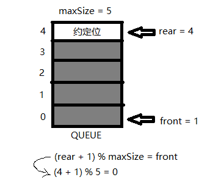
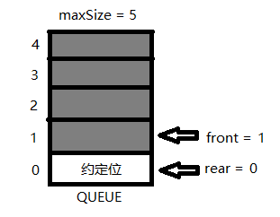
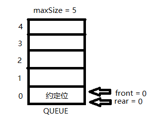

<!-- TOC -->

- [数组模拟环形队列](#%E6%95%B0%E7%BB%84%E6%A8%A1%E6%8B%9F%E7%8E%AF%E5%BD%A2%E9%98%9F%E5%88%97)
    - [基本概述](#%E5%9F%BA%E6%9C%AC%E6%A6%82%E8%BF%B0)
    - [分析说明](#%E5%88%86%E6%9E%90%E8%AF%B4%E6%98%8E)
    - [具体思路](#%E5%85%B7%E4%BD%93%E6%80%9D%E8%B7%AF)
        - [(1) front 变量含义做调整:](#1-front-%E5%8F%98%E9%87%8F%E5%90%AB%E4%B9%89%E5%81%9A%E8%B0%83%E6%95%B4)
        - [(2) rear 变量的含义做调整:](#2-rear-%E5%8F%98%E9%87%8F%E7%9A%84%E5%90%AB%E4%B9%89%E5%81%9A%E8%B0%83%E6%95%B4)
        - [(3) front 和 rear 的初始值都修改为 0](#3-front-%E5%92%8C-rear-%E7%9A%84%E5%88%9D%E5%A7%8B%E5%80%BC%E9%83%BD%E4%BF%AE%E6%94%B9%E4%B8%BA-0)
        - [(4) 当队列满时, 判断条件变化](#4-%E5%BD%93%E9%98%9F%E5%88%97%E6%BB%A1%E6%97%B6-%E5%88%A4%E6%96%AD%E6%9D%A1%E4%BB%B6%E5%8F%98%E5%8C%96)
        - [(5) 当队列为空时, 判断条件不变](#5-%E5%BD%93%E9%98%9F%E5%88%97%E4%B8%BA%E7%A9%BA%E6%97%B6-%E5%88%A4%E6%96%AD%E6%9D%A1%E4%BB%B6%E4%B8%8D%E5%8F%98)
        - [(6) 队列中的有效数据的个数](#6-%E9%98%9F%E5%88%97%E4%B8%AD%E7%9A%84%E6%9C%89%E6%95%88%E6%95%B0%E6%8D%AE%E7%9A%84%E4%B8%AA%E6%95%B0)

<!-- /TOC -->

## 1. 数组模拟环形队列

### 基本概述
对前面的数组模拟队列的优化, 实现充分利用数组.  
因此要将数组看作一个环形结构, 通过取模的方式进行实现.

****

### 分析说明
1) 尾指针的下一个为头指针表示队列占满  
2) 即将队列容量空出一位作为约定,  
   这个在判断队列满的时候需要注意,
   当 `(rear + 1) % maxSize == front` 时,  
   此时表示队列占满.
3) 当 `rear == front` 时, 队列为空.
   
****

### 具体思路
   

#### (1) front 变量含义做调整:  
>front 的指向由指向队列的第一个元素前一个位置,   
修改为指向队列的第一个元素本身.

#### (2) rear 变量的含义做调整:  
>rear 的指向由指向队列的最后一个元素本身,  
修改为指向队列最后一个元素的后一个位置.  
因为需要队列空出一位来作为约定.  

#### (3) front 和 rear 的初始值都修改为 0  
>front 在有数据取出时 `front = (front +1) % maxSize`  
rear 在有数据加入时 `rear = (rear +1) % maxSize`  

#### (4) 当队列满时, 判断条件变化  
>此时条件为 `(rear + 1) % maxSize = front`  

如下图所示:  
- 这是队列第一次被占满的情况  
  
 
- 在上面情况下, 取出一位数据再加入一位  
   约定位会发生移位, 会按照环形队列顺移   

- 因此, 队列被占满时, rear 永远指向约定位.

#### (5) 当队列为空时, 判断条件不变   
>依旧是 `rear == front`,  
此时 rear 和 front 都指向约定位.  

如下图所示:  
- 在队列占满的第二种情况下, 取出所有的数据  

#### (6) 队列中的有效数据的个数
有效数据的个数设置为 num,  
`num = (rear + maxSize - front) % maxSize`