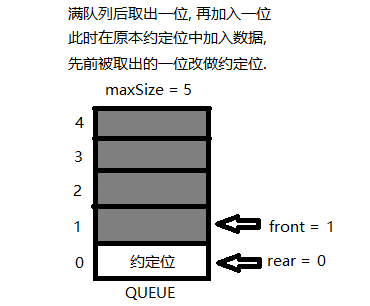

## 1. 数组模拟环形队列

### 基本概述
对前面的数组模拟队列的优化, 实现充分利用数组.  
因此要将数组看作一个环形结构, 通过取模的方式进行实现.

### 分析说明
1) 尾指针的下一个为头指针表示队列占满  
2) 即将队列容量空出一位作为约定,  
   这个在判断队列满的时候需要注意,
   当 `(rear + 1) % maxSize == front` 时,  
   此时表示队列占满.
3) 当 `rear == front` 时, 队列为空.

### 具体思路
   

1) front 变量含义做调整:  
   front 的指向由指向队列的第一个元素前一个位置,   
   修改为指向队列的第一个元素本身.

2) rear 变量的含义做调整:  
   rear 的指向由指向队列的最后一个元素本身,  
   修改为指向队列最后一个元素的后一个位置.  
   因为需要队列空出一位来作为约定.  

3) front 和 rear 的初始值都为 0  
   front 在有数据取出时 `front = (front +1) % maxSize`  
   rear 在有数据加入时 `rear = (rear +1) % maxSize`  

4) 当队列满时, 此时 `(rear + 1) % maxSize = front`  
   如下图所示:  
   - 这是队列第一次被占满的情况  
      
   - 在上面情况下, 取出一位数据再加入一位  
   
   - 因此, 队列被占满时, rear 永远指向约定位.

5) 当队列为空时, `rear == front`,  
   此时 rear 和 front 都指向约定位.  
   如下图所示:  
   在队列占满的第二种情况下, 取出所有的数据  
   