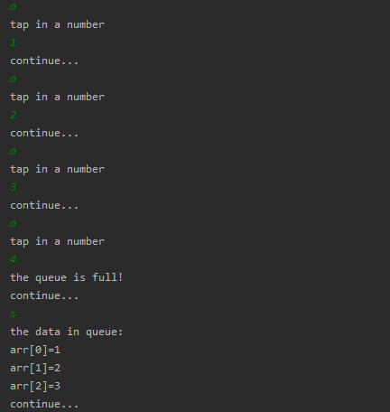

<!-- TOC -->

- [首先创建环形队列类](#首先创建环形队列类)
- [创建测试类](#创建测试类)
- [运行结果](#运行结果)
    - [初始化队列, 并执行操作](#初始化队列-并执行操作)
    - [向队列加入数据](#向队列加入数据)
    - [取出和加入数据, 演示两次](#取出和加入数据-演示两次)
    - [结果分析](#结果分析)

<!-- /TOC -->

## 1. 首先创建环形队列类
<a id="markdown-首先创建环形队列类" name="首先创建环形队列类"></a>

```java
package com.leo9.dc03.round_queue_array;

public class RoundQueueArray {
    //定义队列数组的最大容量
    private int max_size;
    //定义队首指针
    private int front;
    //定义队尾指针
    private int rear;
    //定义队列本身, 用以存放数据模拟队列.
    private int[] arr;

    //创建队列的构造器
    public RoundQueueArray(int arr_max_size){
        max_size = arr_max_size;
        arr = new int[max_size];
        //front 和 rear 的初始值都为 0
        //front指向队列头部第一个元素本身
        front = 0;
        //rear指向队列尾部最后一个元素的后一个位置.
        rear = 0;
    }

    //判断队列是否占满
    public boolean isFull(){
        return (rear + 1) % max_size == front;
    }

    //判断队列是否为空
    public boolean isEmpty(){
        return rear == front;
    }

    //添加数据到队列, 数据入列
    public void addQueue(int data){
        //先判断队列是否占满
        if (isFull()){
            System.out.println("the queue is full!");
            return;
        }
        //若队列仍未占满, 则可以加入数据
        //由于rear指向的就是尾部元素的下一位, 直接加入即可
        arr[rear] = data;
        //加入数据后rear再后移一位, 但要取模, 防止溢出
        rear = (rear + 1) % max_size;
    }

    //取出队列的数据, 数据出列
    public int getQueue(){
        //先判断队列是否为空
        if(isEmpty()){
            throw new RuntimeException("the queue is empty!");
        }
        //队列内有数据, 可以取出数据
        //由于front的指向就是当前队首的数据, 因此可以直接取出
        int data = arr[front];
        //取出后front向后移动一位, 取模防止溢出
        front = (front + 1) % max_size;
        return data;
    }

    //获取队列内有效数据的个数
    public int getNum(){ return (rear + max_size - front) % max_size; }

    //显示队列的所有数据, 实际是遍历数组, 且只输出有效数据
    public void showQueue(){
        //先判断非空
        if(isEmpty()){
            System.out.println("the queue is empty! no data in queue!");
            return;
        }
        System.out.println("the data in queue:");
        //有效数据的个数
        int num = getNum();
        //输出有效数据, 从当前的front指向元素开始输出
        for(int i = 0; i < num; i++){
            //成员的数组内编号, 要取模防止溢出
            int the_sign = (front + i) % max_size;
            System.out.printf("arr[%d]=%d\n", the_sign, arr[the_sign]);
        }

    }

    //显示队列的头数据, 并非取出数据
    public int headQueue(){
        //先判断队列是否为空
        if(isEmpty()){
            throw new RuntimeException("the queue is empty!");
        }
        return arr[front];
    }
}

```

## 2. 创建测试类
<a id="markdown-创建测试类" name="创建测试类"></a>

```java
package com.leo9.dc03.round_queue_array;

import java.util.Scanner;

public class TestDemoR {
    public static void main(String[] args) {
        //创建并初始化队列
        RoundQueueArray queue = new RoundQueueArray(4);

        //创建一个字符变量用以接收用户输入
        char key = ' ';
        Scanner scanner = new Scanner(System.in);
        boolean loop = true;

        //输出一个菜单
        System.out.println("----------------------------------------");
        System.out.println("-------the length of the queue is 3------");

        System.out.println("s(show): show the queue");
        System.out.println("e(exit): exit the program");
        System.out.println("a(add): add data into queue");
        System.out.println("g(get): get data from queue");
        System.out.println("h(head): get the head_data");
        while (loop){
            //接受一个字符
            key = scanner.next().charAt(0);
            switch (key){
                case 's':
                    queue.showQueue();
                    System.out.println("continue...");
                    break;
                case 'a':
                    System.out.println("tap in a number");
                    int val = scanner.nextInt();
                    queue.addQueue(val);
                    System.out.println("continue...");
                    break;
                case 'g':
                    try{
                        int result = queue.getQueue();
                        System.out.println("the data is: " + result);
                    }catch(Exception ex){
                        System.out.println(ex.getMessage());
                    }
                    System.out.println("continue...");
                    break;
                case 'h':
                    try{
                        int result = queue.headQueue();
                        System.out.println("the head_data is: " + result);
                    }catch (Exception ex){
                        System.out.println(ex.getMessage());
                    }
                    System.out.println("continue...");
                    break;
                case 'e':
                    scanner.close();
                    loop = false;
                    System.out.println("quit...");
                    break;
                default:
                    break;
            }
        }
    }
}

```

## 3. 运行结果
<a id="markdown-运行结果" name="运行结果"></a>

### 初始化队列, 并执行操作
<a id="markdown-初始化队列-并执行操作" name="初始化队列-并执行操作"></a>

- 实际上队列的最大容量是 maxSize - 1
- 图略, 跟之前的一样

****
### 向队列加入数据
<a id="markdown-向队列加入数据" name="向队列加入数据"></a>

- 运行结果如下:  
  


****
### 取出和加入数据, 演示两次
<a id="markdown-取出和加入数据-演示两次" name="取出和加入数据-演示两次"></a>

- 运行结果如下:  
  


****
### 结果分析
<a id="markdown-结果分析" name="结果分析"></a>

- 显而易见的实现了环形队列, 队列可以多次复用
- 但这个方法需要留一个空位作判断, 浪费了少许空间
- 但也因为留空位, 因此 0 也可以作为有效数据存入