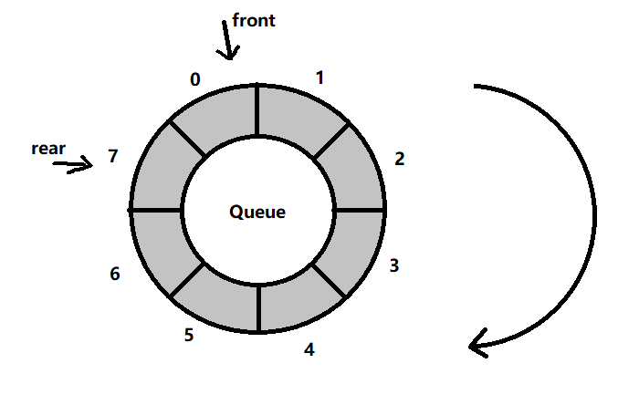
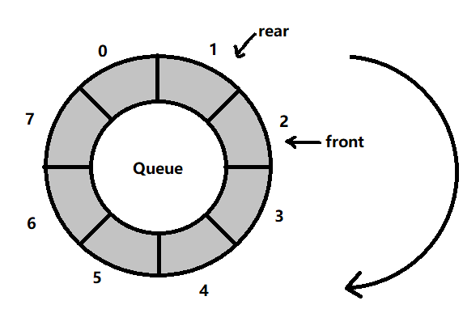
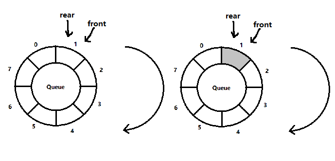

<!-- TOC -->

- [基本分析](#基本分析)
- [优化思路](#优化思路)
    - [(0) 队列位置中默认值都为 0 表示空](#0-队列位置中默认值都为-0-表示空)
    - [(1) front 和 rear 的含义均作调整](#1-front-和-rear-的含义均作调整)
    - [(2) 队列满的时候的判断](#2-队列满的时候的判断)
    - [(3) 队列为空时候的判断](#3-队列为空时候的判断)
    - [(4) 队列中的有效数据个数](#4-队列中的有效数据个数)

<!-- /TOC -->

### 基本分析

- 上一种方法需要用到一个预留位来做判断位,  
  因而造成空间不能被充分使用.  
  但用判断位可以让 int 支持的数都能作为有效数字.
- 但通常来说实际应用中队列都要输入大于 0 的正整数,  
  因此可以用 0 来表示当前位为空.

### 优化思路

#### (0) 队列位置中默认值都为 0 表示空

#### (1) front 和 rear 的含义均作调整

- front 的调整:  
  front 的初始值为 0,  
  front 的指向是当前队首的元素本身.

- rear 的调整:  
  rear 的初始值为 0,  
  rear 的指向是当前队尾的元素本身.

****
#### (2) 队列满的时候的判断

- 在队列占满的时候, 首尾指针必定相邻
- 且首指针必定在顺时针方向(即脚标递增的方向)在尾指针右边  
  (注: 这是在队列满时才有的情况)
- 如下示例两种队列占满的情况
  - **情况 1:** `front + max_size = rear + 1`   

  - **情况 2:** `front = rear + 1`    

- **因此, 总结出判断公式为** `(front - rear + max_size) % max_size = 1`

****

#### (3) 队列为空时候的判断

- 当队列为空时, 首尾指针必定指在同一位置
- 但也会出现两种情况,  
  一种是真的为空即当前位数值为 0,  
  另一种是该位置实际上存在数据.
- 如下图所示   
  

- **因此, 判断公式为** `if(front == rear && Queue[front] == 0)`

****
#### (4) 队列中的有效数据个数

- 必须先判断是否为空才能执行该操作
- 由于尾指针在数据增加的时候往前移动一位,  
  因此 `(rear - front + max_size) + 1` 就是其间隔的数据个数  
- `+ max_size` 是因为有可能出现负数, 要保证在 max_size 的范围内
- `+ 1` 是因为脚标是从 0 开始计算的
- 同时 `(rear - front + max_size)` 这一块有可能会超出范围, 因此要取模
- 最终得出的结果是  
  `(rear - front + max_size) % max_size + 1`