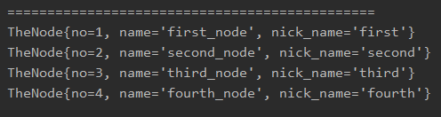
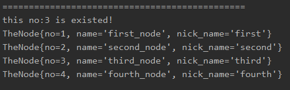

<!-- TOC -->

- [先创建节点类](#%E5%85%88%E5%88%9B%E5%BB%BA%E8%8A%82%E7%82%B9%E7%B1%BB)
- [再创建链表类](#%E5%86%8D%E5%88%9B%E5%BB%BA%E9%93%BE%E8%A1%A8%E7%B1%BB)
- [后创建测试类](#%E5%90%8E%E5%88%9B%E5%BB%BA%E6%B5%8B%E8%AF%95%E7%B1%BB)
- [运行结果](#%E8%BF%90%E8%A1%8C%E7%BB%93%E6%9E%9C)
    - [直接插入](#%E7%9B%B4%E6%8E%A5%E6%8F%92%E5%85%A5)
    - [排序插入](#%E6%8E%92%E5%BA%8F%E6%8F%92%E5%85%A5)

<!-- /TOC -->

## 1. 先创建节点类
```java
package com.leo9.dc04.singly_link_list;
/**
 * 定义节点类
 * */

public class TheNode {
    public int no;
    public String name;
    public String nick_name;
    public TheNode next;

    //定义构造器
    public TheNode(int no, String name, String nick_name){
        this.no = no;
        this.name = name;
        this.nick_name = nick_name;
    }

    //重写toString方法

    @Override
    public String toString() {
        return "TheNode{" +
                "no=" + no +
                ", name='" + name + '\'' +
                ", nick_name='" + nick_name + '\'' +
                '}';
    }
}

```
## 2. 再创建链表类
```java
package com.leo9.dc04.singly_link_list;

/**
 * 定义单链表类
 */

public class SinglyLinkList {
    //初始化头节点,不存放具体数据
    private TheNode head_node = new TheNode(0,"","");

    //添加节点
    //当不需要考虑编号顺序直接插入链表时
    //1.找到当前链表最后的节点
    //2.将最后这个节点的next指向新的节点
    public void addNode(TheNode new_node){
        //因为head节点不能动, 因此需要一个辅助指针temp
        TheNode temp = head_node;
        //开始遍历链表, 找到最后一个节点
        while (true){
            //如果找到了最后一个节点,则跳出循环
            if(temp.next == null){
                break;
            }
            //如果没有找到最后一个节点,指针后移
            temp = temp.next;
        }
        //当退出循环时,此时temp就指向了链表最后
        //因此将最后节点的next域指向当前新增节点
        temp.next = new_node;
    }

    //排序添加节点
    //首先找出正确的位置
    //然后当前节点的next域指向前一个节点next域所指向的位置
    //最后前一个节点的next域改为指向当前节点
    public void addNodeOrder(TheNode new_node){
        //编号不能小于等于0
        if(new_node.no <= 0){
            System.out.println("the no cant be 0 or less than 0 !");
            return;
        }
        //因为head节点不能动, 因此需要一个辅助指针temp
        TheNode temp = head_node;
        while(true){
            //当指针指到最后一个节点时, 跳出循环
            if(temp.next == null){
                temp.next = new_node;
                break;
            }

            //找到要插入的位置的前一个节点
            if(temp.next.no > new_node.no){
                new_node.next = temp.next;
                temp.next = new_node;
                break;
            }
            else if(temp.next.no == new_node.no){
                System.out.println("this no:"+ new_node.no + " is existed!");
                break;
            }
            temp = temp.next;
        }
    }

    //修改节点, 根据no来寻找节点, 因此no不能被修改
    public void editNode(int edit_no, String new_name, String new_nick_name){
        //因为head节点不能动, 因此需要一个辅助指针temp
        TheNode temp = head_node;
        while (true){
            if(temp.no == edit_no){
                temp.name = new_name;
                temp.nick_name = new_nick_name;
                break;
            }

            if(temp.next == null){
                System.out.println("this node:" + edit_no + " is not existed!");
                break;
            }
            temp = temp.next;
        }
    }

    //显示链表
    public void showList(){
        //先判断链表是否为空
        if(head_node.next == null){
            System.out.println("the list is empty!");
        }
        //因为头节点不能动,因此需要辅助指针
        //因为头节点next域不为空,因此至少有一个数据
        TheNode temp = head_node.next;
        while (true){
            //判断链表是否走到最后
            if(temp == null){
                break;
            }
            //输出当前节点
            System.out.println(temp);
            //节点后移
            temp = temp.next;
        }
    }
}

```
## 3. 后创建测试类
```java
package com.leo9.dc04.singly_link_list;

public class TestDemoSLL {
    public static void main(String[] args) {
        //先创建节点
        TheNode first_node = new TheNode(1,"first_node","first");
        TheNode second_node = new TheNode(2,"second_node","second");
        TheNode third_node = new TheNode(3,"third_node","third");
        TheNode third_node_2 = new TheNode(3,"third_node_2","third_2");
        TheNode fourth_node = new TheNode(4,"fourth_node","fourth");

        //然后创建链表
//        SinglyLinkList the_list01 = new SinglyLinkList();
        SinglyLinkList the_list02 = new SinglyLinkList();

//        //直接加入节点
//        System.out.println("==============================================");
//        the_list01.addNode(first_node);
//        the_list01.addNode(second_node);
//        the_list01.addNode(third_node);
//        the_list01.addNode(fourth_node);
//
//        //输出链表
//        the_list01.showList();


        //按顺序加入节点
        System.out.println("==============================================");
        the_list02.addNodeOrder(first_node);
        the_list02.addNodeOrder(second_node);
        the_list02.addNodeOrder(fourth_node);
        the_list02.addNodeOrder(third_node);
        the_list02.addNodeOrder(third_node_2);

        //输出链表
        the_list02.showList();

        //修改节点
        System.out.println("==============================================");
        the_list02.editNode(5,"test","ttt");
        the_list02.editNode(4,"4ourth_node","4ourth");

        //输出链表
        the_list02.showList();
    }
}

```

## 4.运行结果
### 直接插入

### 排序插入
