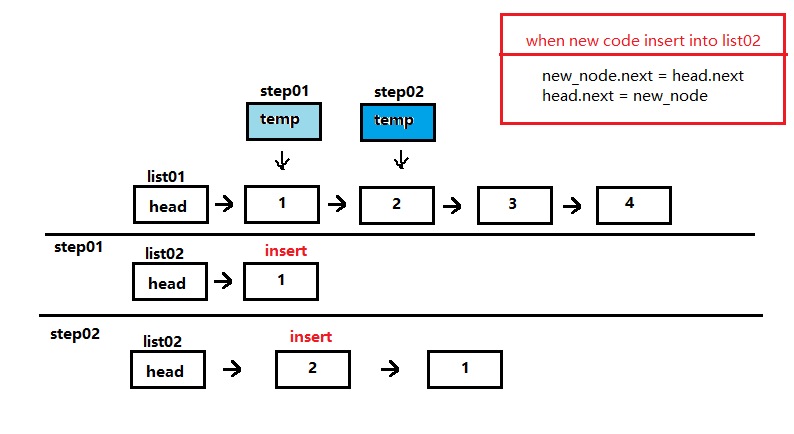
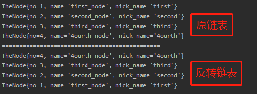

<!-- TOC -->

- [单链表的反转](#单链表的反转)
    - [图解思路](#图解思路)
    - [关键代码](#关键代码)
    - [运行结果](#运行结果)

<!-- /TOC -->

## 单链表的反转
### 图解思路
1) 首先, 创建一个带头节点的链表 list01
2) 然后, 链表反转的时候用新链表 list02 进行接收节点
3) 接着, 开始用临时指针 temp 指向 list01 的有效节点
   - temp 每指向一个有效节点, list02 就插入一个节点
   - 插入节点的时候  
     新建一个拷贝节点, 复制 temp 节点, 防止指向混乱  
     `TheNode copy_node = new TheNode(temp.no,temp.name,temp.nick_name);`  
     `copy_node.next = list02.head_node.next;`,  
     `head_node.next = copy_node`.
   - 当 `temp = null` 时, 停止插入



### 关键代码
```java
    //反转链表
    public SinglyLinkList reversalList(){
        //创建临时指针, 先指向原链表的头节点
        TheNode temp = this.head_node;

        //创建新链表, 用来接受倒置节点
        SinglyLinkList rev_list = new SinglyLinkList();

        //判断链表是否为空, 为空直接返回
        if(temp.next == null){
            System.out.println("the list is empty!");
            return rev_list;
        }

        //temp从第一个有效节点开始进行遍历
        temp = temp.next;
        while(temp != null){
            //复制当前节点
            TheNode copy_node = new TheNode(temp.no,temp.name,temp.nick_name);
            //插入复制节点到新链表
            copy_node.next = rev_list.head_node.next;
            rev_list.head_node.next = copy_node;
            //指针后移
            temp = temp.next;
        }

        //返回反转链表
        return rev_list;
    }
```

### 运行结果
