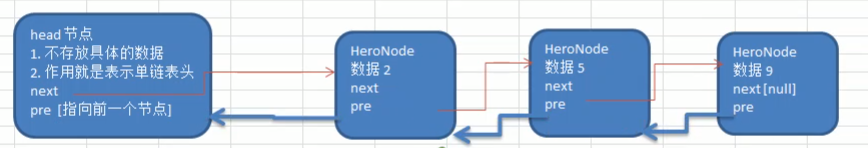

<!-- TOC -->

- [单向链表和双向链表的比较](#%E5%8D%95%E5%90%91%E9%93%BE%E8%A1%A8%E5%92%8C%E5%8F%8C%E5%90%91%E9%93%BE%E8%A1%A8%E7%9A%84%E6%AF%94%E8%BE%83)
- [双向链表示意图](#%E5%8F%8C%E5%90%91%E9%93%BE%E8%A1%A8%E7%A4%BA%E6%84%8F%E5%9B%BE)
- [双向链表的操作分析](#%E5%8F%8C%E5%90%91%E9%93%BE%E8%A1%A8%E7%9A%84%E6%93%8D%E4%BD%9C%E5%88%86%E6%9E%90)
    - [(1) 双向链表的遍历](#1-%E5%8F%8C%E5%90%91%E9%93%BE%E8%A1%A8%E7%9A%84%E9%81%8D%E5%8E%86)
    - [(2) 双向链表的添加节点(默认添加到表最后)](#2-%E5%8F%8C%E5%90%91%E9%93%BE%E8%A1%A8%E7%9A%84%E6%B7%BB%E5%8A%A0%E8%8A%82%E7%82%B9%E9%BB%98%E8%AE%A4%E6%B7%BB%E5%8A%A0%E5%88%B0%E8%A1%A8%E6%9C%80%E5%90%8E)
    - [(3) 双向链表的节点修改](#3-%E5%8F%8C%E5%90%91%E9%93%BE%E8%A1%A8%E7%9A%84%E8%8A%82%E7%82%B9%E4%BF%AE%E6%94%B9)
    - [(4) 双向链表的节点删除](#4-%E5%8F%8C%E5%90%91%E9%93%BE%E8%A1%A8%E7%9A%84%E8%8A%82%E7%82%B9%E5%88%A0%E9%99%A4)

<!-- /TOC -->
****
### 单向链表和双向链表的比较
1) 单向链表查找的方向只能是一个方向;  
   双向链表可以向前或者向后查找.
2) 单向链表不能自我删除, 需要靠辅助节点;   
   双向链表则可以自我删除  
   (单向链表删除时需找到目标节点的前一个节点才能进行删除操作)    

****
### 双向链表示意图
- 每个节点中除了有 next 指针, 用来指向下一节点外
- 每个节点中还有 pre 指针, 用来指向前一个节点

****
### 双向链表的操作分析

#### (1) 双向链表的遍历
- 遍历和单链表思路一样, 但双向链表既可以向前也可以向后遍历

#### (2) 双向链表的添加节点(默认添加到表最后)
1. 通过遍历先找到双向链表最后的节点
2. 用临时指针指向链表最后一个节点 `temp = last_node`
3. 让临时指针的 next 域指向新节点 `temp.next = new_node` 
4. 让新节点的 pre 域指向 temp 节点 `new_node.pre = temp`

#### (3) 双向链表的节点修改
- 和单链表的思路一样

#### (4) 双向链表的节点删除
1. 假设目标删除节点为 del_node
2. 令目标节点的上一节点的 next 域指向目标节点的下一节点  
   `del_node.pre.next = del_node.next`
3. 令目标节点的下一节点的 pre 域指向目标节点的上一节点  
   `del_node.next.pre = del_node.pre`