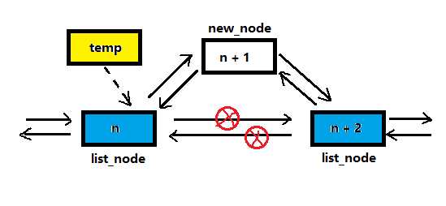

<!-- TOC -->

- [单向链表和双向链表的比较](#单向链表和双向链表的比较)
- [双向链表示意图](#双向链表示意图)
- [双向链表的操作分析](#双向链表的操作分析)
    - [(1) 双向链表的遍历](#1-双向链表的遍历)
    - [(2) 双向链表的添加节点(默认添加到表最后)](#2-双向链表的添加节点默认添加到表最后)
    - [(3) 双向链表的节点修改](#3-双向链表的节点修改)
    - [(4) 双向链表的节点删除](#4-双向链表的节点删除)
    - [(5) 双向链表的顺序插入](#5-双向链表的顺序插入)

<!-- /TOC -->
****
### 单向链表和双向链表的比较
1) 单向链表查找的方向只能是一个方向;  
   双向链表可以向前或者向后查找.
2) 单向链表不能自我删除, 需要靠辅助节点;   
   双向链表则可以自我删除  
   (单向链表删除时需找到目标节点的前一个节点才能进行删除操作)    

****
### 双向链表示意图
- 每个节点中除了有 next 指针, 用来指向下一节点外
- 每个节点中还有 pre 指针, 用来指向前一个节点

****
### 双向链表的操作分析

#### (1) 双向链表的遍历
- 遍历和单链表思路一样, 但双向链表既可以向前也可以向后遍历

#### (2) 双向链表的添加节点(默认添加到表最后)
1. 通过遍历先找到双向链表最后的节点
2. 用临时指针指向链表最后一个节点 `temp = last_node`
3. 让临时指针的 next 域指向新节点 `temp.next = new_node` 
4. 让新节点的 pre 域指向 temp 节点 `new_node.pre = temp`

#### (3) 双向链表的节点修改
- 和单链表的思路一样

#### (4) 双向链表的节点删除
1. 假设目标删除节点为 del_node
2. 令目标节点的上一节点的 next 域指向目标节点的下一节点  
   `del_node.pre.next = del_node.next`
3. 令目标节点的下一节点的 pre 域指向目标节点的上一节点  
   `del_node.next.pre = del_node.pre`

#### (5) 双向链表的顺序插入
- **图解**   
    

  - 为了防止插入节点的编号大于所有节点的编号,  
    即要插入的节点会排在链表最尾端,   
    因此 temp 指针指向的是要插入位置的前一个节点,  
    防止指针向后移位后出现空指针异常

  - 找到要插入位置的前一位的节点后,  
    开始进行节点插入,  因为 temp 节点已经被定位,  
    首要处理的是 temp 的下一位节点

  - 处理顺序为:  
    - 先对 temp.next 是否为空进行判断, 防止空指针异常,  
      如果为空前两步操作可以跳过, 因为插入的节点在链表尾端.
    - `temp.next.pre = new_node`
    - `new_node.next = temp.next`
    - `new_node.pre = temp`
    - `temp.next = new_node`