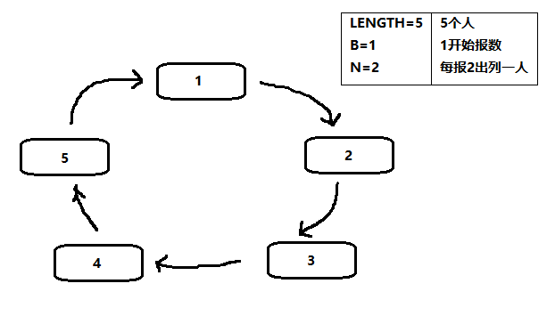

<!-- TOC -->

- [约瑟夫问题(Josephus problem)](#%e7%ba%a6%e7%91%9f%e5%a4%ab%e9%97%ae%e9%a2%98josephus-problem)
  - [(1)问题描述](#1%e9%97%ae%e9%a2%98%e6%8f%8f%e8%bf%b0)
  - [(2)解决方案](#2%e8%a7%a3%e5%86%b3%e6%96%b9%e6%a1%88)
  - [(3)实例图示](#3%e5%ae%9e%e4%be%8b%e5%9b%be%e7%a4%ba)

<!-- /TOC -->

## 约瑟夫问题(Josephus problem)

### (1)问题描述
设编号为 1,2,...,n 的 n 个人围坐一圈,  
约定编号为 k (1 <= k <= n) 的人从 1 开始报数,  
数到 m 的那个人出列, 他的下一位又从 1 开始报数,  
数到 m 的那个人又出列, 以此类推,  
直到所有人出列为止, 由此产生一个出列编号的序列.

****
### (2)解决方案
用一个不带头节点的循环链表来处理约瑟夫问题  
先构成一个有 n 个节点的单循环链表,  
然后由 k 节点起从 1 开始计数,  
计到 m 时, 对应节点从链表中删除,  
然后再从被删除节点的下一个节点起从 1 开始计数,  
直到最后一个节点从链表中删除为止.

****
### (3)实例图示
- 假设有 5 个节点  
  

- 从编号为 1 的节点开始报数, 报数到 2 的人出列  
  即当前节点后 N-1 个节点出列  
  因此第一次出列的节点编号为 2