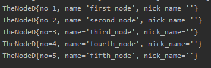
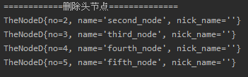

<!-- TOC -->

- [构建无头节点的单向环形链表思路](#构建无头节点的单向环形链表思路)
    - [(1)节点类的构建](#1节点类的构建)
    - [(2)单向环链表类需要的成员](#2单向环链表类需要的成员)
- [无头节点的单向环形链表操作分析](#无头节点的单向环形链表操作分析)
    - [(1)增加节点](#1增加节点)
        - [操作思路](#操作思路)
        - [方法代码](#方法代码)
    - [(2)删除节点](#2删除节点)
        - [操作思路](#操作思路)
        - [方法代码](#方法代码)
- [代码实现](#代码实现)
    - [(1)节点类](#1节点类)
    - [(2)链表类](#2链表类)
- [测试结果](#测试结果)
    - [(1)新建链表并加入节点](#1新建链表并加入节点)
    - [(2)删除链表的头节点](#2删除链表的头节点)

<!-- /TOC -->

## 构建无头节点的单向环形链表思路
### (1)节点类的构建
- 与单链表的节点类一致, 需要有 next 域即可

****
### (2)单向环链表类需要的成员
- 必须要有一个头指针 head_pointer
  - 头指针的作用在于可以定位无头节点的链表,   
    若环形链表没有头节点需要头指针定位
    
- 如果需要判断链尾, 则需要加入尾指针 tail_pointer  
  - 尾指针的作用在于定位链表尾端, 方便新节点插入

- 构造函数可以选择带参数的 如下:   
  ```java
  public CircleLinkList(TheNode first_node){
    head_pointer = first_node;
    tail_pointer = first_node;
    first_node.next = first_node;
    //TODO...   
  }
  ```
  - 带参数的构造函数可以直接在初始化的时候就让头尾指针初始化  
    不需要在后续增加节点的方法中判断头尾指针是否为空


## 无头节点的单向环形链表操作分析
### (1)增加节点
#### 操作思路
- 首先判断链表是否为空, 为空重新初始化链表
- 若链表不为空, 则按照如下流程进行插入节点
  - 首先将尾指针指向节点的 next 域定位到新节点  
    `tail_pointer.next = new_node;`  
  - 然后将尾指针指向到新节点  
    `tail_pointer = new_node;`  
  - 最后新节点成为了尾结点后, 将其 next 域指向头指针指向的节点  
    `new_node.next = head_pointer;`  

#### 方法代码
```java
    // region 增加节点到链表尾部
    public void addNode(TheNodeC new_node){
        //当链表为空的时候, 重新初始化
        if(head_pointer == null && tail_pointer == null){
            head_pointer = new_node;
            tail_pointer = new_node;
            new_node.next = new_node;
        }

        //链表有节点的时候, 直接加入到链表尾部
        tail_pointer.next = new_node;
        tail_pointer = new_node;
        new_node.next = head_pointer;
    }
    // endregion
```

****
### (2)删除节点
#### 操作思路
- 先进行节点的遍历, 从头指针开始,   
  因为是单向链表, 所以要找到删除节点的上一节点  
  定义一个临时指针指向头节点再开始循环遍历
  
- 判断当前节点下一节点`temp.next`是否为目标节点
  - 如果是目标节点
    - 判断头尾指针是否相等
      - 如果相等, 说明链表只剩一个节点, 将头尾指针置空即可, 然后跳出循环.
    - 判断是否为头节点
      - 如果为头节点, 则头指针后移一位再去删除当前节点.  
        因为如果当前节点的下一位是头节点,  
        头指针后移则指向当前节点下一位的下一位.  
        `head_pointer = temp.next.next`

    - 判断是否为尾节点
      - 如果是尾节点, 则尾指针前移一位再去删除当前节点.   
        因为如果当前节点的下一位是尾节点,  
        尾指针前移则指向当前节点.  
        `tail_pointer = temp`
        
    - 既不是头节点也不是尾结点则直接删除即可, 然后跳出循环  
      `temp.next = temp.next.next`
  
  - 如果不是目标节点
    - 节点后移, 直到节点找到目标节点或回到头节点为止


#### 方法代码
```java
    //region 删除选中节点, 根据编号进行删除
    public void delNode(int num){
        //遍历节点
        TheNodeC temp = head_pointer;
        while (true){
            //判断当前节点下一节点是否为目标节点
            if(temp.next.no == num){
                //链表只剩最后一个节点, 则头尾指针置空, 跳出循环
                if(head_pointer == tail_pointer){
                    head_pointer = null;
                    tail_pointer = null;
                    break;
                }

                //删除的是头节点
                if(temp.next == head_pointer){
                    head_pointer = temp.next.next;
                }

                //删除的是尾结点
                if(temp.next == tail_pointer){
                    tail_pointer = temp;
                }

                //删除目标节点, 并跳出循环
                temp.next = temp.next.next;
                break;
            }

            //节点后移
            temp = temp.next;

            //循环一圈最后回到头节点, 则视为找不到目标节点
            if(temp == head_pointer){
                System.out.println("the node is not existed!");
                break;
            }
        }
    }
    //endregion
```

## 代码实现
### (1)节点类
```java
package com.leo9.dc06.circle_link_list;

public class TheNodeC {
    public int no;
    public String name;
    public String nick_name;
    //节点的next域
    public TheNodeC next;


    //定义构造器
    public TheNodeC(int no, String name, String nick_name){
        this.no = no;
        this.name = name;
        this.nick_name = nick_name;
    }

    //重写toString方法

    @Override
    public String toString() {
        return "TheNodeD{" +
                "no=" + no +
                ", name='" + name + '\'' +
                ", nick_name='" + nick_name + '\'' +
                '}';
    }
}

```

****
### (2)链表类
```java
package com.leo9.dc06.circle_link_list;

public class CircleLinkList {
    //定义头尾指针
    private TheNodeC head_pointer;
    private TheNodeC tail_pointer;

    //构造函数, 必须带参数
    public CircleLinkList(TheNodeC first_node){
        head_pointer = first_node;
        tail_pointer = first_node;
        first_node.next = first_node;
    }
    
    //region 输出链表
    public void showList(){
        //先判断链表是否为空
        if(head_pointer == null){
            System.out.println("the list is empty!");
        }

        //设置辅助指针指向当前链表的头指针指向节点
        TheNodeC temp = head_pointer;
        while (true){
            //输出当前节点
            System.out.println(temp);

            //节点后移
            temp = temp.next;

            //判断链表是否循环一圈
            if(temp == head_pointer){
                break;
            }
        }
    }
    //endregion

    // region 增加节点到链表尾部
    public void addNode(TheNodeC new_node){
        //当链表为空的时候, 重新初始化
        if(head_pointer == null && tail_pointer == null){
            head_pointer = new_node;
            tail_pointer = new_node;
            new_node.next = new_node;
        }

        //链表有节点的时候, 直接加入到链表尾部
        tail_pointer.next = new_node;
        tail_pointer = new_node;
        new_node.next = head_pointer;
    }
    // endregion

    //region 删除选中节点, 根据编号进行删除
    public void delNode(int num){
        //遍历节点
        TheNodeC temp = head_pointer;
        while (true){
            //判断当前节点下一节点是否为目标节点
            if(temp.next.no == num){
                //链表只剩最后一个节点, 则头尾指针置空, 跳出循环
                if(head_pointer == tail_pointer){
                    head_pointer = null;
                    tail_pointer = null;
                    break;
                }

                //删除的是头节点
                if(temp.next == head_pointer){
                    head_pointer = temp.next.next;
                }

                //删除的是尾结点
                if(temp.next == tail_pointer){
                    tail_pointer = temp;
                }

                //删除目标节点, 并跳出循环
                temp.next = temp.next.next;
                break;
            }

            //节点后移
            temp = temp.next;

            //循环一圈最后回到头节点, 则视为找不到目标节点
            if(temp == head_pointer){
                System.out.println("the node is not existed!");
                break;
            }
        }
    }
    //endregion
}
```

## 测试结果
### (1)新建链表并加入节点
- 代码如下   
```java
  CircleLinkList crlist = new CircleLinkList(new TheNodeC(1,"first_node",""));
  crlist.addNode(new TheNodeC(2,"second_node",""));
  crlist.addNode(new TheNodeC(3,"third_node",""));
  crlist.addNode(new TheNodeC(4,"fourth_node",""));
  crlist.addNode(new TheNodeC(5,"fifth_node",""));
  crlist.showList();
```

- 运行截图  


****
### (2)删除链表的头节点
- 代码如下
```java
  System.out.println("============删除头节点==============");
  crlist.delNode(1);
  crlist.showList();
```

- 运行截图  
