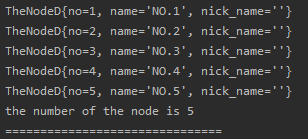
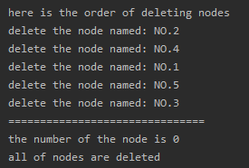
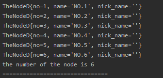
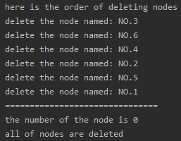

<!-- TOC -->

- [定义节点类(和其它链表的大同小异)](#定义节点类和其它链表的大同小异)
- [定义链表类(增加了些细节)](#定义链表类增加了些细节)
- [定义测试类(类中包含约瑟夫环循环)](#定义测试类类中包含约瑟夫环循环)
- [测试结果](#测试结果)
    - [(1)循环增加节点(5 个节点)](#1循环增加节点5-个节点)
    - [(2)约瑟夫环循环(报数为 2)](#2约瑟夫环循环报数为-2)
- [再次测试结果](#再次测试结果)
    - [(1)循环增加节点(6 个节点)](#1循环增加节点6-个节点)
    - [(2)约瑟夫环循环(报数为 3)](#2约瑟夫环循环报数为-3)

<!-- /TOC -->

## 定义节点类(和其它链表的大同小异)
```java
package com.leo9.dc06.circle_link_list;

public class TheNodeC {
    public int no;
    public String name;
    public String nick_name;
    //节点的next域
    public TheNodeC next;


    //定义构造器
    public TheNodeC(int no, String name, String nick_name){
        this.no = no;
        this.name = name;
        this.nick_name = nick_name;
    }

    //重写toString方法

    @Override
    public String toString() {
        return "TheNodeD{" +
                "no=" + no +
                ", name='" + name + '\'' +
                ", nick_name='" + nick_name + '\'' +
                '}';
    }
}

```

## 定义链表类(增加了些细节) 
```java
package com.leo9.dc06.circle_link_list;


public class CircleLinkList {
    //定义头尾指针
    private TheNodeC head_pointer;
    private TheNodeC tail_pointer;

    //定义链表的节点数
    private int num_of_node;

    //构造函数, 带参数
    public CircleLinkList(TheNodeC first_node){
        head_pointer = first_node;
        tail_pointer = first_node;
        first_node.next = first_node;
    }

    //构造函数, 不带参数
    public CircleLinkList(){}

    //获取节点数
    public int getNum_of_node() {
        return num_of_node;
    }

    //获取头指针
    public TheNodeC getHead_pointer() {
        return head_pointer;
    }

    //获取尾指针
    public TheNodeC getTail_pointer() {
        return tail_pointer;
    }

    //region 输出链表
    public void showList(){
        //先判断链表是否为空
        if(head_pointer == null){
            System.out.println("the list is empty!");
        }

        //设置辅助指针指向当前链表的头指针指向节点
        TheNodeC temp = head_pointer;
        while (true){
            //输出当前节点
            System.out.println(temp);

            //节点后移
            temp = temp.next;

            //判断链表是否循环一圈
            if(temp == head_pointer){
                break;
            }
        }
    }
    //endregion

    // region 增加节点到链表尾部
    public void addNode(TheNodeC new_node){
        //当链表为空的时候, 重新初始化
        if(head_pointer == null && tail_pointer == null){
            head_pointer = new_node;
            tail_pointer = new_node;
            new_node.next = new_node;
        }

        //链表有节点的时候, 直接加入到链表尾部
        tail_pointer.next = new_node;
        tail_pointer = new_node;
        new_node.next = head_pointer;

        //节点数+1
        num_of_node ++;
    }
    // endregion

    //region 删除选中节点, 根据编号进行删除
    public void delNode(int num){
        //判断链表是否为空
        if(num_of_node == 0){
            System.out.println("list is empty!");
            return;
        }

        //定义临时指针
        TheNodeC temp = head_pointer;

        //遍历节点
        while (true){
            //判断当前节点下一节点是否为目标节点
            if(temp.next.no == num){
                //链表只剩最后一个节点, 则头尾指针置空, 跳出循环
                if(head_pointer == tail_pointer){
                    head_pointer = null;
                    tail_pointer = null;
                    break;
                }

                //删除的是头节点
                if(temp.next == head_pointer){
                    head_pointer = temp.next.next;
                }

                //删除的是尾结点
                if(temp.next == tail_pointer){
                    tail_pointer = temp;
                }

                //删除目标节点, 并跳出循环
                temp.next = temp.next.next;
                break;
            }

            //节点后移
            temp = temp.next;

            //循环一圈最后回到头节点, 则视为找不到目标节点
            if(temp == head_pointer){
                System.out.println("the node is not existed!");
                break;
            }
        }
        //节点数-1
        num_of_node --;
    }
    //endregion
}
```

## 定义测试类(类中包含约瑟夫环循环)
```java
package com.leo9.dc06.circle_link_list;


public class TestDemoCLL {
    public static void main(String[] args) {
        //region 约瑟夫环实现

        //创建链表
        CircleLinkList crlist = new CircleLinkList();

        //循环增加节点
        for(int i = 1; i < 6; i++){
            crlist.addNode(new TheNodeC(i,"NO." + i,""));
        }

        crlist.showList();
        System.out.println("the number of the node is " + crlist.getNum_of_node());
        System.out.println("===============================");

        //开始报数
        System.out.println("here is the order of deleting nodes");
        //定义临时节点,并指向第一个节点
        TheNodeC temp = crlist.getHead_pointer();
        while(crlist.getNum_of_node() != 0){
            //若设定报数为2出列,则当前节点的下一节点则为出列节点
            int del_no = temp.next.no;
            System.out.println("delete the node named: NO." + del_no);

            //删除目标节点
            crlist.delNode(del_no);

            //temp指针后移
            temp = temp.next;
        }

        System.out.println("===============================");
        System.out.println("the number of the node is " + crlist.getNum_of_node());
        System.out.println("all of nodes are deleted");
        //endregion
    }

}

```

## 测试结果
### (1)循环增加节点(5 个节点)
如下所示, 无参构造器生成空链表并循环加入节点后, 正确输出  
- 运行截图  



### (2)约瑟夫环循环(报数为 2)
如下所示, 输出顺序为 2-4-1-5-3, 是正确顺序  
- 运行截图   

****

## 再次测试结果
这里需要自行修改代码中对应位置, 具体不再展示
### (1)循环增加节点(6 个节点)
如下所示, 无参构造器生成空链表并循环加入节点后, 正确输出  
- 运行截图  



### (2)约瑟夫环循环(报数为 3)
如下所示, 输出顺序为 3-6-4-2-5-1, 是正确顺序  
- 运行截图   
