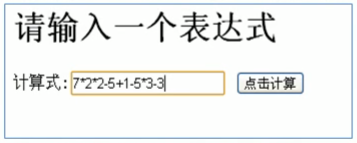
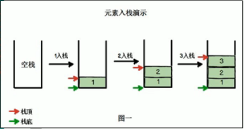
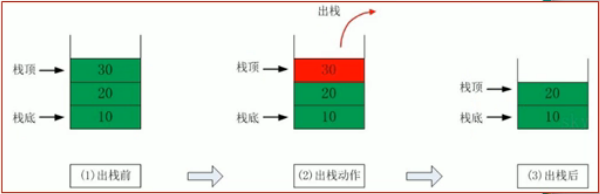

<!-- TOC -->

- [栈的应用场景](#栈的应用场景)
    - [栈的一个实际需求](#栈的一个实际需求)
    - [栈的应用](#栈的应用)
- [栈的介绍](#栈的介绍)
    - [(1)栈的概述](#1栈的概述)
    - [(2)入栈和出栈的概念](#2入栈和出栈的概念)
        - [入栈(push)](#入栈push)
        - [出栈(pop)](#出栈pop)

<!-- /TOC -->

## 栈的应用场景
### 栈的一个实际需求
- 输入表达式进行计算, 如下图所示  
  

- 对于计算机而言, 是收到了一串字符串`"7*2*2-5+1-5+3-3"`.  
  计算机应该怎么理解这个算式, 才能得到计算结果.

****
### 栈的应用
1. 子程序的调用:  
   在跳往子程序前, 会先将下一个指令的地址存到堆栈中,  
   直到子程序执行完后再将地址取出, 以回到原来的程序中.

2. 处理递归调用:  
   和子程序的调用类似, 只是除了储存下一个指令的地址外,  
   也将参数, 区域变量等数据存入堆栈中.

3. 表达式的转换与求值(中缀表达式转后缀表达式)

4. 二叉树的遍历

5. 图形的深度优先搜索法(depth-first)

## 栈的介绍
### (1)栈的概述
- 栈的英文为 stack
- 栈是一个先进后出的有序列表(FILO- First In Last Out)
- 栈是限制元素的插入和删除只能在线性表的同一端进行的一种特殊线性表.   
  - 允许插入和删除的一端为变化的一端, 成为栈顶(top)  
  - 另一端为固定的一端, 称为栈底(bottom)
- 根据栈的定义可知:  
  - 插入元素时, 最先入栈的元素在栈底, 最后入栈的元素在栈顶
  - 删除元素时, 最后入栈的元素最先删除, 最先入栈的最后删除

****
### (2)入栈和出栈的概念
#### 入栈(push)
- 假设有两个指针, 分别为栈顶和栈底指针, 指向栈顶和栈底.
- 当元素入栈时, 栈顶指针会向上移动
- 栈底指针只会一直保持指向栈底 

#### 出栈(pop)
- 元素出栈时, 栈顶指针向下移动
- 栈底指针依旧是指向栈底, 并不会发生变化  

