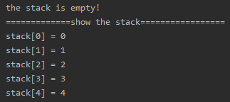
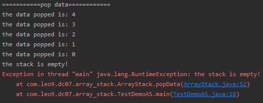

<!-- TOC -->

- [创建数组栈类模拟栈结构](#创建数组栈类模拟栈结构)
- [创建测试类](#创建测试类)
- [测试结果](#测试结果)
    - [(1)入栈测试](#1入栈测试)
    - [(2)出栈测试](#2出栈测试)

<!-- /TOC -->

## 创建数组栈类模拟栈结构
```java
package com.leo9.dc07.array_stack;

/*
* 定义一个数组栈的类表示栈结构
* */
public class ArrayStack {
    //定义栈的最大大小
    private int maxSize;
    //定义一个数组, 模拟栈的结构, 数据存放于数组中
    private int[] stack;
    //定义栈顶指针, 初始值为 -1, 没有数据时就是 -1 表示没有数据
    private int top = -1;

    //定义构造器
    public ArrayStack(int maxSize){
        //定义数组的最大存储位
        this.maxSize = maxSize;
        //初始化数组
        stack = new int[maxSize];
    }

    //判断栈是否为满
    public Boolean isFull(){
        //当栈顶指针+1等于栈最大存储位时, 栈满
        return top + 1 == maxSize;
    }

    //判断栈是否为空
    public Boolean isEmpty(){
        //当栈顶指针变回-1的时候, 栈空
        return top == -1;
    }

    //数据入栈
    public void pushData(int data){
        //判断栈是否存满
        if(isFull()){
            System.out.println("the stack is full!");
            return;
        }

        //栈顶指针上移
        top++;
        //存入数据
        stack[top] = data;
    }

    //数据出栈
    public int popData(){
        //判断栈是否为空
        if(isEmpty()){
            throw new RuntimeException("the stack is empty!");
        }

        //取得数据
        int val = stack[top];
        //指针下移
        top--;
        //返回数据
        return val;
    }

    //遍历栈
    public void showStack(){
        if(isEmpty()){
            System.out.println("the stack is empty!");
            return;
        }
        for(int i = 0; i <= top; i++){
            System.out.println("stack[" + i + "] = " + stack[i]);
        }
    }
}


```

## 创建测试类
```java
package com.leo9.dc07.array_stack;

public class TestDemoAS {
    public static void main(String[] args) {
        ArrayStack stack = new ArrayStack(5);
        stack.showStack();
        for(int i = 0; i < 5; i++){
            stack.pushData(i);
        }
        System.out.println("=============show the stack=================");
        stack.showStack();

        System.out.println("===========pop data============");
        for(int i = 4; i >=0; i--){
            System.out.println("the data popped is: " + stack.popData());
        }
        stack.showStack();
        stack.popData();
    }
}

```

## 测试结果
### (1)入栈测试
- 建立空栈后进行输出测试, 提示为空   
- 循环入栈后, 进行栈数组循环, 输出栈结构   


### (2)出栈测试
- 循环出栈, 将栈清空   
- 清空后再输出栈结构, 提示栈为空   
- 再进行出栈操作, 抛出空栈异常  
