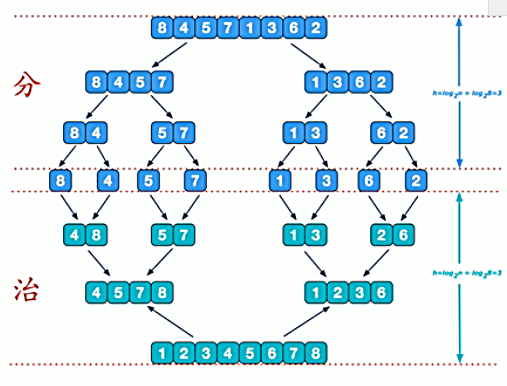
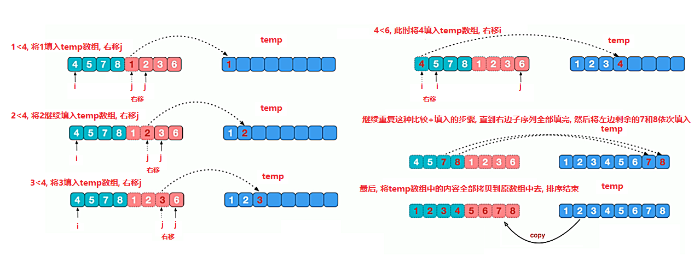

<!-- TOC -->

- [1.归并排序整体分析](#1归并排序整体分析)
  - [基本介绍](#基本介绍)
  - [算法图解](#算法图解)
    - [流程概述](#流程概述)
    - [合并图示](#合并图示)
- [2.归并排序代码实现](#2归并排序代码实现)
  - [整体代码](#整体代码)
  - [测试结果](#测试结果)
    - [一个数组](#一个数组)
    - [测试 8 万个数据的随机数组](#测试-8-万个数据的随机数组)

<!-- /TOC -->

## 1.归并排序整体分析
### 基本介绍
- 归并排序(merge sort)是利用归并的思想实现的排序方法

- 算法采用经典的分治(divide&conquer)策略

- 分治法将问题分成一些小的问题然后递归求解,   
  最后将各个分解出来的问题的答案进行合并.

****
### 算法图解
#### 流程概述
- 可以看到这种结构很像一颗完全二叉树
- 归并排序可以用递归去实现, 也可以用迭代去实现
- 分治算法的核心在于合并, 拆分过程仅仅只是拆分数组而已



****
#### 合并图示
用最后一趟合并来示例算法的合并阶段的流程
- 在最后一趟排序中是要将 2 个分出来排好序的不同部分合并

- 首先定义指针 i 和 j 分别指向每个部分的首位元素

- 将 i 和 j 所指向的元素进行比较, 将小的那一位移入 temp 数组,  
  然后将指针向后移动, 循环元素比较的过程, 直到一边的指针移出边界外为止

- 当有一方的指针已经超出边界, 另一方则把剩下的元素以当前指针指向为起点,  
  顺序将剩余元素都移入 temp 数组中

- 当两边的指针都超出边界时, 说明数组排序完毕,  
  然后将 temp 数组拷贝给原数组, 完成排序



****
## 2.归并排序代码实现
### 整体代码

```java
package com.leo9.dc16.merge_sort;

import java.util.Arrays;

public class MergeSort {
    public static void main(String[] args) {
        int[] arr = {9,8,7,5,6,4,3,2,1,123};
        System.out.println("Origin Array -> " + Arrays.toString(arr));
        mergeSort(arr);
        System.out.println("Sorted Array -> " + Arrays.toString(arr));
    }

    //整合方法, 在排序递归前先定义好各种传递参数
    public static void mergeSort(int[] arr){
        //定义临时数组
        int[] temp = new int[arr.length];
        //传入参数, 并开始递归排序
        mergeSort(arr, 0, arr.length-1, temp);
    }

    //归并排序拆分方法 最后进行合并
    public static void mergeSort(int[] arr, int left, int right, int[] temp){
        if(left < right){
            //求出中间索引
            int mid = (left + right) / 2;
            //向左递归进行拆分
            mergeSort(arr, left, mid, temp);
            //向右递归进行拆分, 这里注意mid要加一, 要作为新的右边子数组的左边界
            mergeSort(arr, mid + 1, right, temp);
            //将两个有序子数组排序合并, 按照堆栈思想第一次拆分时的最大的索引是最后才进行排序运算的
            mergeArray(arr, left, mid, right, temp);
        }
    }

    //归并排序合并方法
    /**
     * @param arr 排序的原始数组
     * @param left 左边有序序列的初始索引
     * @param mid 中间索引
     * @param right 右边有序序列的初始索引
     * @param temp 中转数组
     * */
    public static void mergeArray(int[] arr, int left, int mid, int right, int[] temp){
        //初始化i, 表示左边有序序列的初始索引
        int i = left;
        //初始化j, 表示右边有序序列的初始索引
        int j = mid + 1;
        //初始化t, 指向temp数组的当前索引
        int t = 0;

        //第一步
        //先把左右两边(有序)的数据按照规则填充到temp数组
        //直到左右两边的有序序列有一边处理完毕为止
        while(i <= mid && j <= right){
            //若左侧有序数组当前指向元素小于等于右侧有序数组当前指向元素
            //则先将小的元素放入临时数组, 由小到大进行排序
            if(arr[i] <= arr[j]){
                temp[t] = arr[i];
                i++;
                t++;
            }
            else{
                temp[t] = arr[j];
                j++;
                t++;
            }
        }


        //第二步
        //把另一边剩余的数据一次全部填充到temp中
        while (i <= mid){
            temp[t] = arr[i];
            t++;
            i++;
        }
        while (j <= right){
            temp[t] = arr[j];
            t++;
            j++;
        }

        //第三步
        //将temp数组中的数据拷贝到原数组arr中
        //并非每次都是拷贝整个数组的数组, 因为每次拆分的长度是不一样的
        //因此需要按照拆分边界进行划分
        t = 0;
        while(left <= right){
            arr[left] = temp[t];
            left++;
            t++;
        }
    }
}

```

### 测试结果

#### 一个数组


#### 测试 8 万个数据的随机数组
平均时间大约 0.04s 内, 用 800 万个数据测是 4s 内