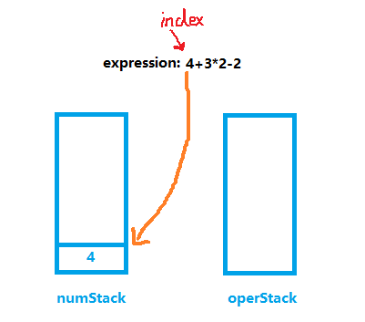
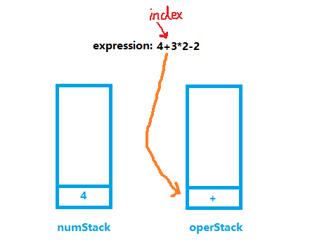
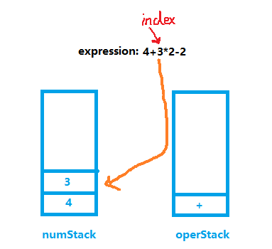
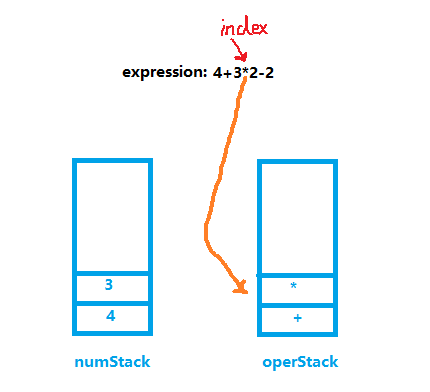
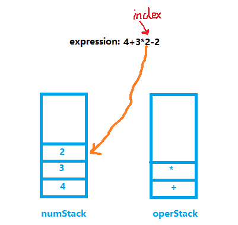
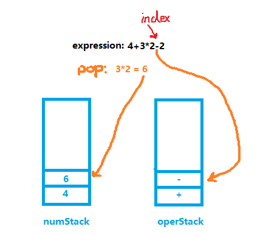
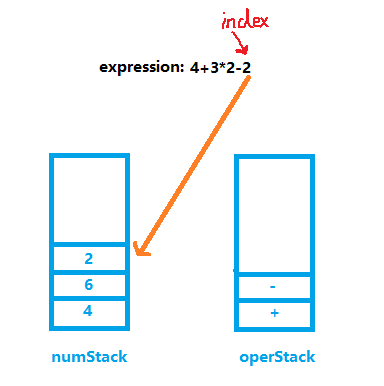
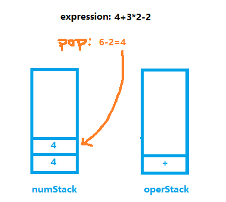
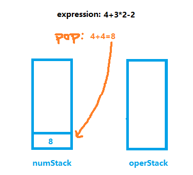
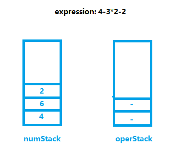

<!-- TOC -->

- [使用栈完成计算一个表达式的结果](#%e4%bd%bf%e7%94%a8%e6%a0%88%e5%ae%8c%e6%88%90%e8%ae%a1%e7%ae%97%e4%b8%80%e4%b8%aa%e8%a1%a8%e8%be%be%e5%bc%8f%e7%9a%84%e7%bb%93%e6%9e%9c)
  - [(1)实现思路](#1%e5%ae%9e%e7%8e%b0%e6%80%9d%e8%b7%af)
  - [(2)思路图例](#2%e6%80%9d%e8%b7%af%e5%9b%be%e4%be%8b)
    - [拿算式 4+3*2-2 来说明流程](#%e6%8b%bf%e7%ae%97%e5%bc%8f-432-2-%e6%9d%a5%e8%af%b4%e6%98%8e%e6%b5%81%e7%a8%8b)
    - [STEP1](#step1)
    - [STEP2](#step2)
    - [STEP3](#step3)
    - [STEP4](#step4)
    - [STEP5](#step5)
    - [STEP6](#step6)
    - [STEP7](#step7)
    - [STEP8](#step8)
  - [(3)缺陷和修复](#3%e7%bc%ba%e9%99%b7%e5%92%8c%e4%bf%ae%e5%a4%8d)
    - [减法/除法失误](#%e5%87%8f%e6%b3%95%e9%99%a4%e6%b3%95%e5%a4%b1%e8%af%af)
    - [解决方案](#%e8%a7%a3%e5%86%b3%e6%96%b9%e6%a1%88)
    - [多位数入栈错误](#%e5%a4%9a%e4%bd%8d%e6%95%b0%e5%85%a5%e6%a0%88%e9%94%99%e8%af%af)
    - [解决方案](#%e8%a7%a3%e5%86%b3%e6%96%b9%e6%a1%88-1)

<!-- /TOC -->

## 使用栈完成计算一个表达式的结果
### (1)实现思路
- 创建两个栈. 一个是数栈, 一个是符号栈.
  - 数栈(numStack): 存放数
  - 符号栈(operStack): 存放运算符

- 创建一个 index 指针, 对表达式字符串进行遍历
  - 扫描结果是数字, 直接将值压入数栈
  - 扫描结果是操作符, 分如下情况:  
    1. 如果当前符号栈为空, 直接将符号压入符号栈
    2. 如果如果符号栈有操作符, 就进行比较.  
       - 如果当前的操作符优先级小于或等于栈中操作符,  
         就需要从数栈中出栈两个数, 从符号栈中出栈一个符号,  
         进行运算得出结果, 将结果入数栈, 再将当前操作符入符号栈.
       - 如果当前的符号优先级大于栈中操作符, 直接入栈.

- 当表达式扫描完毕后, 按顺序从数栈和符号栈中进行出栈,  
  将相应的数和符号进行运算, 并将结果压入数栈.  
- 最后数栈只有一个数字, 就是表达式的结果

### (2)思路图例
#### 拿算式 4+3*2-2 来说明流程
- 首先创建 index 指针, 用来一位位的截取表达式中的字符
- 创建两个栈, 分别为数栈和符号栈
- 然后开始扫描表达式

****
#### STEP1
- index 第一步指向 "4", 因为 4 是数字, 所以直接入栈  
  

****
#### STEP2
- index 下一步指向的是 "+", "+" 是符号  
- 此时符号栈为空, 因此也是直接入栈即可  
  

****
#### STEP3
- index 下一步指向的是 "3", 3 是数字, 直接入栈  
  

****
#### STEP4
- index 下一步指向 "*", 是符号, 要比较优先级  
- 因为 "*" 的优先级高于 "+", 因此直接入栈  
  

****
#### STEP5
- index 下一步指向 "2", 直接入栈即可  
  

****
#### STEP6
- index 下一步指向 "-", 要比较优先级
- "-" 的优先级低于 "*", 因此要先进行运算操作
- 数字栈出栈 2 位数字, 符号栈出栈 1 位符号, 进行运算 
- 最后将运算结果 "6" 和 "-" 分别压入数字栈和符号栈   
  

****
#### STEP7
- index 最后指向的是数字 "2", 直接入栈  
  

****
#### STEP8
- 表达式扫描完毕后, 两个栈开始出栈
- 直到符号栈为空时, 数字栈只剩最终运算结果  
  
  

### (3)缺陷和修复

#### 减法/除法失误
- 当表达式为 4-3*2-2 的时候, 该式正确结果为 -4
- 表达式扫描完时, 两个栈存储如下
    
- 因此在出栈运算的时候会出现 4-(6-2) 的问题, 导致结果为 0
- 除法符号也会出现类似的问题

#### 解决方案
- 需要在符号第一次比较完优先级后, 再比较一次优先级, 但要先判断符号栈非空
  - 第一次比较的时候, 如果当前指针指向的运算符优先级小于等于栈顶运算符,  
    符号栈出栈一位, 并进行运算
  - 第二次再进行比较, 若当前指向运算符优先级依旧小于等于栈顶运算符,  
    符号栈再出栈一位, 并进行运算
- 这种操作能让符号栈的占位始终不超过两位, 且解决减号除号运算错误的缺陷

****
#### 多位数入栈错误
- 当表达式出现不是个位数的时候, 会拆分数字每一位存储, 导致存储错误

#### 解决方案
- 处理多位数时, 不能立即入栈, 要先判断后一位是否为符号再决定入栈
- 循环扫描直到下一位为符号位才停止