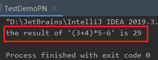

## 逆波兰计算器的设计步骤
1) 输入一个逆波兰表达式(后缀表达式), 使用栈(Stack)计算其结果
2) 支持小括号和多位数证书, 因为主要用于数据结构演示, 复杂功能省略
3) 计算思路分析
4) 代码实现

## 实现代码
### (1)主方法
- 实现细节看注释即可

```java
package com.leo9.dc08.poland_notation;

import java.util.ArrayList;
import java.util.List;
import java.util.Stack;

public class TestDemoPN {
    public static void main(String[] args) {
        //先定义逆波兰表达式
        //表达式 `(3+4)*5-6` 对应的后缀表达式是 `3 4 + 5 * 6 -`
        //为了方便, 逆波兰表达式的数字和符号用空格隔开
        String suffixExpression = "3 4 + 5 * 6 -";
        //思路
        //1.先将逆波兰表达式放到ArrayList中
        //2.将ArrayList传递给一个方法,遍历ArrayList配合栈完成计算
        List<String> rpnList = getListString(suffixExpression);

        int res = calculate(rpnList);
        System.out.println("the result of '(3+4)*5-6' is " + res);
    }

    //将一个逆波兰表达式依次将数字和运算符放入到ArrayList中
    public static List<String> getListString(String suffixExpression){
        //将suffixExpression以空格进行分分割
        String[] split = suffixExpression.split(" ");
        //创建一个ArrayList
        List<String> list = new ArrayList<String>();
        //遍历字符串数组, 并用list接收数字和运算符
        for(String ele: split){
            list.add(ele);
        }
        return list;
    }

    //完成对逆波兰表达式的运算
    /*
    1. 从左到右扫描表达式
    2. 遇到数字时, 将数字压入堆栈
    3. 遇到运算符时, 弹出栈顶的两个数,用运算符对它们做计算, 并将结果入栈.
    4. 重复上述过程直到表达式最右端,最后得到的运算结果就是表达式的最终结果.
   */

    public static int calculate(List<String> ls){
        //创建一个栈, 且只需要一个栈即可
        Stack<String> stack = new Stack<String>();
        //遍历ArrayList
        for(String item: ls){
            //使用正则表达式来取出数
            if(item.matches("\\d+")){
                //匹配的是多位数, 入栈
                stack.push(item);
            }
            else{
                //pop出两个数, 并运算, 再入栈
                int num2 = Integer.parseInt(stack.pop());
                int num1 = Integer.parseInt(stack.pop());
                int res = 0;
                if(item.equals("+")){
                    res = num1 + num2;
                }
                else if(item.equals("-")){
                    res = num1 - num2;
                }
                else if(item.equals("*")){
                    res = num1 * num2;
                }
                else if(item.equals("/")){
                    res = num1/num2;
                }
                else {
                    throw new RuntimeException("error!");
                }
                //把res入栈
                stack.push("" + res);
            }
        }
        //最后留在Stack中的数据是运算结果
        return Integer.parseInt(stack.pop());
    }
}

```

### (2)运行结果
