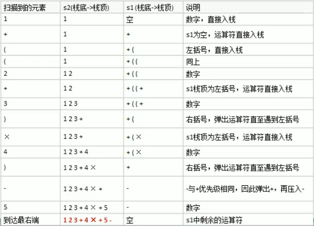

## 中缀表达式转后缀表达式
- 后缀表达式易于计算机计算, 但人类却不容易写出来
- 因此在开发中需要将中缀表达式转换为后缀表达式

### (1)转换步骤
1) 初始化两个栈: 符号栈 s1 和储存中间结果的栈 s2
2) 从左到右扫描中缀表达式
3) 遇到操作数时, 将其压入 s2
4) 遇到运算符时, 比较其与 s1 栈顶运算符的优先级:  
   1) 如果 s1 为空, 或栈顶运算符为左括号 "(", 直接将此运算符入栈
   2) 否则, 若优先级比栈顶运算符的高, 也将运算符压入 s1
   3) 否则, 将 s1 栈顶的运算符弹出并压入到 s2 中,  
      再次转到步骤 4-1 与 s1 中新的栈顶运算符相比较
5) 遇到括号时:  
   1) 如果是左括号 "(", 则直接压入 s1
   2) 如果是右括号 ")", 则一次弹出 s1 栈顶的运算符  
      并压入 s2, 直到遇到左括号为止, 此时将这一对括号舍弃
6) 重复步骤 2 到 5, 直到扫描到中缀表达式的最右边
7) 将 s1 中剩余的运算符依次弹出并压入 s2
8) 依次弹出 s2 中的元素并输出, 并将输出结果进行逆序,  
   得到的表达式就是后缀表达式

### (2)转换实例
- 以中缀表达式 "1 + ((2 + 3) * 4) - 5" 转换过程进行示例
- 转换过程如下图, 转换后的结果为 "1 2 3 + 4 * + 5 -"   
  

