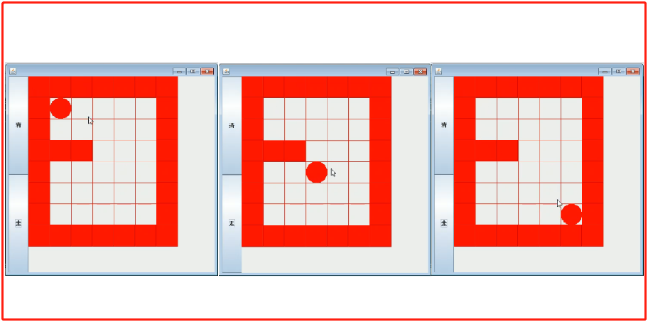
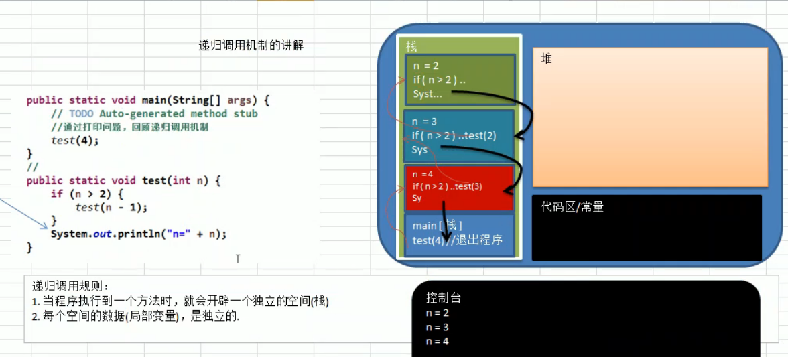

### (1)递归的应用
#### 迷宫问题
- 如下图. 小球从左上角走到右下角, 需要用到递归来处理.
- 这是递归经典应用, 迷宫问题(回溯), 递归(recursion)

****
### (2)递归的定义
- 递归就是方法自己调用自己, 每次调用时传入不同的变量
- 递归有助于编程者解决复杂问题, 同时让代码变得简洁

****
### (3)递归调用机制
- 当程序执行到一个方法时, 就会开辟一个独立的空间(实质是栈)
- 每个空间的数据(局部变量)是独立的
- 然后从栈顶依次执行每个空间内定义的过程
- 执行完栈中最后一个空间的过程后就退出程序

