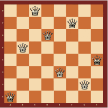
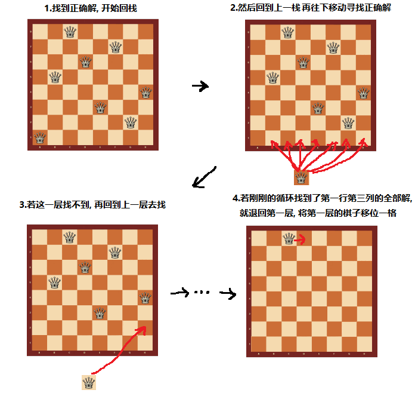

<!-- TOC -->

- [八皇后问题介绍](#八皇后问题介绍)
- [八皇后问题算法思路分析](#八皇后问题算法思路分析)
- [回溯问题的图解](#回溯问题的图解)

<!-- /TOC -->
****
### 八皇后问题介绍
- 八皇后问题是回溯算法的典型案例   
- 该问题由国际象棋棋手马克斯贝瑟于1848年提出 
  
- 在 8*8 格的国际象棋棋盘上摆放 8 个皇后,  
  使其不能互相攻击, 能有多少种摆法?
- 即任意两个皇后都不能处于同一行, 同一列或同一斜线上,  
  一共有多少种情况可以出现.

****
### 八皇后问题算法思路分析
1. 第一个皇后先放第一行第一列
   
2. 第二个皇后放在第二行第一列, 然后判断是否 OK,  
   如果不 OK, 继续放在第二列, 第三列...  
   依次放完所有列, 找到一个合适为止.

3. 继续第三个皇后, 还是第一列, 第二列...的顺序依次摆放,  
   直到第 8 个皇后能放在一个不冲突的位置, 这样算一个正确解

4. 当得到一个正确解时就将栈回退到上一个栈, 开始进行回溯,  
   即将第一个皇后, 放到第一列的所有正确解全部得到

5. 然后回头继续第一个皇后放第一行第二列,  
   后面继续循环执行 1, 2, 3, 4 的步骤.

- **说明:**  
  理论上应该创建一个二维数组来表示棋盘,  
  但实际上可以通过算法用一个一维数组解决问题.

****
### 回溯问题的图解

****