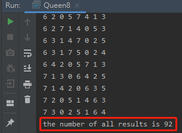

### 整体代码
- 实现细节看代码注释
```java
package com.leo9.dc10.eight_queens;

public class Queen8 {
    //定义一个max表示有多少个皇后
    int max = 8;
    //定义一维数组arr作为棋盘, 保存结果
    int[] array = new int[max];
    //定义变量res记录正确结果次数
    static int res = 0;

    public static void main(String[] args) {
        new Queen8().check(0);
        System.out.println("the number of all results is " + res);
    }

    //定义方法, 放置第n个皇后
    private void check(int n){
        //判断是否放完八个皇后
        if(n == max){
            //当n等于8的时候, 已经超出数组范围, 即放的是第九个皇后
            //因此说明前八个皇后条件满足, 可以输出结果
            print();
            res++;
            return;
        }

        //依次放入皇后, 并判断是否冲突
        //用循环将每一行的每种结果都循环八次, 将所有结果找出
        for (int i = 0; i < max; i++) {
            //先把当前这个皇后n, 放到当前行的第i列, i从0开始
            array[n] = i;
            //判断放放置第n个皇后到第i列时, 是否冲突
            if(judge(n)){
                //如果不冲突, 接着放下一个
                check(n+1);
            }
            //如果冲突, 就会回到循环开头, 将n往下一列放
        }
    }

    //定义方法, 查看当放置第n个皇后时, 当前皇后是否和之前皇后冲突
    private boolean judge(int n){
        for (int i = 0; i < n; i++) {
            //判断是否同列和同斜线
            /*
            * 如果同一列, 则两个数组成员的值相等
            * 如果同一斜线, 则两个数组成员的行号相减的绝对值等于列号相减的绝对值
                *棋盘中若两点在同一斜线会构成等腰直角三角形, 两条短边是相等的
            * */
            if(array[i] == array[n] || Math.abs(n-i) == Math.abs(array[n] - array[i])) {
                return false;
            }
        }
        return true;
    }

    //定义方法, 将每次数组保存的正确结果输出
    private void print(){
        for (int i = 0; i < array.length; i++) {
            System.out.print(array[i] + " ");
        }
        System.out.println();
    }
}

```

### 测试结果
- 显而易见, 已将 92 种结果成功输出

