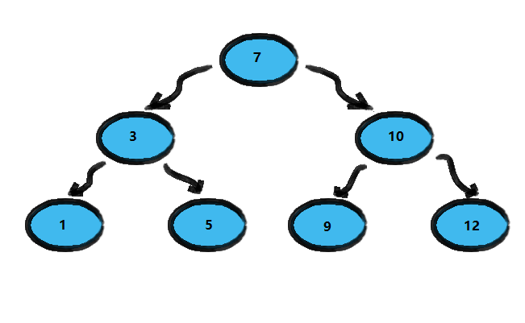
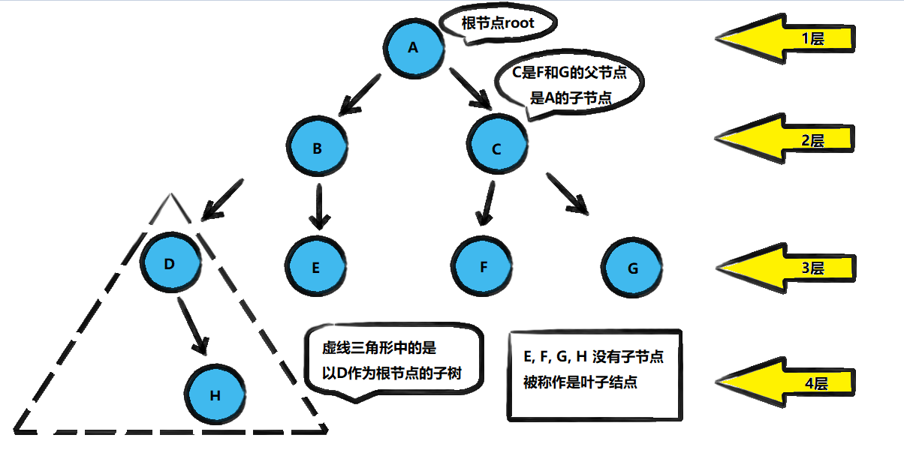
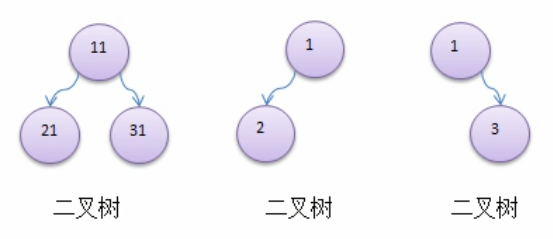

<!-- TOC -->

- [数组, 链表, 树的存储方式分析](#%E6%95%B0%E7%BB%84-%E9%93%BE%E8%A1%A8-%E6%A0%91%E7%9A%84%E5%AD%98%E5%82%A8%E6%96%B9%E5%BC%8F%E5%88%86%E6%9E%90)
    - [数组存储方式的分析](#%E6%95%B0%E7%BB%84%E5%AD%98%E5%82%A8%E6%96%B9%E5%BC%8F%E7%9A%84%E5%88%86%E6%9E%90)
    - [链式存储方式的分析](#%E9%93%BE%E5%BC%8F%E5%AD%98%E5%82%A8%E6%96%B9%E5%BC%8F%E7%9A%84%E5%88%86%E6%9E%90)
    - [树存储方式的分析(以二叉树为例)](#%E6%A0%91%E5%AD%98%E5%82%A8%E6%96%B9%E5%BC%8F%E7%9A%84%E5%88%86%E6%9E%90%E4%BB%A5%E4%BA%8C%E5%8F%89%E6%A0%91%E4%B8%BA%E4%BE%8B)
        - [二叉排序树存储案例](#%E4%BA%8C%E5%8F%89%E6%8E%92%E5%BA%8F%E6%A0%91%E5%AD%98%E5%82%A8%E6%A1%88%E4%BE%8B)
        - [简单总结](#%E7%AE%80%E5%8D%95%E6%80%BB%E7%BB%93)
- [二叉树的原理](#%E4%BA%8C%E5%8F%89%E6%A0%91%E7%9A%84%E5%8E%9F%E7%90%86)
    - [树的常用术语](#%E6%A0%91%E7%9A%84%E5%B8%B8%E7%94%A8%E6%9C%AF%E8%AF%AD)
    - [二叉树的定义](#%E4%BA%8C%E5%8F%89%E6%A0%91%E7%9A%84%E5%AE%9A%E4%B9%89)

<!-- /TOC -->

## 1. 数组, 链表, 树的存储方式分析
### 数组存储方式的分析
- **优点**:  
  通过下标方式访问元素, 速度快. 对于有序数组, 还可以用二分查找提高检索速度.
  
- **缺点**:  
  如果要检索具体某个值, 或者插入值(按一定顺序)会整体移动, 效率较低  
    - 在插入值的时候会发生数组扩容, 本质上是开辟新数组复制旧数组
    - 然后插入值的时候会将数组排序后再放入新数组, 效率较低
    - ArrayList 底层本质上其实也是数组扩容

****
### 链式存储方式的分析
- **优点**:  
  在一定程度上对数组存储方式有优化, 比如插入一个数值节点,  
  只需要将插入结点连接到链表中即可, 删除效率也很好.

- **缺点**:  
  在进行检索时, 效率仍然较低, 比如在检索某个值时, 需要从头节点开始遍历.

****
### 树存储方式的分析(以二叉树为例)
能提高数据存储, 读取的效率, 比如利用二叉排序树(Binary Sort Tree),  
即可以保证数据的检索速度, 也可以保证数据的插入删除修改速度.

#### 二叉排序树存储案例
将数组 `[7,3,10,1,5,9,12]` 用二叉排序树进行存储  

- **需求 1: 查找元素 [12]**
  - 先和 [7] 比较, 发现目标比 [7] 大, 向 [7] 右边寻找
  - 找到 [10], 发现目标依旧比 [10] 大, 继续向 [10] 右边寻找
  - 找到[12], 发现寻找目标, 经过两轮比较, 成功完成检索.

- **需求 2: 添加元素 [13]**  
  - 先进行比较, 找到比 [13] 小的元素中最大的那一位
  - 找到 [12], 直接将 [13] 挂在 [12] 的右边节点即可

- **需求 3: 删除元素[1]**  
  - 找到元素 [1], 并找到元素 [1] 的父节点 [3]
  - 直接将父节点 [3] 对 [1] 的指向引用去掉即可

#### 简单总结
- 树的结构存储很方便, 同时解决了查找元素效率低的问题

****

## 2. 二叉树的原理

### 树的常用术语
 

**树的常用术语** 
- 节点
- 根节点
- 父节点
- 子节点
- 叶子节点(没有子节点的节点)
- 节点的权(节点值)
- 路径(从根节点找到目标节点的路线)
- 层
- 子树
- 树的高度(最大层数)
- 森林(多少颗子树构成森林)

****
### 二叉树的定义
1) 树有很多种, 每个节点最多只能有两个子节点的一种形式称为二叉树

2) 二叉树的子节点分为左节点和右节点

3) 如果该二叉树的所有叶子节点都在最后一层, 并且节点总数为 2n-1 (n 为层数), 则称该二叉树为满二叉树.

4) 如果该二叉树的所有叶子节点都在最后一层或倒数第二层,  
   且最后一层的叶子节点在左边连续, 倒数第二层的叶子节点在右边连续,  
   则称该二叉树为完全二叉树

