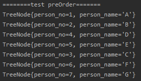
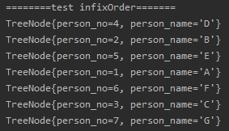
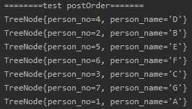

<!-- TOC -->

- [二叉树的创建和遍历](#二叉树的创建和遍历)
  - [二叉树的创建](#二叉树的创建)
  - [二叉树节点遍历的分类](#二叉树节点遍历的分类)
  - [分析二叉树的前序中序后序遍历步骤](#分析二叉树的前序中序后序遍历步骤)
    - [前序遍历步骤](#前序遍历步骤)
    - [中序遍历步骤](#中序遍历步骤)
    - [后序遍历步骤](#后序遍历步骤)
  - [二叉树创建和遍历代码实现](#二叉树创建和遍历代码实现)
    - [节点类](#节点类)
    - [二叉树类](#二叉树类)
    - [测试类](#测试类)
  - [二叉树遍历测试](#二叉树遍历测试)

<!-- /TOC -->

## 二叉树的创建和遍历
### 二叉树的创建
- 需要创建一个节点类, 成员有节点的信息以及左右子节点,  
  成员方法包括一些对节点的操作.  
  (因为节点操作的主要对象是节点, 因此放在节点类比较好)
- 需要创建一个二叉树类, 主要用于存放根节点和去封装调用节点操作.

### 二叉树节点遍历的分类
根据输出父节点的顺序, 分别有三种方式对二叉树进行遍历
- 前序遍历: 先输出父节点, 再遍历左子树和右子树
- 中序遍历: 先遍历左子树, 再输出父节点, 再遍历右子树
- 后序遍历: 先遍历左子树, 再遍历右子树, 最后输出父节点

****
### 分析二叉树的前序中序后序遍历步骤
- 在遍历前都要先创建一棵二叉树

#### 前序遍历步骤
从根节点开始进入递归, 流程如下:
- 输出当前节点
- 若当前节点的左子节点不为空, 则递归继续前序遍历
- 若当前节点的右子节点不为空, 则递归继续前序遍历

#### 中序遍历步骤
从根节点开始进入递归, 流程如下:
- 若当前节点的左子节点不为空, 则递归中序遍历
- 输出当前节点
- 若当前节点的右子节点不为空, 则递归中序遍历

#### 后序遍历步骤
从根节点开始进入递归, 流程如下:
- 若当前节点的左子节点不为空, 则递归中序遍历
- 若当前节点的右子节点不为空, 则递归中序遍历
- 输出当前节点

****
### 二叉树创建和遍历代码实现
#### 节点类
```java
package com.leo9.dc22.binary_tree;

//创建节点类, 用来存放节点信息和节点的左右子节点信息
public class TreeNode {
    //节点存放的信息
    private int person_no;
    private String person_name;

    //节点的子节点
    private TreeNode left_node;
    private TreeNode right_node;

    //节点构造器
    public TreeNode(int person_no, String person_name) {
        this.person_no = person_no;
        this.person_name = person_name;
    }

    //节点成员的getter和setter方法
    public int getPerson_no() {
        return person_no;
    }

    public void setPerson_no(int person_no) {
        this.person_no = person_no;
    }

    public String getPerson_name() {
        return person_name;
    }

    public void setPerson_name(String person_name) {
        this.person_name = person_name;
    }

    public TreeNode getLeft_node() {
        return left_node;
    }

    public void setLeft_node(TreeNode left_node) {
        this.left_node = left_node;
    }

    public TreeNode getRight_node() {
        return right_node;
    }

    public void setRight_node(TreeNode right_node) {
        this.right_node = right_node;
    }

    //重载节点的toString方法
    @Override
    public String toString() {
        return "TreeNode{" +
                "person_no=" + person_no +
                ", person_name='" + person_name + '\'' +
                '}';
    }

    //前序遍历方法
    public void preOrder(){
        //先输出当前节点
        System.out.println(this);
        //然后递归向左子树
        if (this.left_node != null){
            this.left_node.preOrder();
        }
        //再递归向右子树
        if (this.right_node != null){
            this.right_node.preOrder();
        }
    }

    //中序遍历方法
    public void infixOrder(){
        //先递归向左子树
        if(this.left_node != null){
            this.left_node.infixOrder();
        }
        //再输出当前节点
        System.out.println(this);
        //再递归向右子树
        if (this.right_node != null){
            this.right_node.infixOrder();
        }
    }

    //后续遍历方法
    public void postOrder(){
        //先递归向左子树
        if(this.left_node != null){
            this.left_node.infixOrder();
        }
        //再递归向右子树
        if (this.right_node != null){
            this.right_node.infixOrder();
        }
        //再输出当前节点
        System.out.println(this);
    }
}

```

#### 二叉树类
```java
package com.leo9.dc22.binary_tree;

//创建二叉树类. 主要用于存放根节点.
public class BinaryTree {
    //成员只需定义根节点即可, 节点相关操作实际由节点类完成
    private TreeNode root_node;
    //定义设置根节点的方法
    public void setRoot_node(TreeNode root_node) {
        this.root_node = root_node;
    }
    public void setRoot_node(int person_no, String person_name) {
        root_node = new TreeNode(person_no, person_name);
    }

    //二叉树前序遍历
    public void preOrder(){
        if(this.root_node != null){
            this.root_node.preOrder();
        }
    }
    //二叉树中序遍历
    public void infixOrder(){
        if(this.root_node != null){
            this.root_node.infixOrder();
        }
    }
    //二叉树后序遍历
    public void postOrder(){
        if(this.root_node != null){
            this.root_node.postOrder();
        }
    }
}

```

#### 测试类
```java
package com.leo9.dc22.binary_tree;

public class TestDemoBT {
    public static void main(String[] args) {
        //手动创建一棵二叉树的所有节点
        TreeNode nodeA = new TreeNode(1,"A");
        TreeNode nodeB = new TreeNode(2,"B");
        TreeNode nodeC = new TreeNode(3,"C");
        TreeNode nodeD = new TreeNode(4,"D");
        TreeNode nodeE = new TreeNode(5,"E");
        TreeNode nodeF = new TreeNode(6,"F");
        TreeNode nodeG = new TreeNode(7,"G");

        //手动连接各个节点
        nodeA.setLeft_node(nodeB);
        nodeA.setRight_node(nodeC);
        nodeB.setLeft_node(nodeD);
        nodeB.setRight_node(nodeE);
        nodeC.setLeft_node(nodeF);
        nodeC.setRight_node(nodeG);

        //将根节点放入二叉树
        BinaryTree testTree = new BinaryTree();
        testTree.setRoot_node(nodeA);

        //测试前序遍历
        System.out.println("========test preOrder=======");
        testTree.preOrder();
        //测试中序遍历
        System.out.println("========test infixOrder=======");
        testTree.infixOrder();
        //测试后序遍历
        System.out.println("========test postOrder=======");
        testTree.postOrder();
    }
}

```


****
### 二叉树遍历测试
- **创建二叉树**  
  - 这次创建是手动创建, 后续会有递归方式增加节点


- **测试前序遍历**  

- **测试中序遍历**  

- **测试后序遍历**  
