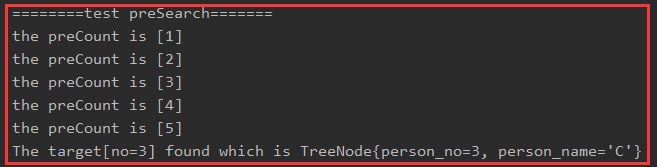
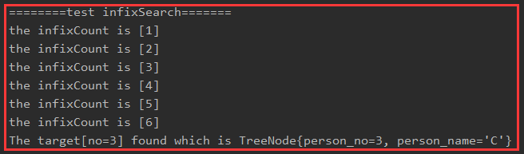
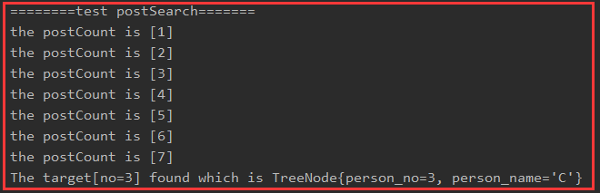
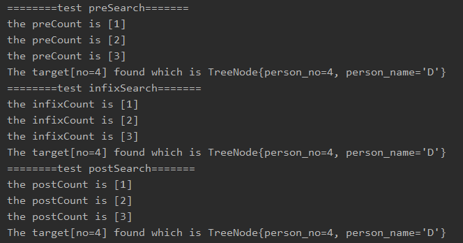

<!-- TOC -->

- [1. 二叉树查找指定节点](#1-二叉树查找指定节点)
  - [1.1. 二叉树查找的分类和思路](#11-二叉树查找的分类和思路)
    - [1.1.1. 前序查找](#111-前序查找)
    - [1.1.2. 中序查找](#112-中序查找)
    - [1.1.3. 后序查找](#113-后序查找)
  - [1.2. 二叉树三种查找的代码实现](#12-二叉树三种查找的代码实现)
    - [1.2.1. 节点类新增三个查找方法](#121-节点类新增三个查找方法)
    - [1.2.2. 二叉树类新增三个查找调用方法](#122-二叉树类新增三个查找调用方法)
    - [1.2.3. 测试类新增](#123-测试类新增)
  - [1.3. 二叉树查找测试](#13-二叉树查找测试)
    - [1.3.1. 测试节点 3](#131-测试节点-3)
    - [1.3.2. 测试节点 4](#132-测试节点-4)
- [2. 二叉树节点的删除](#2-二叉树节点的删除)

<!-- /TOC -->

## 1. 二叉树查找指定节点
**例题要求**  
1. 编写前序查找, 中序查找和后序查找的方法
2. 分别使用三种查找方式, 查找指定的目标节点
3. 分析各种查找方式分别比较了多少次才找到目标

****

### 1.1. 二叉树查找的分类和思路

#### 1.1.1. 前序查找
- 先判断当前节点的 no 是否与目标相等, 若相等返回当前节点
  - 如果不相等
    - 先判断当前节点的左子节点是否为空, 非空则递归前序查找
    - 再判断当前节点的右子节点是否为空, 非空则递归前序查找
- 递归过程中如果匹配正确则输出, 都不匹配则最终返回 null

#### 1.1.2. 中序查找
- 先判断当前节点的左子节点是否为空, 非空则递归中序查找
- 然后判断当前节点的 no 是否与目标相等,  
  相等就返回, 不相等就进行下一步判断
- 再判断当前节点的右子节点是否为空, 非空则递归中序查找
- 递归过程中如果匹配正确则输出, 都不匹配则最终返回 null

#### 1.1.3. 后序查找
- 先判断当前节点的左子节点是否为空, 非空则递归后续查找
- 再判断当前节点的右子节点是否为空, 非空则递归后续查找
- 再判断当前节点的 no 是否与目标相等, 相等就返回
- 递归过程中如果匹配正确则输出, 都不匹配则最终返回 null

****

### 1.2. 二叉树三种查找的代码实现
- 接着使用上一篇的类来进行增添相关方法

#### 1.2.1. 节点类新增三个查找方法
- 每个方法前定义了计数器用来统计比较次数, 若不需要计数器直接删除相关内容即可
  
```java
    //计数器
    public static int preCount = 0;
    //前序查找方法
    public TreeNode preSearch(int target_no){
        //创建一个临时变量用以接收目标节点
        TreeNode target = null;
        //在比较前计数器加一
        preCount++;
        System.out.printf("the preCount is [%d]\n", preCount);
        //先判断当前节点的 no 是否和目标 no 相等
        if (this.person_no == target_no){
            target = this;
        }
        //不相等, 则进入下面的判断
        else{
            //如果当前节点的左子节点不为空, 则递归前序查找
            if(this.left_node != null){
                target = this.left_node.preSearch(target_no);
            }
            //如果当前节点的右子节点不为空, 则递归前序查找
            //target 非空说明找到目标, 直接跳过即可
            if (target == null && this.right_node != null){
                target = this.right_node.preSearch(target_no);
            }
        }
        //如果当前节点的左右节点都不符合或者没有左右子节点, 则返回默认值 null
        return target;
    }

    //计数器
    public static int infixCount = 0;
    //中序查找方法
    public TreeNode infixSearch(int target_no){
        //创建一个临时变量用以接收目标节点
        TreeNode target = null;

        //如果当前节点的左子节点不为空, 则递归中序查找
        if (this.left_node != null){
            target = this.left_node.infixSearch(target_no);
        }

        //在比较前计数器加一
        infixCount++;
        System.out.printf("the infixCount is [%d]\n", infixCount);
        //判断当前节点的 no 是否和目标 no 相等
        //target 非空说明找到目标, 直接跳过即可
        if(target == null && this.person_no == target_no){
            target = this;
        }

        //如果当前节点的右子节点不为空, 则递归中序查找
        //target 非空说明找到目标, 直接跳过即可
        if (target == null && this.right_node != null){
            target = this.right_node.infixSearch(target_no);
        }
        return target;
    }

    //计数器
    public static int postCount = 0;
    //后序查找方法
    public TreeNode postSearch(int target_no){
        //创建一个临时变量用以接收目标节点
        TreeNode target = null;

        //如果当前节点的左子节点不为空, 则递归中序查找
        if (this.left_node != null){
            target = this.left_node.postSearch(target_no);
        }

        //如果当前节点的右子节点不为空, 则递归中序查找
        //target 非空说明找到目标, 直接跳过即可
        if (target == null && this.right_node != null){
            target = this.right_node.postSearch(target_no);
        }

        //在比较前计数器加一
        postCount++;
        System.out.printf("the postCount is [%d]\n", postCount);
        //判断当前节点的 no 是否和目标 no 相等
        //target 非空说明找到目标, 直接跳过即可
        if(target == null && this.person_no == target_no){
            target = this;
        }

        return target;
    }
```

#### 1.2.2. 二叉树类新增三个查找调用方法
- 新增三个查找调用方法, 实际只是以根节点调用查找方法

```java
    //二叉树前序查找
    public void preSearch(int target_no){
        if(this.root_node != null){
            TreeNode target = this.root_node.preSearch(target_no);
            if (target != null){
                System.out.printf("The target[no=%d] found which is %s\n", target_no, target.toString());
            }
            else {
                System.out.printf("Can't found the target[no=%d]\n", target_no);
            }
        }
    }

    //二叉树中序查找
    public void infixSearch(int target_no){
        if(this.root_node != null){
            TreeNode target = this.root_node.infixSearch(target_no);
            if (target != null){
                System.out.printf("The target[no=%d] found which is %s\n", target_no, target.toString());
            }
            else {
                System.out.printf("Can't found the target[no=%d]\n", target_no);
            }
        }
    }

    //二叉树后序查找
    public void postSearch(int target_no){
        if(this.root_node != null){
            TreeNode target = this.root_node.postSearch(target_no);
            if (target != null){
                System.out.printf("The target[no=%d] found which is %s\n", target_no, target.toString());
            }
            else {
                System.out.printf("Can't found the target[no=%d]\n", target_no);
            }
        }
    }
```

#### 1.2.3. 测试类新增
- 本次测试测试节点编号为 3 的节点

```java
        //测试前序查找
        System.out.println("========test preSearch=======");
        testTree.preSearch(3);

        //测试中序查找
        System.out.println("========test infixSearch=======");
        testTree.infixSearch(3);

        //测试后续查找
        System.out.println("========test postSearch=======");
        testTree.postSearch(3);
```

****

### 1.3. 二叉树查找测试

#### 1.3.1. 测试节点 3
- **前序查找的结果**  
  - 一共对比了 5 次  


- **中序查找的结果**  
  - 一共对比了 6 次  


- **后序查找的结果** 
  - 一共对比了 7 次  


#### 1.3.2. 测试节点 4
- 结果是比较次数都一样



****

## 2. 二叉树节点的删除
**例题要求**
1. 如果删除的节点是叶子节点, 则删除该节点
2. 如果删除的节点是非叶子节点, 则删除该子树