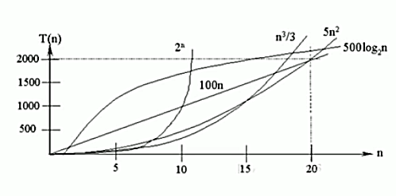

<!-- TOC -->

- [时间复杂度](#时间复杂度)
    - [(1)计算时间复杂度的方法](#1计算时间复杂度的方法)
    - [(2)常见的时间复杂度](#2常见的时间复杂度)
        - [常数阶 O(1)](#常数阶-o1)

<!-- /TOC -->

## 时间复杂度
- 一般情况下, 算法中的基本操作语句的重复执行次数是问题规模 n 的某个函数,  
用 T(n) 表示, 若有某个辅助函数 f(n), 使得当 n 趋近于无穷大时,  
T(n)/f(n) 的极限值为不等于零的常数, 则称 f(n) 是 T(n) 的同数量级函数.  
记作 T(n) = O(f(n)), 称 O(f(n)) 为算法的渐进时间复杂度, 简称时间复杂度.

- T(n) 不同, 但时间复杂度可能相同.  
  如 T(n)=n2+7n+6 和 T(n)=3n2+2n+2, 它们的 T(n) 不同, 但时间复杂度相同, 都为 O(n2)

****
### (1)计算时间复杂度的方法
- 用常数 1 代替运行时间中的所有加法常数
- 修改后的运行次数函数中, 只保留最高阶项
- 去除最高阶项的系数

  - 示例:  
    - 原式: T(n) = 3n2+2n+6
    - 第一步转换: T(n) = 3n2+2n+1
    - 第二步转换: T(n) = 3n2
    - 第三步转换: T(n) = n2
    - 最后得出时间复杂度为 O(n2)

****
### (2)常见的时间复杂度

1) 常数阶 O(1)
2) 对数阶 O(log2n)
3) 线性阶 O(n)
4) 线性对数阶 O(n*log2n)
5) 平方阶 O(n2)
6) 立方阶 O(n3)
7) k 次方阶 O(nk)
8) 指数阶 O(2n)

- 说明:  
  - 常见的算法时间复杂度由小到大排序依次为:  
  O(1) < O(log2n) < O(n) < O(n*log2n) < O(n2) < O(n3) < O(nk) < O(2n)  
  随着问题规模 n 的不断增大, 上述的时间复杂度不断增大, 算法执行效率越低
  - 由图可见, 应该尽量避免使用指数阶的算法

 
#### 常数阶 O(1)
