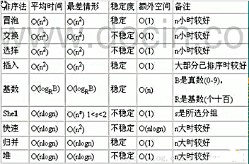

<!-- TOC -->

- [平均时间复杂度和最坏时间复杂度](#平均时间复杂度和最坏时间复杂度)
    - [平均时间复杂度的概念](#平均时间复杂度的概念)
    - [最坏时间复杂度的概念](#最坏时间复杂度的概念)
    - [一些算法的时间复杂度](#一些算法的时间复杂度)

<!-- /TOC -->

## 平均时间复杂度和最坏时间复杂度  
### 平均时间复杂度的概念
- 指的是所有可能的输入实例以均等概率出现的情况下, 算法的运行运行时间

### 最坏时间复杂度的概念
- 最坏情况下的时间复杂度称为最坏时间复杂度  
- 一般讨论的时间复杂度是最坏情况下的时间复杂度
- 因为最坏情况下的时间复杂度是算法在任何输入实例上的运行时间界限  
  这就保证了算法的运行时间不会比最坏情况更长

### 一些算法的时间复杂度
- 平均时间复杂度和最坏时间复杂度是否一致, 和算法本身有关
