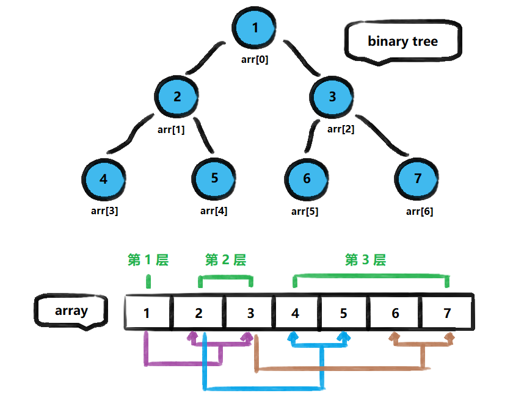

<!-- TOC -->

- [1. 顺序存储二叉树的原理和思路](#1-顺序存储二叉树的原理和思路)
  - [1.1. 顺序二叉树的概念](#11-顺序二叉树的概念)
    - [1.1.1. 基本说明](#111-基本说明)
    - [1.1.2. 操作要求](#112-操作要求)
    - [1.1.3. 顺序存储二叉树的特点](#113-顺序存储二叉树的特点)

<!-- /TOC -->

## 1. 顺序存储二叉树的原理和思路

### 1.1. 顺序二叉树的概念

#### 1.1.1. 基本说明
从数据存储来看, 数组存储方式和树的存储方式可以互相转换,  
即数组可以转换成树, 树也可以转换成数组, 如下示意图所示.  

#### 1.1.2. 操作要求
1. 上图的二叉树的结点, 要求以数组的方式进行存放,  
   即存储为数组 `arr = [1,2,3,4,5,6,7]`

2. 要求在遍历数组 arr 时, 仍可以用遍历二叉树的方式进行,  
   即可以用前序遍历, 中序遍历和后序遍历的方式完成结点遍历.

#### 1.1.3. 顺序存储二叉树的特点
- 顺序二叉树通常只考虑完全二叉树
- 第 n 个元素的左子结点为 `2*n+1` 
- 第 n 个元素的右子结点为 `2*n+2` 
- 第 n 个元素的父结点为 `(n-1)/2`
- n 表示二叉树中的第几个元素(从 0 开始编号)