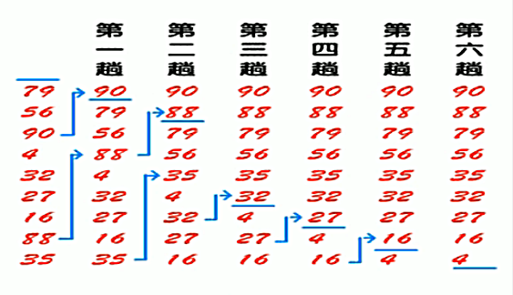

<!-- TOC -->

- [冒泡排序](#冒泡排序)
    - [基本介绍](#基本介绍)
    - [优化方式](#优化方式)
    - [排序图解](#排序图解)

<!-- /TOC -->

## 冒泡排序
### 基本介绍
冒泡排序(bubble sorting)的基本思想是:  
- 通过对 "待排序序列" 从前到后(从下标较小的元素开始)依次比较相邻元素的值
  - 若发现逆序则交换, 让值较大的元素向后移
  
  - 若没有逆序则保持不变, 继续向后进行比较 

****
### 优化方式  
- 排序的过程中, 各元素不断接近自己的位置,  
  若一轮比较下来并无发生交换, 说明序列有序.
    
- 因此需要在排序过程中设置一个标志, 判断元素是否进行过交换,  
  从而减少不必要的循环队列进行元素比较.

****
### 排序图解
- 如下图所示, 最顶上是队尾, 最底下是队首, 从下到上从小到大排序
- 图中省略了最后两趟的重复排序, 这两次排序并无发生交换
- 一共会发生数组长度减一次排序, 下图对应数组是 8 次
- 每次排序需要比较的数在逐渐减少, 第 i 次排序确立数组中第 i 大的元素

