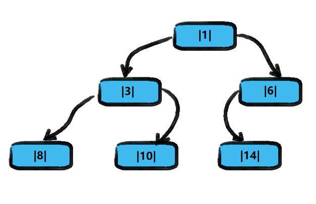
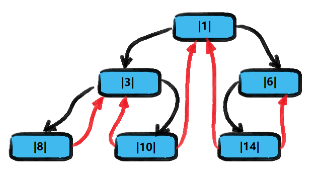

<!-- TOC -->

- [1. 线索化二叉树的概念](#1-线索化二叉树的概念)
  - [1.1. 基本介绍](#11-基本介绍)
  - [1.2. 线索二叉树应用案例](#12-线索二叉树应用案例)
    - [1.2.1. 图解分析](#121-图解分析)
    - [1.2.2. 后续说明](#122-后续说明)
- [2. 线索化二叉树的代码实现](#2-线索化二叉树的代码实现)

<!-- /TOC -->

## 1. 线索化二叉树的概念

### 1.1. 基本介绍
- n 个结点的二叉链表中含有 n+1 个空指针域  
  - 由公式 `2n-(n-1)=n+1` 得出  
  - 2n 指的是所有结点所有指针个数
  - n-1 指的是实际非空指针的个数
- 利用二叉链表中的空指针域, 存放指向该结点在某种遍历次序下的前驱和后继结点指针
- 这种附加的指针称为"线索" 
  </br></br>
- 这种加上了线索的二叉链表称为线索链表 
- 相应的二叉树称为线索二叉树(Threaded Binary Tree)
- 根据线索性质的不同, 线索二叉树有三种, 可分为前序/中序/后序线索二叉树
  </br></br>
- 一个结点的前一个结点, 称为前驱结点
- 一个结点的后一个结点, 称为后继结点

### 1.2. 线索二叉树应用案例

#### 1.2.1. 图解分析
- 将下面的二叉树, 进行中序线索二叉树.  
- 中序遍历的数列为 {8,3,10,1,14,6}.  

**原二叉树**  
- 黑色指针是实际使用的指针 
- 每个结点都有左右两个指针


**中序线索二叉树**  
- 红色指针指向当前结点的前驱和后继结点 
- 只有当结点左右指针有空位时才产生线索   


#### 1.2.2. 后续说明
**当线索化二叉树后, Node 结点的属性 left 和 right, 有如下情况:**  
- left 指向的是左子树, 也可能是指向前驱结点.  
  比如 1 结点 left 指向的左子树,  
  而 10 结点的 left 指向的是前驱结点.
- right 指向的是右子树, 也可能是指向后继结点.  
  比如 1 结点 right 指向的右子树,  
  而 10 结点的 right 指向的是后继结点.


## 2. 线索化二叉树的代码实现
- 本次实现以中序线索二叉树为主
  

```java
```