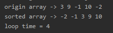
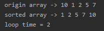

### 优化后的冒泡排序
- 具体的实现细节看代码注释即可
```java
package com.leo9.dc11.bubble_sorting;

public class BubbleSort {
    static private int count = 0;

    public static void main(String[] args) {
        //定义用来排序的数组
        int[] arr = {3, 9, -1, 10, -2};
        //int[] arr = {10, 1, 2, 5, 7};
        //输出原数组
        System.out.print("origin array -> ");
        showArray(arr);
        System.out.println();
        //开始排序,然后输出
        System.out.print("sorted array -> ");
        sortArray(arr);
        showArray(arr);
        System.out.println();
        System.out.println("loop time = " + count);
    }

    //数组排序的方法
    public static void sortArray(int[] arr){
        //获取传入数组的长度
        int arr_length = arr.length;
        //开始循环, 外层总共要循环数组长度减一次
        for(int i = 0; i < arr_length - 1; i++){
            //设置标志位用以判断是否产生交换
            int ifchange = 0;
            //外层每循环一次, 需要比较的数组成员就少一个, 因此循环次数要再减 i 次
            for (int j = 0; j < arr_length - 1 - i; j++) {
                //比较是否逆序, 是就开始交换
                if(arr[j] > arr[j + 1]){
                    int temp = arr[j + 1];
                    arr[j + 1] = arr[j];
                    arr[j] = temp;
                    ifchange++;
                }
            }
            count ++;
            //如果一轮比较下来并没有发生交换, 直接跳出循环.
            if(ifchange == 0){
                break;
            }
        }
    }

    //数组输出的方法
    public static void showArray(int[] arr){
        int arr_length = arr.length;
        for(int i = 0; i < arr_length ; i++){
            System.out.print(arr[i] + " ");
        }
    }
}

```

****
### 测试结果

#### 数组1
- 循环了 4 次



#### 数组2 
- 循环了 2 次, 至少要循环 1 次来检测是否没有发生元素交换

