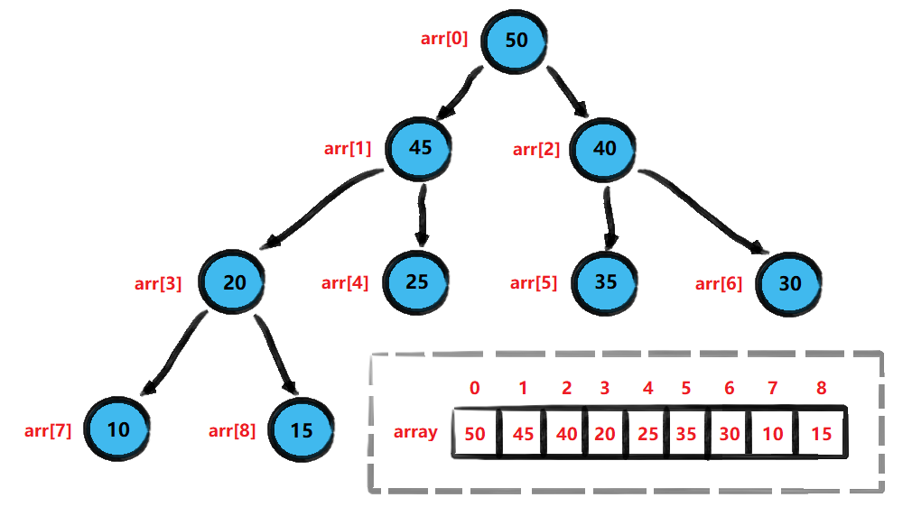
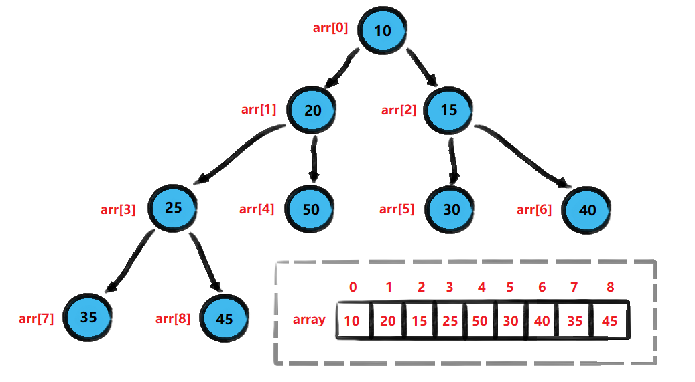
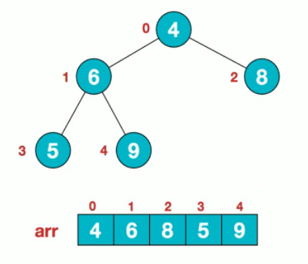
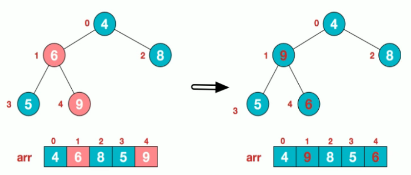

<!-- TOC -->

- [1. 大顶堆和小顶堆](#1-大顶堆和小顶堆)
  - [1.1. 堆的概念](#11-堆的概念)
    - [1.1.1. 大顶堆图示](#111-大顶堆图示)
    - [1.1.2. 小顶堆图示](#112-小顶堆图示)
- [2. 堆排序的概念](#2-堆排序的概念)
  - [2.1. 基本介绍](#21-基本介绍)
  - [2.2. 基本思想](#22-基本思想)
  - [2.3. 步骤图解](#23-步骤图解)

<!-- /TOC -->

## 1. 大顶堆和小顶堆

### 1.1. 堆的概念
- 堆是具有特定结点性质的完全二叉树, 且分为大顶堆和小顶堆
- 每个结点的值大于或等于其子结点的值称为大顶堆
- 每个结点的值小于或等于其子结点的值称为小顶堆
- 大/小顶堆都没对结点的左右子结点的值有大小关系要求.
    
- 一般升序采用大顶堆, 降序采用小顶堆

#### 1.1.1. 大顶堆图示
- 右下是对堆中结点按层进行编号, 然后映射到数组中的结果

- 大顶堆的特点:  
  `arr[i] >= arr[2*i+1] && arr[i] >= arr[2*i+2]`  
  其中 i 对应的是堆的结点编号, 即数组下标, 从 0 开始.

#### 1.1.2. 小顶堆图示

- 小顶堆的特点:  
  `arr[i] <= arr[2*i+1] && arr[i] <= arr[2*i+2]`  
  其中 i 对应的是堆的结点编号, 即数组下标, 从 0 开始.

****

## 2. 堆排序的概念

### 2.1. 基本介绍 
- 堆排序是利用堆这种数据结构而设计的一种排序算法, 是不稳定的排序.
- 堆排序是一种选择排序, 最坏/最好/平均时间复杂度均为 O(nlog2n)

### 2.2. 基本思想
1. 将待排序序列构造成一个大顶堆.(可用数组模拟树进行操作)
2. 构造完后的整个序列的最大值就是堆顶的根节点.
3. 将其与末尾元素进行交换, 此时末尾就为最大值.
4. 再将剩余 n-1 个元素重新构成一个堆, 这样会得到 n 个元素的次小值.  
5. 如此反复执行, 便能得到一个有序序列.

- 可以看到在构建大顶堆的过程中, 元素的个数逐渐减少,  
最终就能够得到一个有序序列.

### 2.3. 步骤图解
- 要求: 对数组 arr={4,6,8,5,9} 使用堆排序, 将数组升序排序

1. 假设给定无序序列结构如下  

2. 此时从最后一个非叶子结点开始, 从左到右, 从上到下进行调整   
   第一个非叶子结点计算公式为 `arr.length/2 - 1 = 1`, 即结点 6  
