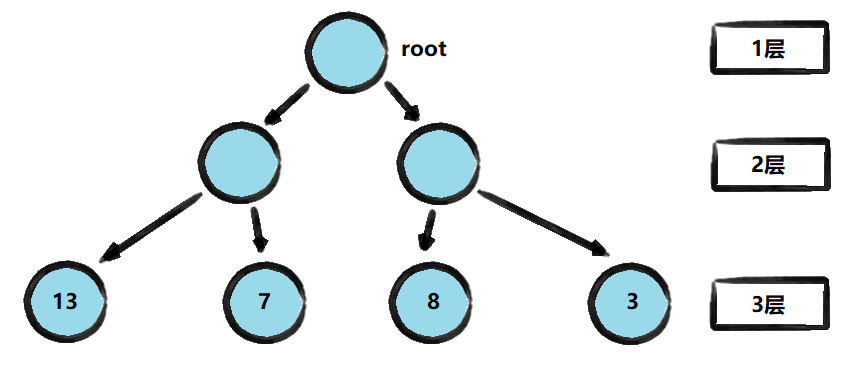
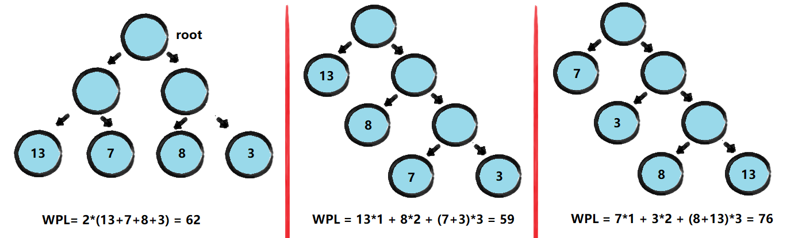

<!-- TOC -->

- [1. 哈夫曼树的概念](#1-哈夫曼树的概念)
  - [1.1. 基本介绍](#11-基本介绍)
  - [1.2. 概念说明](#12-概念说明)
    - [1.2.1. 路径和路径长度](#121-路径和路径长度)
    - [1.2.2. 结点的权和带权路径长度](#122-结点的权和带权路径长度)
    - [1.2.3. 树的带权路径长度](#123-树的带权路径长度)
    - [1.2.4. WPL 最小的就是哈夫曼树](#124-wpl-最小的就是哈夫曼树)
- [2. 哈夫曼树创建步骤](#2-哈夫曼树创建步骤)
  - [2.1. 思路分析](#21-思路分析)
  - [2.2. 构建步骤](#22-构建步骤)

<!-- /TOC -->

## 1. 哈夫曼树的概念

### 1.1. 基本介绍
- 给定 n 个权值作为 n 个叶子结点, 构造一颗二叉树  
  若该树的带权路径长度(wpl)达到最小,  
  称这样的二叉树为最优二叉树, 或哈夫曼树(Huffman Tree)

- 哈夫曼树是带权路径长度最短的树, 权值较大的结点离根较近.

### 1.2. 概念说明
- 以如下二叉树进行讲解  

#### 1.2.1. 路径和路径长度
- **路径**  
  在一棵树中, 从一个结点往下可以达到的孩子或孙子结点之间的通路, 称为路径.

- **路径长度**  
  通路中分支的数目称为路径长度, 若规定根结点的层数为 1,  
  则从根结点到第 L 蹭结点的路径长度为 L-1.  
  例如: 根结点到 13 结点的路径长度为 3-1=2.

#### 1.2.2. 结点的权和带权路径长度
- **结点的权**  
  若将书中结点赋给一个有着某种含义的数值, 则这个数值称为该结点的权.  
  例如: 结点 13 中的 13 就是该结点的权值.

- **结点的带权路径长度**   
  从根结点到该结点之间的的路径长度与该结点的权的乘积为带权路径长度.  
  例如: 根结点到 13 结点的带权路径长度为 (3-1)*13=26.

#### 1.2.3. 树的带权路径长度
树的带权路径长度规定为所有叶子结点的带权路径长度之和,  
记为 WPL(Weighted Path Length),  
权值越大的结点离根结点越近的二叉树才是最优二叉树.

#### 1.2.4. WPL 最小的就是哈夫曼树

****

## 2. 哈夫曼树创建步骤
给定数列 arr={13,7,8,3,29,6,1}, 要求转换成哈夫曼树

### 2.1. 思路分析

### 2.2. 构建步骤
1. 将每个数据从小到大进行排序, 每个数据都是一个结点,  
   每个结点都看成一棵最简单的二叉树.

2. 取出根结点权值最小的两棵二叉树

3. 组成一棵新的二叉树, 该二叉树的根结点的权值是前面两棵二叉树根结点权值的和.  

4. 再将这棵二叉树, 以根节点的权值大小再次排序.  

5. 不断重复上述 4 个步骤, 直到数列中所有的数据都被处理,  
   最终就会得到一棵哈夫曼树.