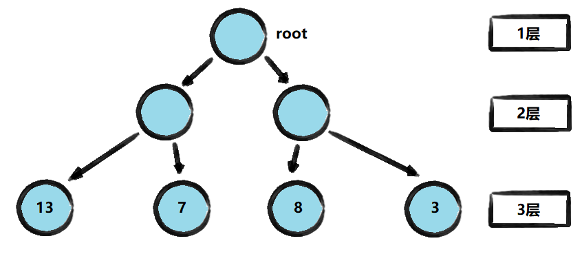
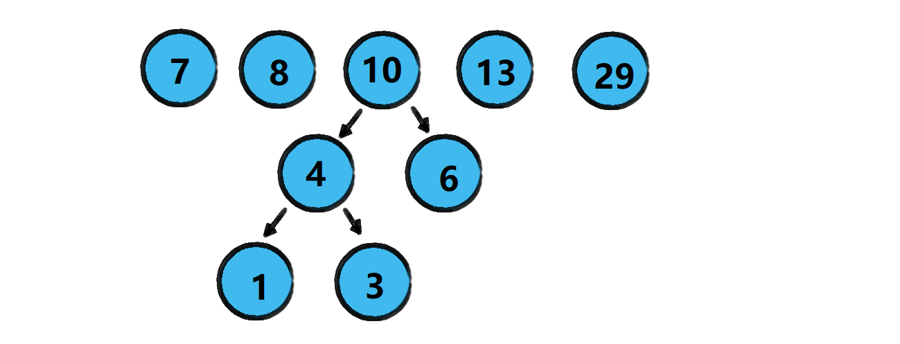
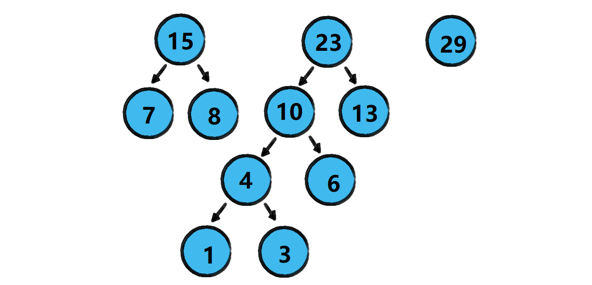
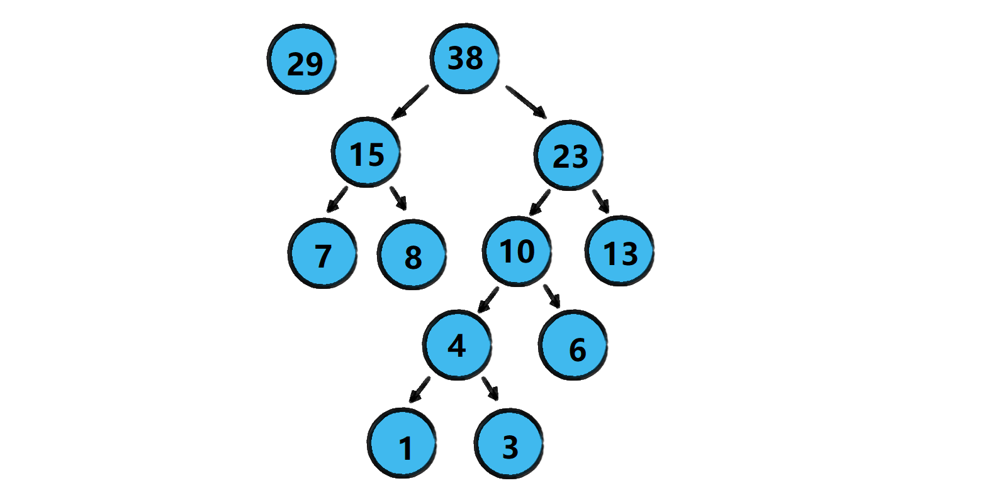
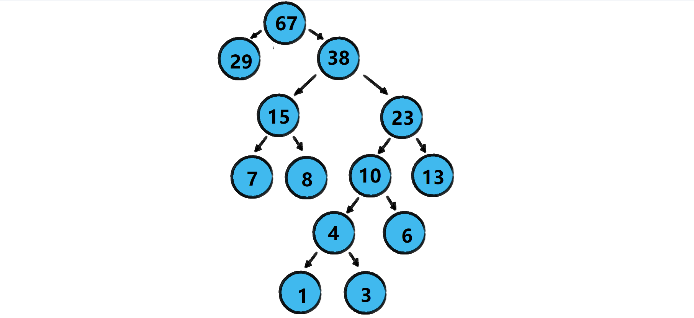
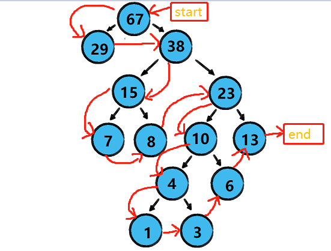
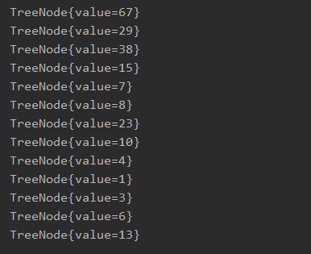

<!-- TOC -->

- [1. 哈夫曼树的概念](#1-哈夫曼树的概念)
  - [1.1. 基本介绍](#11-基本介绍)
  - [1.2. 概念说明](#12-概念说明)
    - [1.2.1. 路径和路径长度](#121-路径和路径长度)
    - [1.2.2. 结点的权和带权路径长度](#122-结点的权和带权路径长度)
    - [1.2.3. 树的带权路径长度](#123-树的带权路径长度)
    - [1.2.4. WPL 最小的就是哈夫曼树](#124-wpl-最小的就是哈夫曼树)
- [2. 哈夫曼树创建步骤](#2-哈夫曼树创建步骤)
  - [2.1. 构建步骤](#21-构建步骤)
  - [2.2. 构建图解](#22-构建图解)
- [3. 哈夫曼树代码实现](#3-哈夫曼树代码实现)
  - [3.1. 二叉树结点类](#31-二叉树结点类)
  - [3.2. 哈夫曼树类](#32-哈夫曼树类)
  - [3.3. 测试结果](#33-测试结果)

<!-- /TOC -->

## 1. 哈夫曼树的概念

### 1.1. 基本介绍
- 给定 n 个权值作为 n 个叶子结点, 构造一颗二叉树  
  若该树的带权路径长度(wpl)达到最小,  
  称这样的二叉树为最优二叉树, 或哈夫曼树(Huffman Tree)

- 哈夫曼树是带权路径长度最短的树, 权值较大的结点离根较近.

### 1.2. 概念说明
- 以如下二叉树进行讲解  


#### 1.2.1. 路径和路径长度
- **路径**  
  在一棵树中, 从一个结点往下可以达到的孩子或孙子结点之间的通路, 称为路径.

- **路径长度**  
  通路中分支的数目称为路径长度, 若规定根结点的层数为 1,  
  则从根结点到第 L 蹭结点的路径长度为 L-1.  
  例如: 根结点到 13 结点的路径长度为 3-1=2.

#### 1.2.2. 结点的权和带权路径长度
- **结点的权**  
  若将书中结点赋给一个有着某种含义的数值, 则这个数值称为该结点的权.  
  例如: 结点 13 中的 13 就是该结点的权值.

- **结点的带权路径长度**   
  从根结点到该结点之间的的路径长度与该结点的权的乘积为带权路径长度.  
  例如: 根结点到 13 结点的带权路径长度为 (3-1)*13=26.

#### 1.2.3. 树的带权路径长度
树的带权路径长度规定为所有叶子结点的带权路径长度之和,  
记为 WPL(Weighted Path Length),  
权值越大的结点离根结点越近的二叉树才是最优二叉树.

#### 1.2.4. WPL 最小的就是哈夫曼树


****

## 2. 哈夫曼树创建步骤
给定数列 arr={13,7,8,3,29,6,1}, 要求转换成哈夫曼树

### 2.1. 构建步骤
1. 将每个数据从小到大进行排序, 每个数据都是一个结点,  
   每个结点都看成一棵最简单的二叉树.

2. 取出根结点权值最小的两棵二叉树来组成一棵新的二叉树,  
   该二叉树的根结点的权值是前面两棵二叉树根结点权值的和.  

3. 再将这棵二叉树, 以根节点的权值大小再次排序.  

4. 不断重复上述 3 个步骤, 直到数列中所有的数据都被处理,  
   最终就会得到一棵哈夫曼树.

### 2.2. 构建图解
- 将每一个结点都看成一棵树, 并存放于数列中
- 首先将结点树数列排序, 由小到大进行排序

****
- 然后选出排序后的结点树数列中, 根结点最小的两个
- 这里显然是 1 和 3 最小, 然后将其组成新二叉树
- 新二叉树的根结点是其一级子结点权值之和, 即为 4
- 再将合并后的新根结点放回数列中, 再次由小到大排序

****
- 在选出排序后的两个最小根节点, 显然是 4 和 6
- 它们权值相加为 10, 然后用新的根结点将两树相连
- 再把 10 这个结点放回原序列中进行排序

****
- 新一轮排序后选出最小的两个根结点为 7 和 8
- 然后用其权值相加的新结点 15 将两树相连
- 再将 15 放回数列进行排序

****
- 新一轮排序后选出最小的两个根结点为 10 和 13
- 然后用其权值相加的新结点 23 将两树相连
- 再将 23 放回数列进行排序

****
- 新一轮排序后选出最小的两个根结点为 15 和 23
- 然后用其权值相加的新结点 38 将两树相连
- 再将 38 放回数列进行排序

****
- 最终只剩两个根结点, 然后将俩根结点权值相加
- 得到最终根结点 67 并将两树相连, 得到哈夫曼树


****

## 3. 哈夫曼树代码实现

### 3.1. 二叉树结点类
```java
package com.leo9.dc26.huffman_tree;

//创建结点类
//为了能让TreeNode对象支持排序 如Collections集合排序
//因此让TreeNode实现Comparable接口
public class TreeNode implements Comparable<TreeNode> {
    //定义结点权值
    public int value;
    //定义结点的左右子结点
    public TreeNode left_node;
    public TreeNode right_node;

    //定义构造器
    public TreeNode(int value) {
        this.value = value;
    }

    @Override
    //重写toString方法
    public String toString() {
        return "TreeNode{" +
                "value=" + value +
                '}';
    }

    @Override
    //实现接口的比较方法
    public int compareTo(TreeNode treeNode) {
        //表示从小到大排序
        return this.value - treeNode.value;
    }

    //前序遍历二叉树
    public void preOrder() {
        System.out.println(this);
        if (this.left_node != null) {
            this.left_node.preOrder();
        }
        if (this.right_node != null) {
            this.right_node.preOrder();
        }
    }
}

```

### 3.2. 哈夫曼树类
```java
package com.leo9.dc26.huffman_tree;

import java.util.ArrayList;
import java.util.Collections;
import java.util.List;

//创建哈夫曼树类
public class HuffmanTree {
    public static void main(String[] args) {
        //创建示例数组
        int[] arr = {13, 7, 8, 3, 29, 6, 1};
        createHuffmanTree(arr).preOrder();
    }

    /**
     * @function 创建哈夫曼树方法
     * @param arr 传入的目标数组
     * @return 返回的是哈夫曼树的根结点
     * */
    public static TreeNode createHuffmanTree(int[] arr) {
        //1.为了操作方便, 先遍历数组
        //2.将数组每个元素都转化为结点元素
        //3.将转化得到的结点元素全部放入ArrayList中

        //创建结点列表
        List<TreeNode> nodeList = new ArrayList<TreeNode>();
        //遍历数组, 转化结点并存入结点列表
        for (int value : arr) {
            nodeList.add(new TreeNode(value));
        }

        //往复循环排序结点列表和构建二叉树, 最终得到的结点列表只保留了哈夫曼树的根结点
        while (nodeList.size()>1){
            //4.列表排序后, 取出根结点权值最小的两棵二叉树, 并构建新的二叉树
            //4.0.先从小到大对结点列表进行排序
            Collections.sort(nodeList);
            //4.1.取出最小的结点
            TreeNode left_node = nodeList.get(0);
            //4.2.取出次小的结点
            TreeNode right_node = nodeList.get(1);
            //4.3.构建新二叉树根结点, 并连接上面俩结点
            TreeNode root_node = new TreeNode(left_node.value + right_node.value);
            root_node.left_node = left_node;
            root_node.right_node = right_node;

            //5.重新整理结点列表
            //5.1.先去除掉已经连接上的两个最小结点
            nodeList.remove(left_node);
            nodeList.remove(right_node);
            //5.2.再将得到的新的二叉树根结点放入列表
            nodeList.add(root_node);
        }
        return nodeList.get(0);
    }
}

```

### 3.3. 测试结果
- 目标的哈夫曼树的前序遍历结果如下
  

****
- 根据最后的输出前序遍历结果来看, 哈夫曼树成功构建
  