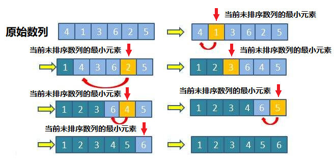

<!-- TOC -->

- [选择排序](#选择排序)
    - [基本介绍](#基本介绍)
    - [排序思想](#排序思想)
    - [排序图解](#排序图解)
    - [排序总结](#排序总结)

<!-- /TOC -->

## 选择排序
### 基本介绍
选择式排序也属于内部排序法, 是从待排序的数据中,  
按指定的规则选出某一元素, 再依规定交换位置后达到排序的目的

### 排序思想
- 选择排序(select sorting)也是一种简单的排序方法

- 它的基本思想是:  
  - 第一轮先从 arr[0]~arr[n-1] 中取最小值, 与 arr[0] 互换

  - 第二轮再从 arr[1]~arr[n-1] 中取最小值, 与 arr[1] 互换

  - 依次类推, 第 i 轮循环时取 arr[i-1]~arr[n-1] 中的最小值, 和 arr[i-1] 互换

  - 直到 i-1 = n-1 就停止循环, 总共排序了 n-1 次得到由小到大排序的数组  

### 排序图解

### 排序总结
- 若数组长度为 n, 则选择排序会进行 n-1 轮外层循环
- 每轮排序会根据外循环次数 i 以 arr[i] 作为起点(注: 这里的 i 从零开始计算)