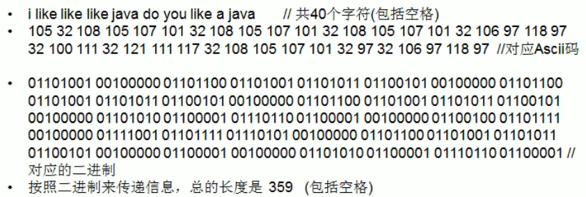
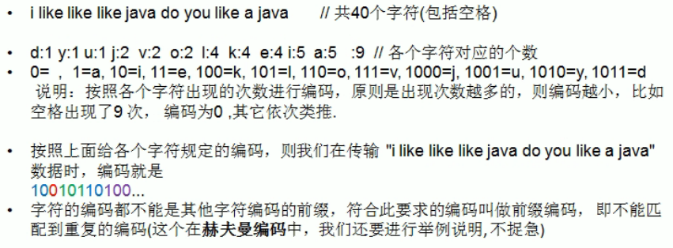
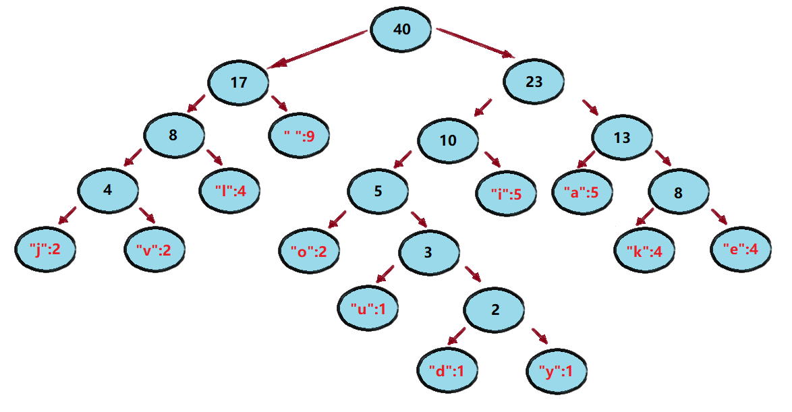
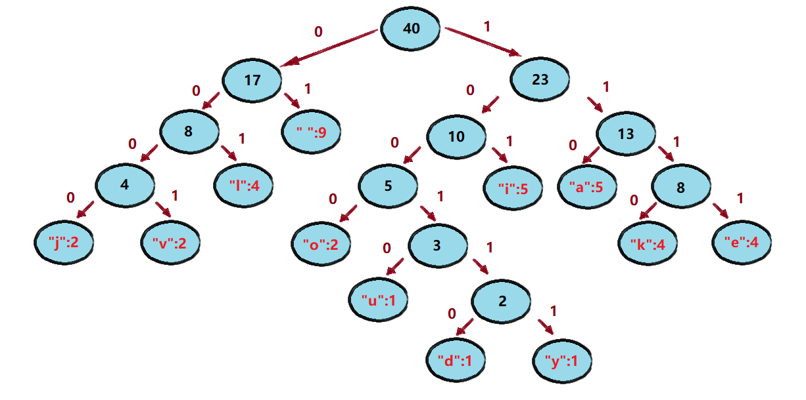

<!-- TOC -->

- [1. 哈夫曼编码的原理](#1-哈夫曼编码的原理)
  - [1.1. 基本介绍](#11-基本介绍)
  - [1.2. 编码方式](#12-编码方式)
    - [1.2.1. 定长编码](#121-定长编码)
    - [1.2.2. 变长编码](#122-变长编码)
    - [1.2.3. 哈夫曼编码](#123-哈夫曼编码)
  - [1.3. 原理剖析](#13-原理剖析)
    - [1.3.1. 编码步骤](#131-编码步骤)
- [2. 哈夫曼编码的实现](#2-哈夫曼编码的实现)
  - [2.1. 实现思路](#21-实现思路)
  - [2.2. 代码实现](#22-代码实现)

<!-- /TOC -->

## 1. 哈夫曼编码的原理

### 1.1. 基本介绍
- 哈夫曼编码(Huffman Coding)是一种编码方式, 属于一种程序算法
- 哈夫曼编码是哈夫曼树在电讯通信中经典应用之一
- 哈夫曼编码广泛地用于数据文件解缩压缩. 压缩率通常在 20-90% 之间  
- 哈夫曼编码是可变字长编码(VLC)的一种.  
- 是哈夫曼于 1952 年提出一种编码方法, 称之为最佳编码.  

### 1.2. 编码方式
通讯领域中信息处理的方式通常有 3 种

#### 1.2.1. 定长编码
存在着占用太多位的问题  



#### 1.2.2. 变长编码
存在着解码可能产生二义性的问题  


#### 1.2.3. 哈夫曼编码


### 1.3. 原理剖析
以上述案例来进行示范

#### 1.3.1. 编码步骤
- 首先用上述例子的字符串进行传输, 即字符串  
  >"i like like like java do you like a java"

- 然后确定各个字符出现的次数, 如下:  
  >"d":1 "y":1 "u":1 "j":2 "v":2 "o":2  
  >"l":4 "k":4 "e":4 "i":5 "a":5 " ":9

- 按照上面字符出现的次数构建一棵哈夫曼树, 次数作为权值.  
  

- 然后每个左右指针分别做标识, 左指针为"0", 右指针为"1".  
  

- 最后依次得出每个字母的哈夫曼编码的编码序列.  
  这个编码属于前缀编码,各个编码间的前缀并不会重复.
  
  |字母|编码值|字母|编码值|字母|编码值|字母|编码值|
  |--|--|--|--|--|--|--|--|
  |" "|01|"l"|001|"j"|0000|"u"|10010|
  |||"i"|101|"v"|0001|"d"|100110|
  |||"a"|110|"o"|1000|"y"|100111|
  |||||"k"|1110|
  |||||"e"|1111|
  
- 按照上面的哈夫曼编码, 最终可将字符串转换成如下编码  
  (这里使用无损压缩, 得到的编码长度为 133)  
  > 1010100110111101111010011011110111101001  
  > 1011110111101000011000011100110011010000  
  > 1100111100010010010011011110111101110000  
  > 01100001110

- 得到的最终编码进行匹配解码的时候,  
  可直接按照前缀来逐段比较, 因为前缀不重复,  
  不会造成匹配二义性, 所以最终必定将全部编码匹配完成.  
  原来用定长编码的长度是 359, 压缩率算出为 (359-133)/359=0.629

- 注意:  
  以上例子可能会根据哈夫曼排序方法不同, 得出编码不一样.  
  因为存在多个权值相同的结点, 其排序顺序可能并不一样.
  但是排序得到的哈夫曼树的 WPL 是一样的, 都是最小的.
  因此最终得到的编码长度都是相同的, 并无影响.

## 2. 哈夫曼编码的实现

### 2.1. 实现思路
1. 先创建一个结点类, 结点成员有四个, 分别是:  
   data 存放字符对应的 ASCII 码, weight 存放权值,  
   left 和 right 存放左右子结点.

2. 得到目标字符串对应的 byte[] 数组, 用以统计得出权值.

3. 编写方法, 将准备构建哈夫曼树的结点放到 List 中.  

4. 通过构建的 List 来创建对应的哈夫曼树.
   
### 2.2. 代码实现
```java

```