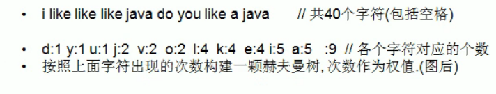

<!-- TOC -->

- [1. 哈夫曼编码的原理](#1-哈夫曼编码的原理)
  - [1.1. 基本介绍](#11-基本介绍)
  - [1.2. 原理剖析](#12-原理剖析)
    - [1.2.1. 定长编码](#121-定长编码)
    - [1.2.2. 变长编码](#122-变长编码)
    - [1.2.3. 哈夫曼编码](#123-哈夫曼编码)

<!-- /TOC -->

## 1. 哈夫曼编码的原理

### 1.1. 基本介绍
- 哈夫曼编码(Huffman Coding)是一种编码方式, 属于一种程序算法
- 哈夫曼编码是哈夫曼树在电讯通信中经典应用之一
- 哈夫曼编码广泛地用于数据文件解缩压缩. 压缩率通常在 20-90% 之间  
- 哈夫曼编码是可变字长编码(VLC)的一种.  
- 是哈夫曼于 1952 年提出一种编码方法, 称之为最佳编码.  

### 1.2. 原理剖析
通讯领域中信息处理的方式通常有 3 种

#### 1.2.1. 定长编码
存在着占用太多位的问题  

#### 1.2.2. 变长编码
存在着解码可能产生二义性的问题  

#### 1.2.3. 哈夫曼编码
