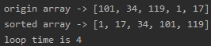

<!-- TOC -->

- [选择排序](#选择排序)
- [测试结果](#测试结果)
    - [数组1](#数组1)
    - [测试 8 万个数据的随机数组](#测试-8-万个数据的随机数组)

<!-- /TOC -->

### 选择排序
```java
package com.leo9.dc12.select_sorting;

import java.util.Arrays;

public class SelectSort {
    private static int count = 0;
    public static void main(String[] args) {
        //定义要排序的数组
        int[] arr = {101, 34, 119, 1, 17};
        //int[] arr = {1, 2, 5, 10 ,7};

        //开始排序并输出
        System.out.println("origin array -> " + Arrays.toString(arr));
        sortArray(arr);
        System.out.println("sorted array -> " + Arrays.toString(arr));
        System.out.println("loop time is " + count);
    }

    //定义选择排序方法
    public static void sortArray(int[] arr){
        //获取数组长度
        int arr_length = arr.length;
        //定义变量以获取最小值和其对应的数组编号
        int min, num;
        //外层循环次数为数组长度减一, 因为最后一位元素后面并没有元素可以和它进行比较
        for (int i = 0; i < arr_length - 1; i++) {
            //初始化最小值和其角标, 默认为本轮循环的起始元素
            min = arr[i];
            num = i;
            //内层循环从外层循环的起始元素的下一位开始, 直到获取完数组剩余元素为止
            for (int j = i + 1; j < arr_length; j++) {
                //出现更小的值则开始进行更新最小值和角标
                if(min > arr[j]){
                    min = arr[j];
                    num = j;
                }
            }
            //计数表++
            count ++;
            //如果有更小的值就进行调换
            if(num != i){
                arr[num] = arr[i];
                arr[i] = min;
            }
        }
    }
}

```

### 测试结果
#### 数组1

#### 测试 8 万个数据的随机数组
平均时间是 2s