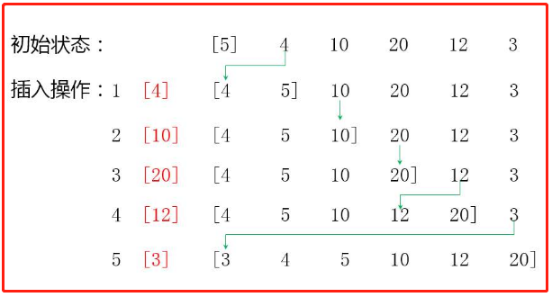

<!-- TOC -->

- [插入排序](#插入排序)
    - [基本介绍](#基本介绍)
    - [排序思想](#排序思想)
    - [排序图解](#排序图解)

<!-- /TOC -->

## 插入排序
### 基本介绍
- 插入式排序(insertion sorting)属于内部排序法 
- 是将待排序数组的元素以插入的方式去寻找适当的位置, 以达到排序的目的

### 排序思想
插入排序的基本思想是:  
- 把 n 个待排序的元素看成一个有序表和一个无序表

- 开始时有序表中只包含一个元素, 无序表中包含有 n-1 个元素

- 排序过程中每次从无序表中取出第一个元素,  
  把它的排序码依次与有序表元素的排序码进行比较  
  将它插入到有序表中的适当位置, 使之成为新的有序表

### 排序图解
