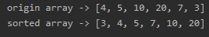

<!-- TOC -->

- [插入排序](#插入排序)
- [测试结果](#测试结果)
    - [数组1](#数组1)
    - [测试 8 万条随机数数组](#测试-8-万条随机数数组)

<!-- /TOC -->

### 插入排序
- 算法细节看注释即可
```java
package com.leo9.dc13.insertion_sort;

import java.util.Arrays;

public class InsertionSort {
    public static void main(String[] args) {
        int[] arr = {4, 5, 10, 20, 7, 3};
        System.out.println("origin array -> " + Arrays.toString(arr));
        sortArray(arr);
        System.out.println("sorted array -> " + Arrays.toString(arr));
    }

    //编写插入排序算法
    public static void sortArray(int[] arr){
        //获取数组长度
        int arr_length = arr.length;
        //要获取除了第一个数的每个数与前面的值进行比较, 因此循环次数为数组长度减一
        for (int i = 1; i < arr_length; i++) {
            //要插入值从数组第二个元素开始, 第一个元素默认有序
            int insertVal = arr[i];
            //从当前要插入元素的上一位到数组首位开始逐一比较, 因此插入的比较索引为当前插入值索引减一
            int insertIndex = i - 1;
            //防止索引出界超出首位元素之前, 因此要大于0
            //若当前要插入元素小于比较位元素, 比较位元素向后一位复制, 相当于后移
            //即若有数组为[3,4,5,1]进行插入排序, 第一次移位变成[3,4,5,5], 第二次移位变成[3,4,4,5], 第三次移位是[3,3,4,5], 插入位置是最后一次比较位的前一位, 当前最后一位是-1, 前一位则是0
            //因为是从数组后端开始进行比较, 且对插入元素用变量进行保存, 因此元素后移并不会导致元素缺失.
            while(insertIndex >= 0 && insertVal < arr[insertIndex]){
                arr[insertIndex + 1] = arr[insertIndex];
                //索引向前移动
                insertIndex --;
            }
            //索引值发生改变则进行插入, 插入位置是最后一次比较位的前一位
            if(insertIndex != i - 1){
                arr[insertIndex + 1] = insertVal;
            }
        }
    }
}

```

### 测试结果
#### 数组1


#### 测试 8 万条随机数数组
平均时间是 5s