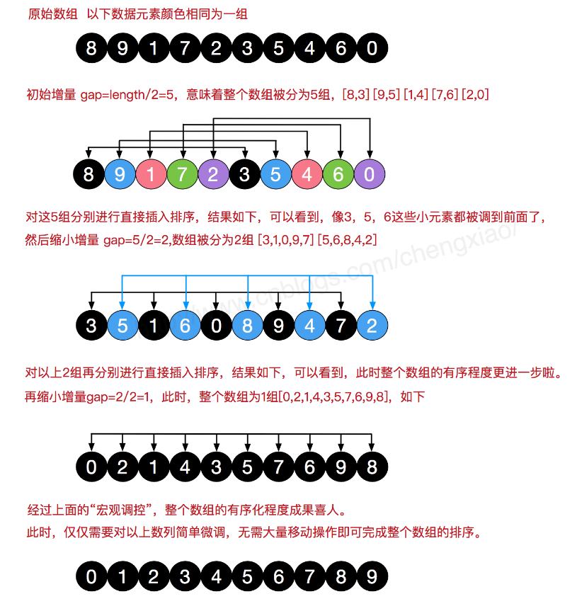

<!-- TOC -->

- [希尔排序](#希尔排序)
    - [(1)直接插入排序存在的问题](#1直接插入排序存在的问题)
        - [一个简单的实例](#一个简单的实例)
        - [结论](#结论)
    - [(2)希尔排序介绍](#2希尔排序介绍)
    - [(3)希尔排序基本思想](#3希尔排序基本思想)
    - [(4)希尔排序图解](#4希尔排序图解)
    - [(5)希尔排序分析](#5希尔排序分析)

<!-- /TOC -->

## 希尔排序
### (1)直接插入排序存在的问题
#### 一个简单的实例  
对于 `arr = [2, 3, 4, 5, 6, 1]` 这种数组来说, 这它现在需要插入的值是 1  
然而要将 1 这个元素插入到数组中时, 要把前面 5 个元素都移位, 效率会很低

#### 结论
直接插入排序在插入的数是较小的数时, 元素后移次数明显增多, 对效率有很大影响

****
### (2)希尔排序介绍
- 希尔排序是希尔(DonaldShell)于 1959 年提出的一种排序算法

- 希尔排序是直接插入排序经过改进过后的版本, 也称为缩小增量排序

****
### (3)希尔排序基本思想 
- 希尔排序是把记录按下标的一定增量分组, 对每组使用直接插入排序; 

- 随着增量逐渐减少, 每组包含的关键词越来越多

- 当增量减至 1 时, 整个文件恰好被分成一组, 算法结束

****
### (4)希尔排序图解

****
### (5)希尔排序分析
- 希尔排序一定程度上优化了插入排序, 因为插入排序对大部分排好的数列性能最优;  
   
- 希尔排序是先让数组大部分变得有序, 最后步长变为 1 的时候就是最优直接插入排序;

- 希尔排序的步长取值方案会直接影响算法性能:  
  - 最初 Shell 提出的是初始时 `step = array.length/2` 每轮结束再 `step /= 2` 折半,  
  直到 `step / 2 = 0` 为止结束循环.
  - 但是要直到 `step / 2 = 1` 时, 奇偶数位才开始互相比较, 导致性能低下;
  - 后来 Knuth 提出 `step / 3 + 1` 的方式, 也有人认为取奇数好,  
  也有人认为 step 间取互质的数好

- 希尔排序是一种不稳定的算法, 它的最坏时间复杂度为 O(n2),  
  一些经过优化的增量序列可使最坏时间复杂度达到 O(n3/2)