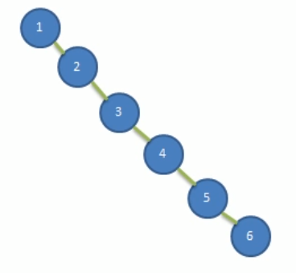
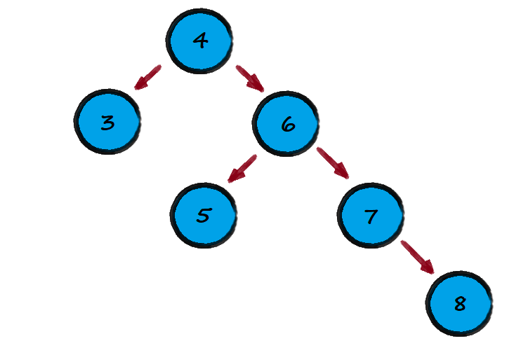
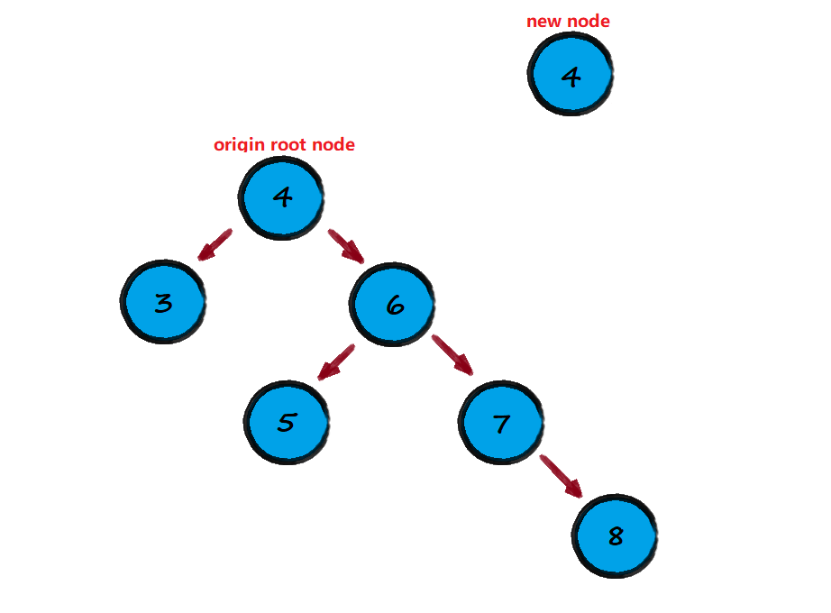
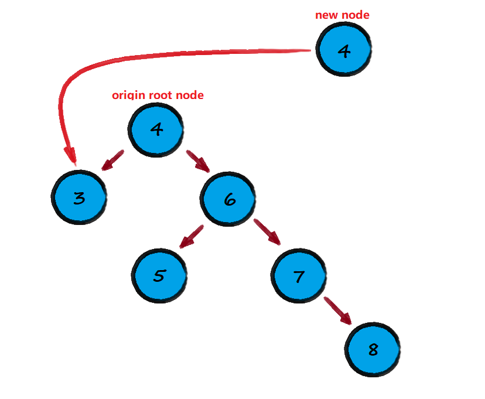
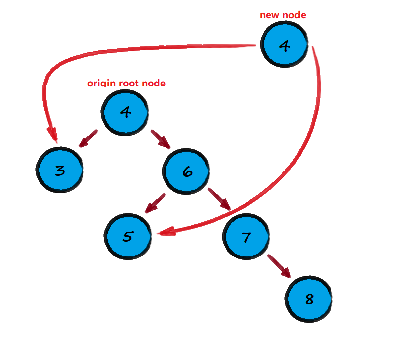
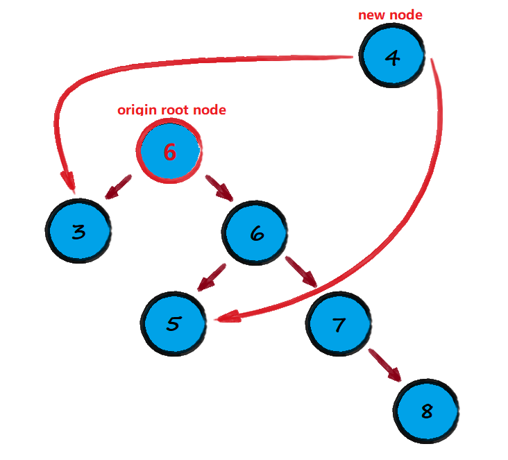
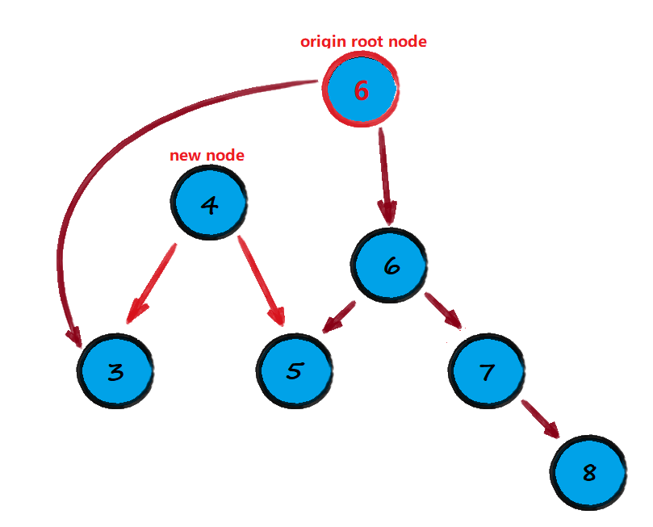
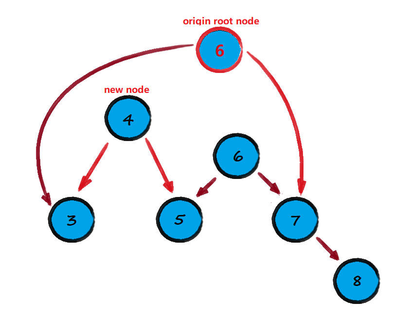
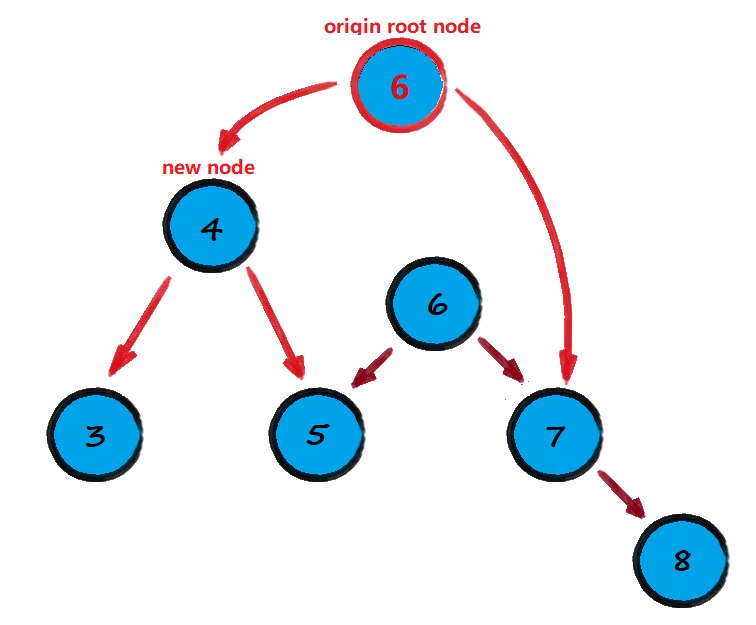
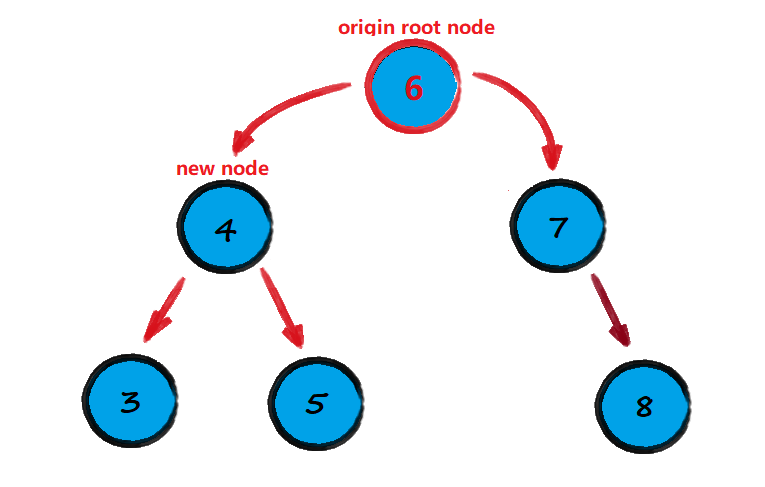

<!-- TOC -->

- [1. 二叉树排序树的缺陷](#1-二叉树排序树的缺陷)
  - [1.1. 存在的问题](#11-存在的问题)
    - [1.1.1. 问题分析](#111-问题分析)
- [2. 平衡二叉树的原理](#2-平衡二叉树的原理)
  - [2.1. 基本介绍](#21-基本介绍)
- [3. 左旋转 AVL 树](#3-左旋转-avl-树)
  - [3.1. 思路分析](#31-思路分析)
    - [3.1.1. 左旋转进行的步骤如下:](#311-左旋转进行的步骤如下)
    - [3.1.2. 注意事项:](#312-注意事项)
  - [3.2. AVL 树左旋转代码实现](#32-avl-树左旋转代码实现)

<!-- /TOC -->

## 1. 二叉树排序树的缺陷

### 1.1. 存在的问题
- 给定数列 `arr = {1,2,3,4,5,6}` 创建二叉排序树
- 创建出来的二叉排序树如下图所示  
  

#### 1.1.1. 问题分析
- 左子树全部为空, 从形式上看更像是单链表
- 这种树对插入新结点的速度并不受影响
- 查询速度却会明显下降, 因为要依次比较, 不能发挥 BST 的优势  
  因为每次还要比较左子树, 其查询速度比单链表还要慢

## 2. 平衡二叉树的原理

### 2.1. 基本介绍
- 平衡二叉树也叫平衡二叉搜索树 (Self-balancing binary search tree)  
  又被称为 AVL 树, 可以保证有较高的查询效率  

- 具有如下特点: 
  - 首先它本身是二叉排序树, 是二叉排序树的改进  
  - 它是一棵空树或它的左右两个子树的高度差绝对值好不超过 1  
  - 并且它的左右两个子树都是一棵平衡二叉树

- 平衡二叉树常用的实现方法有: 红黑树, AVL, 替罪羊树, Treap, 伸展树等.  

****

## 3. 左旋转 AVL 树
- 要求: 给定数列, 创建出对应的平衡二叉树, `arr = {4,3,6,5,7,8}`

### 3.1. 思路分析
- 首先用数列 `arr = {4,3,6,5,7,8}` 进行构造二叉排序树, 如下图进行排列.  
   

- 然后问题就出现于此, 此时正常构建的二叉排序树的右子树的高度为 3,  
  左子树的高度则为 1, 并不满足平衡二叉树的定义, 因此要进行左旋转.

#### 3.1.1. 左旋转进行的步骤如下:  
- 创建一个新结点, 权值等于当前二叉树的根结点, 即权值等于 4.   
  
  
- 把新结点的左子结点设置为原根结点的左子结点  
  

- 把新结点的右子树设置为原根结点的右子结点的左子结点  
  

- 把原根结点的权值替换成原根结点的右子结点的权值  
    

  位置进行调整和优化  

  

- 把原根结点的右子树设置成其右子结点的右子结点  
  
  
- 把原根结点的左子树设置为新结点  
  

- 调整后得到新的平衡二叉树  
  
  
****

#### 3.1.2. 注意事项:  
- 在分析过程中左右子树的高度是关键判断是否旋转的标准,  
  当发现左右子树的高度差绝对值大于 1 的时候就进行旋转.  

- 即当新结点进行插入的时候, 若发现二叉树不再是 AVL 树的时候,  
  就根据条件情况进行判断进行左旋转或右旋转.

- 因此在旋转前, 需要统计出二叉树的高度及其左右子树各自的高度

### 3.2. AVL 树左旋转代码实现