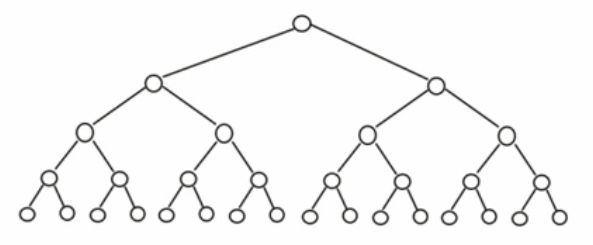
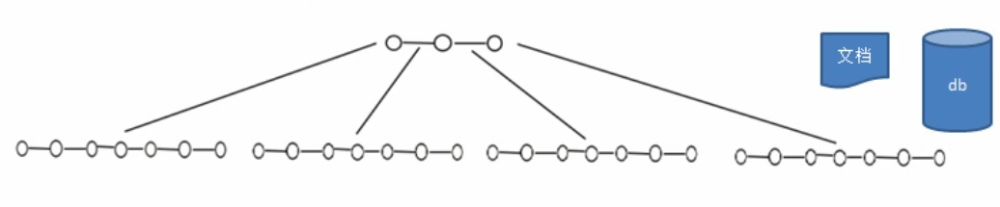
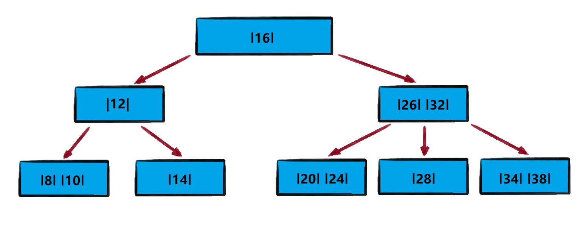

<!-- TOC -->

- [1. 二叉树与 B 树](#1-二叉树与-b-树)
  - [1.1. 二叉树缺陷分析](#11-二叉树缺陷分析)
  - [1.2. 多叉树的概念](#12-多叉树的概念)
  - [1.3. B 树的基本介绍](#13-b-树的基本介绍)
- [2. 2-3 树](#2-2-3-树)
  - [2.1. 基本介绍](#21-基本介绍)
  - [2.2. 应用案例](#22-应用案例)

<!-- /TOC -->

## 1. 二叉树与 B 树

### 1.1. 二叉树缺陷分析
**二叉树的操作效率较高, 但是也存在如下问题**
- 如下给出一棵二叉树作为示例
  - 二叉树高度: 5  
  - 结点数量: 2^5-1 = 31  

- 二叉树需要加载到内存, 如果二叉树的结点少, 则不会有影响  
  但二叉树的结点过多, 例如一亿个结点, 就会出现如下情况:  

  - 情况 1:  
    在构建二叉树时, 需要多次进行 I/O 操作,  
    海量数据存在数据库或文件中, 造成会生成海量结点,  
    对构建二叉树的速度有很大影响.
    
  - 情况 2:  
    当出现海量结点时, 二叉树的高度也会随之增高,  
    当高度变得很高时, 对二叉树的操作速度会变慢.

### 1.2. 多叉树的概念
- 在二叉树中每个结点有数据项, 最多有两个子结点.  

- 如果允许每个结点可以有更多的数据项和子结点, 就是多叉树(multiway tree)

- 多叉树通过重新组织结点, 减少了树的高度, 能对二叉树进行优化.

### 1.3. B 树的基本介绍
  
- B 树通过重新组织结点, 降低树的高度, 并且减少 I/O 读写次数来提升效率.

- 文件系统及数据库系统的设计者利用了磁盘预读原理,  
  将一个结点的大小设为等同于一个页(页的大小通常为 4k)  
  这样每个结点只需要一次 I/O 就可以完全载入

- 将树的度 M 设置为 1024, 在 600 亿个元素中最多只需要四次 I/O 操作  
  就可以读取到想要的元素, B 树 B+ 树广泛应用于文件存储系统及数据库系统中.

## 2. 2-3 树

### 2.1. 基本介绍
**2-3 树是最简单的 B 树结构, 具有如下特点:**  
- 2-3 树的所有叶子结点都在同一层(只要是 B 树都满足这个条件)
- 有两个子结点的结点叫二结点, 二结点要么没有子结点, 要么就有两个子结点
- 有三个子结点的结点叫三结点, 三结点要么没有子结点, 要么就有三个子结点
- 2-3 树是由二结点和三结点构成的树

### 2.2. 应用案例
- 将数列 `arr = {16,24,12,32,14,26,34,10,8,28,38,20}` 构成 2-3 树, 并保证数据插入的大小顺序.  

- **结点插入规则:**  
  - 2-3 树的所有叶子结点都在同一层(只要是 B 树都满足这个条件)
  
  - 有两个子结点的结点叫二结点, 二结点要么没有子结点, 要么就有两个子结点
  
  - 有三个子结点的结点叫三结点, 三结点要么没有子结点, 要么就有三个子结点

  - 当按照规则插入一个数据到某个结点时, 若不能满足以上三个要求, 就需要拆解,  
    先向上拆解, 如果上层满了, 就拆本层, 拆后仍需满足上述三个要求.  

  - 对于三结点的子树的值大小仍然遵守二叉排序树的规则.