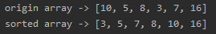

<!-- TOC -->

- [(1)代码实现](#1%e4%bb%a3%e7%a0%81%e5%ae%9e%e7%8e%b0)
- [(2)测试结果](#2%e6%b5%8b%e8%af%95%e7%bb%93%e6%9e%9c)
  - [数组1](#%e6%95%b0%e7%bb%841)

<!-- /TOC -->

### (1)代码实现
```java
package com.leo9.dc14.shell_sort;

import java.util.Arrays;

public class ShellSort {
    public static void main(String[] args) {
        int[] arr = {10, 5, 8, 3, 7, 16};
        System.out.println("origin array -> " + Arrays.toString(arr));
        sortArray(arr);
        System.out.println("sorted array -> " + Arrays.toString(arr));
    }

    //编写希尔排序算法
    public static void sortArray(int[] arr){
        //最外层循环确定每轮的步长, 每次循环步长折半, 直到整除为0为止
        for (int step = arr.length/2; step > 0; step/=2) {
            //中层和内层循环根据直接插入排序进行修改, 由之前的步长为1, 修改为动态步长
            for (int i = step; i < arr.length; i++) {
                int insertVal = arr[i];
                int insertIndex = i - step;
                while(insertIndex >= 0 && insertVal < arr[insertIndex]){
                    arr[insertIndex + step] = arr[insertIndex];
                    insertIndex -=step;
                }
                if(insertIndex != i - step){
                    arr[insertIndex + step] = insertVal;
                }
            }
        }
    }
}

```

### (2)测试结果
#### 数组1
