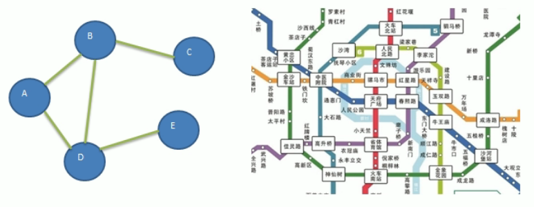
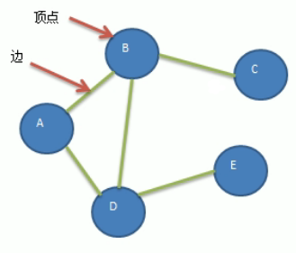
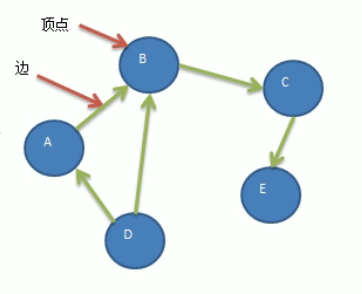
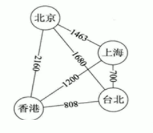
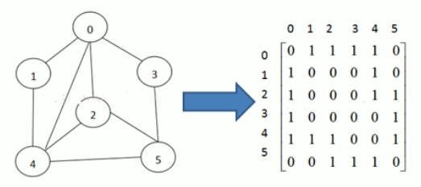
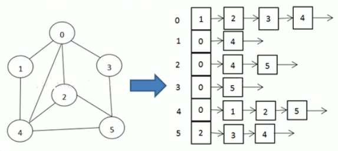

<!-- TOC -->

- [1. 图的概念](#1-图的概念)
  - [1.1. 图的必要性](#11-图的必要性)
  - [1.2. 图的示例](#12-图的示例)
  - [1.3. 图的常用概念](#13-图的常用概念)
  - [1.4. 图的表示方式](#14-图的表示方式)
    - [1.4.1. 邻接矩阵](#141-邻接矩阵)
    - [1.4.2. 邻接表](#142-邻接表)
- [2. 图的实现](#2-图的实现)

<!-- /TOC -->

## 1. 图的概念

### 1.1. 图的必要性
- 线性表局限于一个直接前驱和一个直接后继的关系
- 树结构也只能有一个直接前驱即父结点
- 当需要表示多对多的关系时, 需要用到图结构

### 1.2. 图的示例
- 图是一种数据结构, 其结点可以具有零个或多个相邻元素.
- 两个结点之间的连接称为边, 结点也可以称为顶点.  

****

### 1.3. 图的常用概念  
- 顶点(vertex):  
  - 即结点, 如 A,B,C 顶点

- 边(edge):  
  - 两个结点之间的连接即为边

- 路径:
  - 比如从 D 到 C 的路径, 有如下两种:  
    - D->B->C
    - D->A->B->C

- 无向图(如下图):  
  - 无向图的顶点之间的连接没有方向, 如 A 到 B 的路径,  
    即可以是 A->B, 也可以是 B->A

- 有向图(如下图):  
  - 有向图的顶点之间的连接有方向, 比如 A 到 B 的路径,  
    只能是 A->B, 不能 B->A.  

- 带权图(如下图):  
  - 带权图的每条边都带有权值, 带权图也叫做网.  

****

### 1.4. 图的表示方式
- 图的表示方式有两种:  
  - 二维数组表示, 也叫做邻接矩阵
  - 链表表示, 也叫做邻接表

#### 1.4.1. 邻接矩阵

- 邻接矩阵是表示图形中顶点之间相邻关系的矩阵.
- 对于 n 个顶点的图而言, 矩阵是 n 行 n 列的二维数组.  
- 它的 row 和 col 表示的是 1...n 个点.

  

#### 1.4.2. 邻接表

- 邻接矩阵需要为每个顶点都分配 n 条边的空间,  
  实际上有很多边可能是不存在的, 会造成空间浪费.

- 邻接表的实现只关心存在的边, 不关心不存在的边.  
  因此不会造成空间的浪费.  

- 邻接表由数组 + 链表的形式构成.

  

> 关于上述示例的说明: 
> - 标号为 0 的结点的相关联结点为 1, 2, 3, 4  
> - 标号为 1 的结点的相关联结点为 0, 4  
> - 标号为 2 的结点的相关联结点为 0, 4, 5  
> - 标号为 3 的结点的相关联结点为 0, 5  
> - 标号为 4 的结点的相关联结点为 0, 1, 2, 5
> - 标号为 5 的结点的相关联结点为 2, 3, 4

## 2. 图的实现